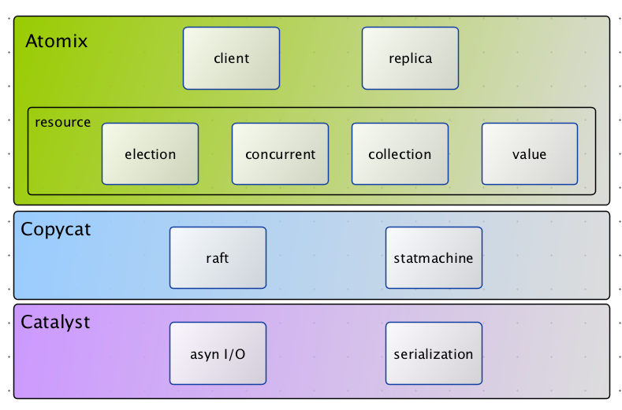

> 理想与现实，到底哪个来得更加实在，更加重要？究竟是要仰着脖颈欣赏暗夜里钉着的明月，还是要低下头颅捡起道旁一枚闪着寒光的六便士银币？

一致性是分布式系统永恒的主题。根据CAP理论，一致性、可用性和分区容忍性三者不可兼得，大多数系统架构都采用A+P，即通过牺牲一致性换区可用性和分区容忍性。但也有一些系统是着重强调一致性——整个集群工作起来就像一台服务器——比如分布式数据库系统。那如何保证分布在各节点的副本数据是一致的呢？灵魂算法当然非`Paxos`莫属，但Paxos理解起来异常艰难，使得工程实现上不尽人意。正因如此，很多分布式组件并没有直接采用Paxos，而是采用他的改进版本，比如`Zookeeper`、`Google Chubby`。除了Paxos算法外，`Raft`算法是近年来最为火热的另一门分布式一致性算法，它提供了和Paxos算法相同的功能和性能，但是它的算法结构不同，这使Raft更容易理解，也更容易构建成实际的系统。

由于raft的诸多特性([论文链接](https://raft.github.io/raft.pdf))，近年来也有越来越的分布式系统采用raft算法保证集群数据一致性，比如etcd，tidb等。如果我们要使用raft算法，重复造轮子显然不是最佳答案，[这里](https://raft.github.io/)提供了诸多raft算法的开源实现，其中github上star最高的当属atomix。本文正是学习`Atomix`的一个引子，旨在整理近期所学，也为想了解Atomix的读者提供一个简单的参考。

本文的核心内容如下：

 - Atomix的基本原理
 - Atomix集群初始化
 - 利用Atomix进行group管理
 - 利用Atomix进行group单播、组播
 - 利用Atomix分布式资源
 - 利用Atomix自定义资源
 - Atomix常用配置概览

本文的完整代码，请点击[代码片段](https://gist.github.com/kris-zhang/f2d647f0051cdc007fbc195e07ee0c44)。

## atomix原理

atomix整体的技术栈大致如下图所示：



从上到下分别是，`Atomix`、`Copycat`、`Catalyst`，其中Copycat提供了raft算法的完整特性实现，并提供了一套分布式状态机，我们所使用的Atomix所有框架功能都是直接或间接封装了Copycat。Catalyst提供了一套异步io和序列化框架，主要作为Copycat的网络支持层。Atomix则是本文学习重点，他提供了集群选举、分布式框架、分布式并发控制，组播等功能，同时也可自定义`分布式状态机`。

Atomix并不神秘，他能做到的功能，大部分Zookeeper也能做到。不同的是，Atomix本身作为一个框架，是面向一致性系统开发者的；而Zookeeper本身作为一款功能完整的中间件系统，则是面向分布式系统使用者的。如果资源条件有限，不能利用中间件进行选举，那么Atomix将是不二法门。

## Atomix集群初始化

### 集群创建

想要创建一个Atomix集群，可以参考如下代码：

```java
    // 定义集群所有节点
    List<Address> clusters = Lists.newArrayList(/*....*/);

    // 定义本机地址
    Address address = new Address("localhost", 5001);

    // replica即一个副本，也可以理解为一个节点
    AtomixReplica atomix = AtomixReplica.builder(address)
        // transport类型
        .withTransport(new NettyTransport())
        // 日志存储地址
        .withStorage(new Storage("/logs/xxx"))
        // 还有其他配置请参考后文
        .build();

    //启动并加入集群，如果集群本身没有启动则新创建集群
    atomix.bootstrap(clusters).join();
```

其中集群中clusters地址可通过运维管控平台（如果有）进行推送，或者存储到DB中，甚至也可以文件形式存在本地。AtomixReplica的Buidler还有其他配置可以参考后文的常用配置概览。

### Atomix客户端

`AtomixReplica`是作为集群的一个复制节点存在，而客户端(`AtomixClient`)则是作为Atomix使用者加入集群，需要注意二者的区别。客户端的创建可参考如下代码：

``` java
        // 创建客户端
        AtomixClient client = AtomixClient.builder()
            .withTransport(new NettyTransport())
            .build();

        // 异步连接clusters
        client.connect(clusters).thenRun(() -> {
            System.out.println("Client connected!");
        }).get();

        // 同步连接
        //client.connect(clusters).join();
        return client;
```

Atmoix的所有远程调用接口都提供两种方式：异步、同步。请参考文章：[CompletableFuture 详解](http://colobu.com/2016/02/29/Java-CompletableFuture/)，其中对JDK8的CompletableFuture有比较详尽的描述。`AtomixClient`与`AtomixReplica`的使用基本一样，这里请参考后文，不做赘述。

## Atomix的使用

### 利用Atomix进行集群选举

Atomix利用Raft算法进行集群选举。当集群初始无Leader节点的时候，也即无任何心跳检测，那么很快某个节点选举定时器将会超时，改节点将会变成'候选人'进行集群内投票，与任何一款分布式一致性算法相同，只有收到超过半数选票后方能提升为leader节点。当leader挂了，follower收不到heartbeat，那么选举定时器再次超时，新一轮（`TERM`）选举即将再次上演！

```java
      // Atomix的抽象基础是资源，group也是一种分布式资源
      DistributedGroup group = atomixReplica.getGroup("group").get();

      // 加入该group
      LocalMember localMember = group.join().get();
      
      // 获得本节点的唯一标示id
      System.out.println("本节点id:" + localMember.id());

      // 选举回调
      group.election().onElection(term -> {
          // term为当前选举任期信息
          if (term.leader().equals(localMember)) {
              System.out.println("选上领导了");
          } else {
              System.out.println("没有选上,Leader：" + term.leader());
          }
      });

      // 离开group
      localMember.leave();

```

想要进行集群选举，就需要先获得`DistributedGroup`对象，该对象是Atomix资源的一种，注意与Cluster的节点相区别，一个Cluster可以有多个group，每个group都有自己唯一一个leader。举个例子，一个Cluster可以有5个节点，如果只设了一个group，那么这个集群只有一个leader，如果设置了两个group，则这两个group分别有一个leader，这两个leader可能是同一个节点，也可能是两个不同的节点。`LocalMember`是本地成员的一个领域模型，通过LocalMember对象我们能得到当前节点的id标志（全局唯一），离开group。通过election()可以注册集群选举回调，当发生回调的时候，我们可以通过判断当前group的leader（`Term.leader()`）是否是本节点（LocalMember)。

除了以上功能，group还可以注册其他监听器，来感知整个group组的加入、退出变化：

```java
    group.onJoin(m->System.out.println("加入grou:id：" + m.id()));
    group.onLeave(m->System.out.println("离群group:id：" + m.id()));
```

也可以遍历当前group中的所有节点

```java
   for (GroupMember groupMember : group.members()) {
     System.out.println(groupMember.id());
   }
```

### 利用Atomix进行集群单播、组播

group资源除了能够进行集群选举，也可以用来进行单播或组播。

**单播需要使用GroupMember对象：**

生产者代码：

```java
    // 需要给谁发送
    GroupMember member = group.member("node1");

    // 创建producer
    MessageProducer<String> producer = member.messaging().producer("topic");

    // 异步发送消息
    producer.send("this is a message").thenRun(()->{
      //consumer ack
    });
```

消费者代码：

```java
    MessageConsumer<String> consumer = localMember.messaging().consumer("topic");
    consumer.onMessage(m->{
        // 收到的消息
        System.out.println("收到消息" + m.message());
        // 可以进行reply
        m.reply("my reply");
        // 也可以直接ack
        m.ack();
        // 也可以发送失败
        m.fail();
    });
```

**组播则需要使用DistributedGroup领域模型：**

```java
    MessageProducer.Options options = new MessageProducer.Options()
        .withDelivery(MessageProducer.Delivery.RANDOM)
        .withExecution(Execution.SYNC);

    MessageProducer<String> producer = group.messaging().producer("topic", options);
    producer.send("broadcast message");
```

上述代码与单播基本类似，不同的是这里使用`DistributedGroup`发送消息。Options配置可以设置execution(ASYNC,SYNC,REQUEST\_REPLY)方式和delivery(BROADCAST,DIRECT,RANDOM)方式。ASYNC不需要等待消费者回复、SYNC必须等待所有消费者回复、REQUEST\_REPLY只要有一个消费者回复即可。BROADCAST集群广播方式，DIRECT单播，RANDOM随机挑选节点进行广播。

### 利用Atomix分布式资源

除了group资源以外，Atomix还支持如下集中资源：

- 分布式值对象资源
- 分布式Long值资源
- 分布式同步资源
- 分布式集合资源

这里的资源创建于group不同，group的创建须由集群内节点（AtomixReplica）创建。而上述4种资源均可以由客户端进行创建，并持久化到每个集群节点，其一致性当然由Atomix保证（Copycat）。在Atomix的实现中，这些资源并不只是保存在内存中，宕机恢复以后，Atomix节点会读取本地事务日志，进行事务reply，恢复之前的所有数据，只有当所有事务日志清空后才会真正清除所有数据。根据Raft算法，有且仅有leader节点负责写入操作，写入后再同步到follower节点，然后进行二阶段提交。因此，频繁写入型系统，为减少数据一致性同步开销，不应设置过多节点；而读写比高的应用可以设置多节点，以分担读取压力。无论怎样，节点数应设置为`2n+1`，其中n是`可容忍的最大故障节点数`。

#### 值对象资源

```
      AtomixClient client = connect();
      DistributedValue<String> value = client.<String>getValue("test-value").get();
      
      // 同步获得数据
      System.out.println(value.get().join());

      // 不带有过期时间的设置
      value.set("lala");

      // 带有时间的设置
      value.set("lala", Duration.ofDays(10));

      // 异步获得数据
      value.get().thenAccept(System.out::println);
```

以上需要注意两点，其一这里的值对象是一个泛型定义，如果想使用自己的领域对象，则需要实现序列化接口。其二，值对象可设置超时时间，如果不设置超时时间，则永不过期。

#### Long值资源

```java
  // 获得long变量，初始化时为0
  DistributedLong distributedLong = client.getLong("test-long").get();

  // long的基本操作
  System.out.println(distributedLong.getAndDecrement().join());
  System.out.println(distributedLong.getAndAdd(10).join());
  System.out.println(distributedLong.getAndDecrement().join());
```

#### 分布式同步资源

```java
    AtomixClient client = connect();
    CompletableFuture<DistributedLock> completableFuture =  client.getLock("my_lock");

    // 异步api
    completableFuture.thenAccept(lock -> {
        lock.lock().thenRun(()->System.out.println("得到了锁"));
    });

    // 同步api
    DistributedLock lock = completableFuture.get();
    lock.lock().join();
```

#### 分布式集合资源

Atomix支持比较丰富的分布式集合，如下：

- DistributedMap
- DistributedSet
- DistributedQueue
- DistributedMultiMap

其中使用方式都大同小异，这里只看一下`DistributedMap`如何使用，其他的使用方式请参考[代码片段](https://gist.github.com/kris-zhang/f2d647f0051cdc007fbc195e07ee0c44)。

```java
    AtomixClient client = connect();
    CompletableFuture<DistributedMap<String, String>> completableFuture = client.getMap("my_map");

    DistributedMap<String, String> map = completableFuture.join();

    // 同步调用
    if (map.containsKey("key").join()) {
        String value = map.get("key").join();
        System.out.println(value);
    } else {
        //do others
    }

    // 同步调用
    map.putIfAbsent("key", "value").join();

    //异步调用
    map.containsKey("key").thenAccept(containsKey -> {
        if (containsKey) {
            map.get("key").thenAccept(System.out::println);
        } else {
            //do others
        }
    });

    map.putIfAbsent("key", "value").thenRun(()->{
        System.out.println("success");
    });
```

### 利用Atomix自定义资源

Atomix的自定义资源，其实是基于Copycat状态机，其本质依然是raft状态机的实现。为了演示需要，我们这里定义一个只有increaseAndGet方法的long资源。

首先我们需要定义一个资源对象：

```java

    @ResourceTypeInfo(id=12, factory = MyResourceFactory.class)
    public class MyResource extends AbstractDistributedValue<DistributedLong, Long> {
        protected MyResource(CopycatClient client, Properties options) {
            super(client, options);
        }

        // 对外提供的方法
        public CompletableFuture<Long> incrementAndGet() {
            return client.submit(new MyResourceResolver.IncrementAndGet());
        }
    }
```

然后定义资源工厂：

```java
    public class MyResourceFactory implements ResourceFactory<MyResource>  {
        @Override
        public SerializableTypeResolver createSerializableTypeResolver() {
            return new MyResourceResolver();
        }

        @Override
        public ResourceStateMachine createStateMachine(Properties properties) {
            return new MyStateMachine(properties);
        }

        @Override
        public MyResource createInstance(CopycatClient copycatClient, Properties properties) {
            return new MyResource(copycatClient, properties);
        }
    }
```

在定义资源解析器，也就是状态机的操作：

```java
       public class MyResourceResolver implements SerializableTypeResolver {
            public static class IncrementAndGet extends LongCommand<Long> {
            }

            @Override
            public void resolve(SerializerRegistry registry) {
                registry.register(LongCommands.IncrementAndGet.class, -115);
            }
        }
```

最后再定义资源状态机：

```java
    public class MyStateMachine extends ResourceStateMachine {
          long value;
          protected MyStateMachine(Properties config) {
              super(config);
          }

          public long incrementAndGet(Commit<IncrementAndGet> commit) {
              try {
                  Long oldValue = value;
                  value = oldValue + 1;
                  return value;
              } finally {
                  commit.close();
              }
          }
  }
```

然后在创建AtomixReplica的时候，加入资源类型，以使框架能够识别该类资源：

```java
    return AtomixReplica.builder(address)
            .withTransport(new NettyTransport())
            .withStorage(new Storage(storage))
            .addResourceType(MyResource.class)
            .build();
```

这里我们做一下简要说明，定义资源，必须打上`ResourceTypeInfo`注解，id为全局唯一，factory为资源工厂；资源工厂主要用来创建资源、创建资源的解析器、创建资源状态机；每个资源被创建出来之后，都会对应一个状态机`StateMachine`，这个状态机即维护该资源状态，是资源的管理者；`SerializableTypeResolver`定义该状态机的执行动作，将这些动作注册到`SerializerRegistry`中。每次客户端对该资源进行IncrementAndGet操作的时候（Command<T>操作，对应还有Query<T>，请参考[该链接](http://atomix.io/copycat/docs/state-machine/)），都将执行状态机相应动作，执行完成后，提交事务。除此之外，由于日志压缩的需要，亦可实现快照接口`Snapshottable`以提供快照支持，快照可以理解为db中的检查点（Check Point)。

## Atomix常用配置

配置项 | 默认值 | 说明
--- |--- | ---
raft.electionTimeout	| 500ms | 选举超时时间
raft.heartbeatInterval	| 250ms | 心跳检测周期
raft.sessionTimeout |	5s | 客户端回话超时时间
server.transport	| NettyTransport | 一般都用netty
server.transport.connectTimeout	| 5s | 连接超时时间
server.transport.reuseAddress	 | true| SO_REUSEADDR 
server.transport.tcpKeepAlive	 | true|SO_KEEPALIVE 
server.transport.tcpNoDelay	| false|TCP_NODELAY 
server.transport.acceptBacklog	| 1024 | 全连接队列
storage.level	 | DISK | 存储级别，MEMORY,MAPPED,DISK
storage.directory	| user.dir | log 存储日志目录。
storage.maxSegmentSize	| 32M | 最大段长度，每段一个文件
storage.maxEntriesPerSegment	| 1M | 每段多少个log entry
storage.compaction.threads	| 2| 日志压缩线程数
storage.compaction.minor	| 1m | minor压缩的预估间隔，并不一定执行minor压缩
storage.compaction.major	| 1h | major压缩的预估间隔，并不一定执行major压缩

## 后记

学习了Atomix，是否可以在深入的想一想这个框架在实际工作中有什么用途？比如是否可以作为一个组播中间件使用？是否可以用来保存业务不经常变化的元数据？是否可以通过选举机制选出主节点后，作为定时调度节点?是否可以利用一致性，保证跨机房部署的缓存(tair/redis)数据一致？亦或我们要用java开发自己的分布式存储系统，Atomix难道不可以用作保证作底层副本一致性的框架吗？

## 参考文章

- https://raft.github.io/
- https://github.com/maemual/raft-zh_cn/blob/master/raft-zh_cn.md
- http://atomix.io/atomix/
- https://raft.github.io/raft.pdf
- http://colobu.com/2016/02/29/Java-CompletableFuture/
