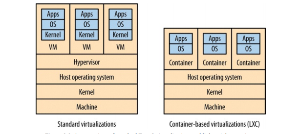
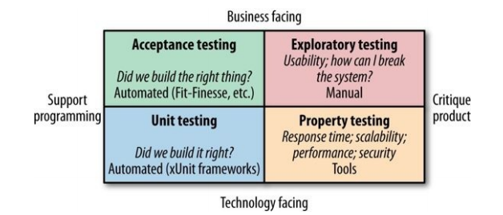
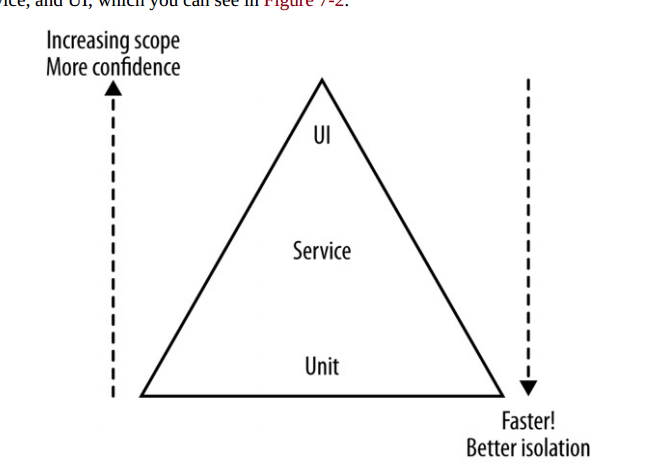

全书可以分为三大块：

1. `思想`：阐明微服务的意义，演化式架构师，微服务的基本原则以及_不适用_微服务的场景
2. `方法论`：如何建模（定义边界DDD）、集成、分解、部署、测试、监控、安全。涉及到微服务架构的各个方面。
3. `规模化微服务`：属于方法论范畴，但是我这里单独拿出来，它包括：康威定律、规模化指南。康威定律章节主要讲组织结构问题，规模化主要是讲微服务治理。

<!-- toc -->

 # 第一篇 思想

## 第一章 微服务

> 把因为相同原因而变化的东西聚合到一起，而把因为不同原因而变化的东西分离开来。

### 什么是微服务？

作者这里只用了一句话解释微服务：微服务就是一些协同工作的小而自洽的服务。因此微服务有几个关键点：

1. `很小而专注` 很小是多小？这个其实涉及到了微服务粒度，任何一个系统都没有一概而论的原则，多小就需要依靠我们的实践经验了。
2. `协同工作` 协同意味着耦合，微服务之间的耦合一般通过api定义进行解耦。那么微服务就是应该按照api进行划分么？作者建议我们应该用业务来划分微服务而不是仅仅从技术上。
3. `微服务是自洽的` 自洽实际上意味着我们的每一个微服务都是一个独立的个体，就像峰群中的蜜蜂一样，他们能单独维护，单独迭代，单独部署，单独测试，单独发布。这其实也就是意味着极低的耦合，只依赖接口。

### 微服务的好处是？

- `技术异构` ：极少的耦合意味着每个微服务都可以使用不同的技术栈实现，比如有的微服务使用java语言，有的使用go语言。
- `弹性` ：遇到故障的时候，能够将其像舱壁一样隔离，不会影响整个系统
- `扩展` ：遇到性能问题的时候，只需要横向扩展有性能瓶颈的服务即可
- `简化部署` ：修改服务内一小段代码，只需要发布该服务，不需要发布整个系统
- `与组织结构相匹配` ：可以看看后面的康威定律
- `可组合性` ：就是说单个微服务能够快速重用
- `对可替代性的优化` ：可替代性意味着重新再实现一遍微服务的成本非常低

### 与其他分解技术区别？

1. `SOA` ：微服务架构是SOA的一种特定方法
2. `共享库` ：适用于与业务无关的代码，比如StringUtils这种
3. `模块` ：可能更适用于传统软件，比如eclipse等

### 我的理解

微服务的概念实际上从名字就可以看出来，'微'意味着小和专注，'服务'意味着就需要自洽和被调用（耦合）。需要注意的是，微服务并不意味着没有耦合。

微服务之所以能够带来上述好处本质是因为：`小而精且独立`。代码规模小了，依赖少了，自然会有上述好处。但这也会带来诸多问题，后面书中会一一讨论如何解决，他们也即是微服务方法论的淫威所至。

针对书中与其他分解技术的区别，个人觉得不同技术方案适用于不同的技术场景，这个观点再平常不过了。微服务不是万能药。共享库和模块机制无法或很难解决微服务所面临的场景；同理微服务也无法或很难解决共享库和模块机制面临的场景，因此只有更合适，没有最合适。

现在回过头来想一想公司推行的dubbo，能够解决服务之间的依赖调用，但是对于技术异构这块，是否值得商榷呢？因为dubbo的出现就已经将你限定死了----你无法跨语言。再加上服务治理和应用中心的功能，框架耦合度实在是太强了。想想今日头条的thrift顿觉开朗。

## 第二章 演化式架构师

> 规则对于智者来说是指导，对于愚蠢者来说是遵从

作者很谦虚，开篇就说了本章内容是他自己的个人观点，让大家求同存异。

### 架构师是什么？

我们软件架构师与建筑工程师有很多方面是不同的，大部分人都误解了我们，因此我们应该重新定义架构师的含义。作者觉得软件架构师与城市规划师比较相似，他们都需要有一个`演化视角`，即架构师需要专注于一个大的方向上面，什么应该做，什么不应该做。让参与开发的人员与使用这个系统的用户一样开心。这很难，如何开始？分区！如同城市规划师，他关注城市划分的每一个区域，而不会关心区域中的一户人家。同理软件架构师应该关注区域间发生的事情，而不应该过多关注区域之间的事情。当然有的时候也要关注内部，比如我们不能允许团队选择10种技术栈，这样招聘比较困难。

### 原则性方法？

1. 技术选型应该与公司战略目标一致
2. 将系统的设计原则摆在明面上，时刻牢记
3. 通过实践保证原则能够得到实施，并巩固原则
4. 实践与原则相结合

作者给了一个真实的表格，我觉得很有参考价值，不过，在中国公司真的能行得通吗？

### 要求的标准是什么？

- `清晰的监控` ：比如用graphite收集指标，nagios检测健康状态
- `标准的接口` ：选用几种即可，如何处理版本，如何处理url规范
- `架构的安全性` ：比如标准的返回码，异常的处理，连接池，熔断器等等

### 如何治理代码？

有的时候，达成共识是个好主意，但是花时间保证人们遵守这个共识就没那么有趣了。作者根据实际经验给出了两个比较奏效的办法：

- `使用范例` ：给出你规范的示例代码，注意一定要是生产环境下的，可用的。程序员都喜欢看代码。直观！
- `剪裁服务代码模板`：给一个代码模板大家都用一套模板即可，这也在一定程度上规范了代码。

### 架构师如何看待技术负债？

架构师应该从更高的层次出发，理解如何权衡负债和紧急特性的取舍。应该维护一个技术负债列表，定期回顾检查。

### 架构师如何团队建设？

作者给了一个类比，讨论架构师对一个团队的影响和团队的自主话语权之间的思考。他就像教小孩骑自行车一样，小孩子初学骑车很容易摔倒，如果你每次都去搀扶他，他始终都学不会。如果当他骑向川流不息的马路和池塘时，你就需要马上抓紧他们。架构师和团队就是这样的关系，即使你是对的，也有可能会破坏与团队的关系。所以，架构师不容易啊！这种拿捏的度，需要多少工作经验积累啊！

### 我的理解

如果说上学那会，我一定会说这一章太没意思了，根本看不懂。工作了几年以后，各种事情见得多了，也就与作者产生了共鸣，又顿觉醍醐灌顶。就拿代码治理来说，我也曾制定过一些规范，会议上大家都是一致赞同，而实战中却又没有几个人能够严格遵守。现在回过头想想，我们将前后端接口格式定义为一个JsonData模板类是多么的明智。这正好用了作者所提出的剪裁服务代码模板。

关于技术负债我也感同身受，有一次技术需求，我们将系统中所有的@Autowired改成了@Resource注解，这样我们能够统一使用JSR标准，避免各种注解的滥用。但是QA不愿意了，他说你们这么做没有意义。实际上作者已经给出了我的回答----定期检查技术负债，避免系统负债越积越多！

## 第十二章 总结

这里我们将总结提前了，因为我觉得这个应该放到思想里面。微服务的原则：

1. 围绕业务概念建模
2. 接受自动化文化
3. 隐藏内部实现细节
4. 让一切都去中心化
5. 可独立部署
6. 隔离失败
7. 高度可观察

什么时候你不应该使用微服务？给你看一个Martin Fowler的对比图：

# 第二篇 方法论

## 第三章 服务建模技术

> 细胞只所以存在，是因为细胞膜定义了什么在细胞内，什么在细胞外，并且确定了什么物质可以通过细胞膜。

### 什么是好的服务？

本章核心内容是教我们如何对服务进行建模，在讲如何建模之前作者先提出了一个问题----什么样的服务是好服务？然后给出了我们常见的两个概念，`松耦合`和`紧内聚`。为了保证松耦合，实际上我们应该去限制两个服务之间的调用形式数量，减少他们之间的直接通信。针对紧内聚，我们希望把相关的行为聚集在一起，把不相关的行为放在别处。

### 界限上下文

作者提出了一个限界上下文的概念，根据Evans在《领域驱动设计》所描述：任何一个给定的领域都包含多个`限界上下文`，每个限界上下文中的东西分成两个部分，一部分不需要与外部通信，另一部分需要与外部通信。我个人觉得说的挺废话的，但是往往玄妙就藏在这种废话之中。大自然也是如此，细胞只所以存在，是因为细胞膜定义了什么在细胞内，什么在细胞外，并且确定了什么物质可以通过细胞膜。

在不同的上下文之间，实际上是存在一个`共享模型`的，这种模型能够隐藏两个上下文中的内部详细信息。我觉得有点类似我们REST接口的`传输对象`（DTO），这种传输对象就是一种共享模型。

作者觉得服务不应该过早的划分，过早划分的代价非常高，团队应该能准确识别出非常稳定的边界之后，在将单块系统拆分成微服务。对于单块系统，我们可以先通过模块机制划分层次，然后在进行微服务拆分，这样效果更好。

### 关于技术边界

作者给了一个他们之前遇到的实际例子，说明他们那个架构是`洋葱架构`，因为有很多层，而且当纵切这些层时，他只想哭。这说明：_我们应该谨慎采用技术边界划分_。除非你的划分是合理的，比如想达到某个性能目标。

### 我的理解

这里我忽略了一些其他章节，就挑主要的说，对我个人来讲，界限上下文的概念，还有那个细胞的比喻，以及共享模型，都是比较有意思的。共享模型我们比较常见，比如给前端传递信息的json数据，这个json数据的格式其实也是一种共享模型，或者我们在dubbo接口的时候使用AO对象，其实也是共享模型，他隐藏了我们底层的数据结构，这样两端可以独立变化，直接把共享模型想象成一座桥也是很贴切的。这章的本质内容就是如何识别微服务边界。

## 第四章 集成

> 唯一不变的就是变化

作者认为集成是微服务相关技术中最重要的一个。好则自洽，不好则懵逼。实际上集成技术，你可以理解为微服务和微服务之间的通信技术。

### 协议选型的原则？

针对微服务之间的通信，我们有很多协议：SOAP，REST，PB，JSON，XML等等，那么选择这些技术的理由是什么？或者说我们选择他们是为了什么？有哪些原则需要注意的呢？

- `避免破坏性修改`：比如服务端加了一个字段，客户端不升级的话就完蛋了。这种就是破坏性修改，不过一般序列化协议能够支持字段的增加和删除，对于类型修改就无能为力了。
- `保证API的技术无关性`：比如rest+http就可以保证技术无关性，但是dubbo目前就不行。
- `使你的服务易于消费方使用`：理想情况下消费方应该可以使用任何技术来实现。
- `隐藏内部实现细节`：这个就不用说了，所有倾向于暴露内部实现细节的技术都不应该采用。

这些是基本原则，有些我们都比较熟悉，有些也值得我们思考。比如上述的保证技术无关性就值得思考。我们公司大力推行dubbo，阿里巴巴也是，各个公司都在推行。仔细想想dubbo其实制约了技术更新换代以及将业务线绑死到了java技术栈上。从长期来看不利于系统技术探索。

### 共享数据库可以吗？

可以，但是不好。作者觉得共享库会产生_重度耦合_，因为数据库表是最底层的业务抽象了，他的变化会严重导致直接依赖的系统的变化，比如新增字段，变更字段等。但这里我觉得应该为这种模式平反一下。在业务早期，我们是可以有节制的可以采用这种模式的。多个服务依赖相同的数据库，但不一定是依赖同一张表或者同一个schema。不过，在系统规划的早期就应该用业务区分开来哪些是未来可能要单独迁移出去的表，哪些是需要放在同一个业务内的。以后随着业务的发展，再慢慢的将他们迁移出去，使用服务接口调用形成依赖，以进一步减少耦合。

### 是同步还是异步？

api的调用分`同步调用`和`异步调用`，基于事件的调用天生就是异步的。使用同步调用和异步调用，或者事件机制，都不是限定死的，要看场景。这个作者也说了。没有必要再过多的解释。

### 编排还是协同？

`编排`的意思是使用一个服务，调用多个其他服务，协调整个业务流程，这个可能出现的问题是下游服务变成单纯的CRUD的`贫血模型`了。这个不难理解，因为你的业务逻辑上移了，下游就非常有可能沦为DAO层。

`协同`的意思就是事件机制，一个事件发送到事件队列，其他服务消费这个事件（有序或者无序）。这就是所谓的`架构反转`。非常流行的一种架构模式。

举一个下单的例子，一个用户下单，会触发以下服务：①订单服务增加订单，②库存服务减少库存，③短信服务发送短信，那么针对编排就是一个下单服务，顺序调用订单服务，库存服务，通信服务；如果是协同，就是下单服务发送一个事件，然后其他服务去消费。协同模式能够很大程度上的解耦，扩展性也好，但需要一个靠谱的中间件，比如我们qunar的QMQ。

### RPC会有什么问题？

RPC是我们比较常用的技术，比如dubbo框架就是一个RPC框架，JMI、thrift等等。但是我们经常使用的RPC框架在实现微服务的时候会有什么问题呢？

- `技术耦合`：比如DUBBO，绑死到了JAVA技术上。但是可以通过代码生成机制解决这个问题。
- `本地调用和远程调用`：很容易让人误用，将远程调用当成本地调用，从而造成性能问题。
- `脆弱性`：想想接口变动的兼容性问题吧！这个时候你需要所有客户端都需要生成一遍代码。

上述问题，并不意味着RPC很糟糕，对比数据库集成方式，RPC显然有很大的提高。不过我们要使用，也要有所保留，需要读者注意。

### REST好不好?

先来明确`REST`跟`HTTP`是不同的，很多人提到REST自然想到HTTP，HTTP就是一个协议承载体，REST也可以通过其他协议实现（`USB`)，只不过使用HTTP去实现REST要简单的多了。同时HTTP生态中有大量的工具给你受用，你能更方便的开发和调试。

作者提到了`超媒体`作为程序状态引擎，实际上这里的思维是将写死的API变成`动态API`。这是需要提供中间层的，这个中间层其实就是类似一种发现机制。link标签就是这种思想的很好体现。

使用json还是xml？作者喜欢xml，并且给了几个原因，但大多说人还是喜欢用json，它处理起来太简单，太方便了。这里我补充一下，大家喜欢json的另一个原因是他可以很好的在`javascript`下使用。

当然，REST还是有其缺点的，比如：

1. 无法生成客户端的桩代码
2. WEB服务框架无法很好的支持所有HTTP动词
3. 性能会有问题，想想最新的HTTP2吧
4. 高级的序列化机制得我们自己搞了

### 基于事件机制好不好？

RPC和REST都是采用的`请求响应模式`。事件机制是另种集成模型，也是作者非常推崇的模型。主要可以从两个方面去考察这个模型：服务发布，服务消费。由于事件机制我们太熟悉不过了，这里就不啰嗦了。作者的主要观点就是事件机制很好，但`异步架构`真是挺复杂的，想想各种消息队列的实现，都是面对不同的业务场景，kafka，rocketMQ，QMQ，RabbitMQ，ZeroMQ等等，你需要根据不同的场景合理使用事件机制。

`服务即状态机`的观点其实也是很容易理解的。每个服务都是维护自己的那些状态，并通过外部作用改变其状态。

`RxJava`是响应式扩展的java实现，本人学过一些，不过没有在实际中使用过。不过它比较适用于类似GUI的场景中，比如android的各种控件事件的处理等。能把观察者模式玩的如此之炫，也是很让人佩服的。

### DRY原则可以用在微服务吗？

不一定可以。为什么这么说，大家都知道应该避免重复代码，将每个服务的公共代码都抽出来形成一个共享库。好，但是也不好。好是其避免了重复代码，不好在于，共享库引入了耦合。一旦共享库有了修改，那么所有服务都可能要跟着升级。这种情况已经在现实工作中遇到不止一次了，有人觉得我们应该把`ORM对象`单独一个jar包中，然后每个项目都引用它。可是一次又一次的升级和重新部署证明这种方式不靠谱。更靠谱的方式是每个项目维护自己的实体，单独升级，单独修改。因此，在微服务设计中，我们应该尽量避免共享库的存在，适当的违反DRY原则。有些通用工具确实可以单独抽象出来，比如类似`apache-commons`或者`guava`。

关于客户端库的使用，作者建议不要把业务代码写到那里面，只提供协议封装、服务发现、网络通信等。这个是很自然的。各种RPC框架也都这么做了。

### 按引用访问时什么？

`按引用访问` 开始有点不明白，这里我给你举个例子就懂了。一般电商的产品发货后都会发邮件通知，一般做法是调用api，其参数有：地址、姓名、订单信息等。然后发邮件服务将这些信息入队列，之后再异步发送。但是在队列等待处理的时候，是不是有可能用户修改了电子邮件地址呢？这个时候再去发送邮件就会有问题了。因此正确做法是将调用参数保存邮件地址的引用，当真正发送的时候，在通过这个引用对信息做反查，找到邮件地址在发送。这个想法挺赞的，我以前真没有想过这个问题。

### 如何进行版本控制？

多版本兼容性一直都是服务化最头疼的事情，服务端升级了版本，我们应该尽量向下兼容。有时候可能会产生破坏性修改，这种修改无法兼容原有接口，比如原有接口中删除了一个还在使用的字段。作者给出了几种解决方案：

- `尽可能推迟` 你最好不进行破坏性修改，比如你要删除字段，那么你还是别删除留着吧，你要修改类型，那么你还是增加一个字段吧。
- `及早发现破坏性修改` 比如对于一个不用的字段，赶紧删除，千万不要暴露出去，作者强烈建议使用`消费者驱动契约`来及早定位这些问题。所谓消费者契约就是说，要听乙方的。呵呵。
- `使用语义化版本控制` 比如1.0.0，大版本小版本，有什么意义，修bug是1.0.1，新特性1.1.0，大改动2.0.0等等
- `不同接口共存` 这个挺实用的，意味着多接口，单实现。我用的比较多，尤其针对不同既有www，又有touch app 微信等等。
- `多个版本的服务` 这个在做新老系统迁移的时候常用，类似灰度，保留新老两个接口和实现，当发现老接口没有人用的时候，再统一删除。

### 用户界面？

实际上名字不太好理解，用户界面就是说，如何组合API，然后提供对用户提供统一输出（比如界面）。这也有几种方式，我们最常见的当然是ajax，由js直接通过ajax调用，然后在前端进行数据组合。不过这里有几个人问题，跨域和性能，这可以通过`api gateway`解决。还有一种做法是UI片段组合，比较适用于`CMS系统`，输出的就是一个渲染好的页面，或者是其一部分。他的问题在于`样式一致性`。

另一种方案，也是我们目前MICE采用的，就是为前端服务的后端，也叫`大前端`。一般这个为前端服务的后端可以使用`node.js`，来组合各种API，静态化页面等。不过我们目前流量比较小，看不出什么问题，不知道在对大流量高并发支持上面是否靠谱。在平常开发中这种模式还有有一个弊端：非常不方便调试。因为你在本地需要部署多个环境，node+tomcat。因此只能去调试接口，集成测试恶心死了。还有一个就是查问题不方便，你需要多定位一层。当然最后作者提出了混合方式，这个不多说了，具体问题具体分析。

### 如何与第三方软件集成？

这里说的第三方软件集成，比如CMS，发布系统，人力资源系统等等。作者有一个观点：_如果某个软件非常特殊，并且它是你的战略性资产的话，那就自己构建，如果不是这么特别的话，那就购买。_

针对购买的系统，我们做持续集成真的很恶心，想一想公司的wiki，想修改个bug都难。不过`jenkins`这种开源软件，我们也有可能面对这种问题，虽然是开源的，但是水深也需要有人去趟。因此作者给出一个好办法，就是把这种可定制的系统封装起来，通过提供api，不暴露实现。作者屡试不爽。或者采用`绞杀模式`（Strangler Application Pattern）其实就是拦截接口调用，把他们打到新系统上。

## 第五章 分解单块系统

> 关键是要在拆分这件事变得太过昂贵之前，意识到你需要做这个拆分

先说一下本质。为什么要分解单块系统？是因为他太大了，造成很多问题（后面会说），那么大了自然就要分，现实中也是这个样子的，组织大了，要划分成小team；国家大了要分成省州。我们也希望系统的架构随着时间的推移做增量的变化（不变化意味着你的业务完蛋了），关键是要在拆分这件事变得太过昂贵之前，意识到你需要做这个拆分。

### 拆分的关键与原因？

拆分的关键是`接缝`，我的理解接缝就是一个切面，这个切面将系统一分为二，这两个一分为二的系统就是将来的两个服务。上面说的界限上下文就是两个非常好的接缝。那么如何找到这个接缝呢？一般我们可以通过语言的特性，比如java的包机制。因此我们在项目早期一定要做好包的划分，为拆分做好准备。

为什么我们要分解单块系统？一块不挺好么？作者认为有以下原因：

1. `改变的速度` ：意味着代码的快速迭代，单块系统后期极难维护，更别说迭代了。改个bug都改死你。
2. `团队结构` ：我的团队50人了，还能一起维护这一摊子代码吗？
3. `安全`：我有一些是需要加密保护的，我单独拿出来，可以做统一处理。
4. `技术`：不拆分难以试验新技术，比如我利用其它语言特性可以更好的解决一个问题，系统一大块，无法使用另一种语言，因此也难以实践新技术。

### 有哪些实践技巧？

作者认为数据库是你系统依赖杂乱无章的源头！我极其同意这个观点。因此作者建议在拆分服务的时候应该 _先从数据库入手，将数据库拆分之后，在着手分离服务_。除此之外，作者还给出了几个其他的拆分实践：

1. `打破外键关系`：这要求我们将join等操作干掉！然后通过接口形式交流。这会增加性能消耗？呵呵。
2. `共享静态数据`：对于一些共享的静态数据，比如城市信息，作者给了三个做法，我这里不说了，我个人觉得可以采用`submodule`，或者资源型jar包进行依赖，也可以做成一个单独服务（数据都走缓存）。
3. `共享数据`：其实作者这里的意思是垂直划分为公共服务，比如notify系统，供应商服务等等。
4. `共享表`：如果两个界限依赖同一个表，一个好的做法是拆成两个表，字段不同。

个人觉得这些经验确实值得借鉴，不过说起来容易，但是真正去做的时候，会遇到很多问题。比如管理上的各种扯皮，哎。

### 事务如何处理？

单块系统，同一个数据源，两条insert语句，可以放到一个事务中执行。拆分之后，分别放到不同的系统，不同的数据源，如何保证他们的事务性质？这个问题是典型的分布式事务问题。拆多个系统就有这个问题，对于分布式事务，几个办法：2pc 3pc pazos totem gossip raft，算法太复杂，我们一般用`最终一致性`，或者采用幂等+异常重试。这里这里就不举具体例子了。除非你有类似QMQ这种可靠消息队列，或者你有事务补偿机制。

现在想来，公司的QMQ真的是意义非凡！

### 报表如何处理？

这里的内容我不是特别理解，因为没有做过相关报表的工作，这里建议你阅读原文，我只是单纯的罗列作者的思想。单块系统报表很好出，因为一个数据库，直接来了。现在多数据源，如何做？作者给了几个办法：

1. `通过服务api`：对于小规模数据，没问题；大规模数据，这种实时调用不现实。
2. `数据导出`：比如我们做离线库，将数据都汇总到一个地方，然后在这里出报表。
3. `事件数据导出`：基于增量信息，比如事件。
4. `aegisthus`：开源解决方式

## 第六章 部署

部署的概念大家应该都比较清楚了，从代码开发测试完毕后，自动化测试、合并到主干，发布到生产环境等等一整套的发布操作。在微服务化之后，部署方式上都有哪些需要注意的事情呢？这个就是本章作者想要告诉我们的。

### CI的好处是什么？

作者说明了CI的概念，`Continuous Integration`，持续集成，将新代码与已有代码进行集成，让所有人都保持代码同步。CI的输出，我们也称之为构建物`artifact`，使用CI也有很多好处，比如能够对代码质量进行某种程度的反馈（比如我们的`sonar`检查等等。但是大多数人根本不知道自己是否在做CI，Jez Humble提出三个问题用来测试别人是否真正理解CI：

1. 你是否每天签入代码到主线？
2. 你是否有一组测试来验证修改？
3. 当构建失败后，团队是否把修复CI当做第一优先级的事情来做？

### 微服务架构下如何做CI？

所谓的微服务架构做CI集成，简单理解就是：我们划分后的每个微服务如何发布到上线。作者提出了几个方案:

1. 单库单构建：代码库统一放到一起，CI构建也只有一个，但是这样有一个问题就是，每次修改代码都需要将所有代码部署一次，比较慢，浪费资源。
2. 单库多构建：同一个代码库，但是不同的CI监听代码库不同部分。
3. 多库多构建：这个就是多个代码库，分别构建，最常用的方式

### 关于平台构建物？

不同的技术栈都有不同的二进制输出，比如jar、gem、egg等等，当混合不同的构建物进行部署会很复杂，作者觉得可以使用类似`chief`、`puppet`、`ansible`等，他们支持一些通用技术栈的部署。同时还有一种操作系统构建物，比如`RPM包`、`MSI`、`APK`等等，作者觉得使用这些平台构建物可以避免多种技术栈下的异构构建物所导致的问题。

除此之外还有一种技术手段叫做`定制镜像`，因为使用ansible这种工具最大的问题就是需要花费大量时间在机器上运行脚本。我们不如使用定制化的镜像，这些镜像本身就已经带有这些软件，然后将定制化镜像直接运行在虚拟环境下（虚拟机或者容器）就可以了。这么做的本质是：将构建物向上包装。比如我们的war包，原来的做法是war作为构建物，部署在主机上。现在我们把整个环境都作为构建物（war+tomcat+os），并部署在虚拟环境中，这省了很多事，也方便未来的快速部署和动态扩容。不过使用定制镜像的一个问题是，有人登陆到镜像系统中修改了相关配置，这样就使得镜像中的配置和源代码管理中的配置不在一致，这个叫做`配置漂移`。我们可以使用禁用SSH等手段，使其变成`不可变服务器`从而避免配合漂移。

针对环境问题，作者有一个核心观点：不同环境（beta,prod)之间需要`最小化环境配置差异`。这个观点太重要了，试想，如果beta环境和线上环境一模一样，那么我们在beta上测试通过，就可以直接部署到prod下，无任何环境上的后顾之忧。但现实是不可能的，因为至少生产环境和测试环境下的数据库地址是不同的，所以我们只能尽量缩小他们之间的配置差异。

### 微服务与主机如何映射？

微服务与主机之间的映射，就是二者的对应关系：

1. 一个主机部署多个服务：一台机器上面部署多个服务，不好，各种问题，监控、部署、自治性、扩展性等等。
2. 使用应用程序容器：比如一个java servlet部署5各java服务。不好，也是各种问题，安全性、性能等等。
3. 每个主机一个服务：每个主机都只部署一个服务。非常好。

每个主机一个服务，作者认为这个是最好的方式，其实也是我们工作中最常用的方式。不过他有两个问题，一个是资源消耗大，一个是管理主机麻烦。针对管理方式，作者给了几个办法，一个是使用PaaS，通过类似`Heroku`工具帮助我们进行主机的管理。还有就是我们应该通过自动化脚本来做日常运维，这也就是现在各大技术论文博客吵吵的自动化运维所说的`自动化`。自动化一切！

针对资源消耗大，我们通过虚拟化技术解决这个问题。虚拟化技术分为两种类型，一种是类似AWS，WMVare，Xen，KVM；一种是基于容器的虚拟化（LXC）。针对docker，我们可以使用类似mesos或者coreOS这种专门为了虚拟化而定制的操作系统进一步提高资源利用率。

## 第七章 测试

### 测试有哪些类型？

作者给出了Brain Marick的`测试象限`，我觉得蛮有意思的，这里给出来贴图。

### 测试范围是什么？

作者给出了《Scrum敏捷软件开发》中的`测试金字塔`。这个测试金字塔模型大家也比较熟悉了，从塔尖到塔底分别是：用户界面测试，服务测试，单元测试。从上到下测试的范围越来越小，但是速度越来越快。

那这三种测试如何权衡呢？测试金字塔的关键是，为不同目的选择不同的测试来覆盖不同的范围。他们是有一定经验比例的，一般顺着金字塔向下，下面一层的测试数量要比上面一层多一个数量级。

### 每个部分如何测试？

`单元测试`，作者没有说太多，我只说xUnit对于业务线来说，很难维护。`服务测试`是蛮重要的一种测试，他的关键点在于需要对每一位下游合作者进行打桩或者mock。说白了就是要保证外部服务是稳定的，我们默认外部服务稳定后，才能专心针对这个服务进行测试。作者对于mock还是打桩做了对比，他更倾向于打桩。无论是打桩还是mock，Martin Fowler把他们都称为`测试替身`。作者还给`mbtest`打了一个广告，我没有具体使用过这个工具：[mbtest.org](www.mbtest.org) 大家有兴趣可以试一试。

针对端到端测试（金字塔最上面），作者给出了很多缺点：

1. 测试比较脆弱，会引入过多的失败可能性，因为你系统多了。
2. 谁来编写测试？职责不明确，可以联合负责。
3. 测试时间太长，不好把控
4. 测试用例大量堆积，还没人敢删
5. 元版本管理不好弄

除了这些缺点外，作者还给了一些建议，比如：

1. 测试场景，而不是测试故事，这个很容易理解。
2. 使用消费者驱动测试，`CDC`，Consumer-Driven Contract。`pact`工具，挺复杂，没有用过，有兴趣的可以玩玩。
3. 消费者和生产者要有良好的沟通

### 其他方面

除了以上内容，作者又讲了`金丝雀发布`，我觉得应该就是我们平常所说的ABtest，他跟蓝绿发布（灰度发布）不太一样，主要区别就是新旧版本共存时间不同，金丝雀共存的时间更长一些。这两种我都在实践中搞过。灰度主要用来做一些大影响的发布，ABtest主要是用来评估搜索算法的好坏。

然后作者有说了`MTTR`和`MTBF`之间的权衡问题，以及其他跨功能的测试，比如性能测试等。这些测试平常也都有做过。大部分观点也都轻车熟路，因此不做总结了。

## 第八章 监控

在单机单服务下的监控，不算复杂；拆分成微服务后，形成大量的小集群，这种监控就要命了，作者在这章主要介绍了细粒度系统监控和故障定位所面临的挑战。其实本质思路很简单：_监控小的服务，然后聚合起来看整体_。这似乎也就是为什么公司又cacti迁移到watcher上的原因。watcher是我们qunar的内部系统主要由graphite、grafana、nagios进行搭建。

### 监控面对的模型？

作者觉得监控所面对的模型可以分为以下三种：

1. 单一服务，单一服务器
2. 单一服务，多个服务器
3. 多个服务，多个服务器

### 日志如何查看?

多服务多服务器模型下，日志聚合查看变得很麻烦。针对单机情况下，我们可以直接到机器上grep日志。但是如果一旦集群规模变大，这种查看就是不靠谱的，在qunar有`atnodes`脚本，他可以在跳板机上聚合多个服务器的日志。但更好的办法是使用类似ELK的工具，做日志的聚合。这样通过统一的平台进行聚合查询。

### 监控指标？

作者认为，针对微服务的监控有以下指标：

1. `系统指标`：比如cpu 内存等，这些可以collectd进行收集
2. `服务指标`：比如接口调用次数，线程池空闲线程数等
3. `语义指标`：类似业务指标，比如订单量，活动用户数等。

### 服务追踪？

作者叫做`关联标识`，其实就是`服务追踪`。因为微服务化后，各种系统之间的调用关系很复杂，因此排查一个问题会比较难受，你不需要一个系统一个系统去找问题。所以服务追踪就变得非常关键。他能够追踪一次会话的所有调用，哪里有了问题，一目了然。我们qunar有自己的`qtracer`，开源有`zipkin`和`pinpoint`，都是参考谷歌的`dapper`论文。这里我就不多说了，有兴趣的可以去参考一下这篇论文。

### 其他一些建议

1. 标准化：将监控api标准化。
2. 考虑受众：谁看？运营还是开发？
3. 更加实时：监控应该具有实时性，出问题第一时间反应。
4. 避免级联危险：可以使用hystrix。

## 第九章 安全

关于安全方面的内容不是一句话两句话能够讲的完的，作者这里也仅仅给我们几个主要的选项，方便我们进一步的深入研究。

### 身份验证和授权

`身份验证`和`授权`是安全领域的核心概念。身份验证一般使用密码体系，但是我们不喜欢每个系统都要单独登陆，那样太麻烦了，因此`SSO`就变得非常重要。作者给了常见的单点登录的实现，比如`SAML`、`OpenID Connect`等。其本质就是访问一个资源的时候，把你重定向到一个授权验证服务网关，然后你进行登陆。之后这个网关会告诉你需要访问的服务，这个人身份验证通过，可以继续访问。作者也讲了单点登陆网关的弊端，比如单点问题，一旦网关死了，什么都玩完了。作者给了一个建议就是千万不能让这个网关层承担太多的功能，不然他最终会变成一个庞大的耦合点，并且功能越多，受攻击的面也就越大。

除此之外，作者有两个观点我比较赞同，其一是`深度防御`的概念，从网络边界，到子网，到防火墙，到主机，到操作系统，再到底层硬件，你需要在所有这些方面都实现安全措施的能力；还有一个是你应该倾向于使用粗粒度的角色，围绕组织的工作方式进行建模。

### 服务间的身份验证和授权

上文我们谈到的身份验证和授权的主体（`principal`）是人。这里的主体则是服务。有几个方案可以使用：

1. 在边界内采用隐式信任模型，这个目前也我们MICE采用的。简单，不安全。
2. 使用HTTPS，弊端挺多。
3. 使用SAML或者OpenID Connect企业级方案，有缺点。
4. 使用HMAC，AWS用的方案，也有三个问题。
5. API秘钥，作者很推荐，这个也是我们接入微信啊，其他服务啊啥的通用做法。

上面具体有什么缺点，还是希望你能阅读原文。

### 静态数据的安全

这里的静态数据安全，实际上主要是对静态数据进行加密保护。这也是我们业务系统经常干的事情，比如对数据库中手机号进行加密，对服务器上日志中用户信息进行加密等等。作者给了几个建议：

1. 一定要使用众所周知的算法，你自己做的算法不靠谱
2. 加盐做HASH，一定记得加盐
3. 使用安全的秘钥库来存储你的秘钥
4. 按需加密，有的你不需要加密就别加密了，很浪费你知道么
5. 注意加密的备份，加密也是需要有备份的，当然这个备份也是加密的。

### 深度防御

1. `防火墙` 比如iptables等，具体实践中都会采用，比如数据库白名单。
2. `日志` 好的日志方便排查问题，但注意敏感信息加密。
3. `入侵检测和预防系统` IDS，我没有用过。不太懂。
4. `网络隔离` 比如办公网VPN等。
5. `操作系统` 定期打补丁，无论是os还是三方软件，还记得openSSL的漏洞么。。。

这里我推荐一本书：[白帽讲web网络安全](https://book.douban.com/subject/10546925/)

### 其他方面

1. 保持节俭
2. 人的因素
3. 黄金法则
4. 内建安全
5. 外部验证

# 第三部分 规模化微服务

## 康威定律和系统设计

梅尔康威于1968年4月在Datamation杂志发表How Do Committees Invent的论文指出：

> 任何组织在设计一套系统（广义概念上的系统）时，所交付的设计方案在结构上都与该组织的沟通结构保持一致。

比如，雷蒙德在《新黑客字典》中总结这一现象时指出："如果你有四个小组开发一个编译器，那么这个就是一个四步编译器"

本质就是组织架构会影响软件的结构。我们大致可以分为松耦合组织和紧耦合组织，紧耦合组织的一个代表就是商业产品公司，他们所有员工都在一起工作，有着统一的愿景和目标，而松耦合组织的典型代表就是分布式开源社区。作者列举了很多例子证明这个定理是有效的。

### 针对组织的一些思考

作者对组织和系统架构做了一些思考，并列举了几个常见的场景：

1. 适应沟通途径，实际上地域和时区界限，使得团队之间非常难于进行细粒度的沟通。因此创建系统的开发人员之间存在地理位置的差异，是一个应该对服务进行分解的很明显的信号，一般来说，你应该分配单个服务的所有权给可以保持低成本变化的团队。哎，支付宝经常出差，是不是跟这个有关？
2. 关于服务所有权问题，所有权程度的增加会提高自治和交付速度。
3. 服务共享的原因：难以分割、特性团队、交付瓶颈

### 内部开源

如果我们尽了最大努力，但是仍然无法找到方法来避免共享几个服务怎么办？拥抱内部开源模式可能更合理。在标准的开源项目里，一小部分人被认为是核心提交者，他们是代码的守护者，这些人应该花费大量精力与提交者进行清晰的沟通，并对他们的工作方式进行引导。并且当代码成熟稳定了之后再进行开源，这样会给别人一种很好的规范。

quanar的一些系统中间件开始的时候是打算采用内部开源方式，但是发现代码被泄露，风险很大，所以，又进行了闭源。之前我一直觉得david关于公司开源项目的看法是非常正确的，他不反对开源，但也不鼓励，除非你能把项目维护好。但是我到今天又由了一个全新的认识：公司将自主研发的软件开源出去有一个非常重要的好处，就是对员工技术成长有非常大的帮助。因为内部员工可以参与到自己公司的框架研发当中，并且再找另一份工作的时候，也是重要的闪光点。所以我觉得公司可以搞两个版本，一个是开源版本，一个是内部版本，开源版本交给社区维护，有好的特性可以merge到内部版本中，内部版本的特性可能更加业务化。

## 规模化微服务

微服务多了，怎么办？数以百计的微服务，比开发都多，如何管理？有什么应对模式么？这是本章核心话题。

### 关于故障的思考？

规模化后，故障不可避免，所以，_不要在使用流程和控制来试图阻止故障发生上花太多心思，而是要想想如何第一时间从故障中恢复出来！_

你需要了解你可以容忍多少故障，或者系统需要多快，这取决于系统用户。这其实是说我们对不同系统的HA要求是不一样的，不是所有系统都需要HA，因为HA会花费你大量的经历和时间。有以下几点我们可以去衡量：

1. `响应时间/延迟`： 这个是我们队系统的性能指标要求。
2. `可用性` ：这个是系统可用性衡量，比如就一个10几个人使用的内部系统来说，显然可用性要求显然要比日活几亿的支付系统低很多。
3. `数据持久性`：是保存几天，还是几年？这也对方案产生很大影响。

那么有哪些方案，或者思考角度值得我们注意呢？作者给了几个：

1. `功能降级`：出现问题的时候，对一些不太重要的周边系统是可以进行降级的，比如推荐系统出了问题，那么我就不推荐了。但不会影响下单支付的核心流程。
2. `安全性架构`：正确设置超时、舱壁隔离、断路器。
3. `反脆弱`：《反脆弱》作者Nassim Taleb认为事物实际上受益于失败和混乱。因此netflix搞了一个什么混乱猴子活动，每几天自己让自己故障一把，看看硬度如何？有一些应对措施：超时、断路器、舱壁、隔离
4. `幂等`：这个不多解释了。很容易理解，幂等设计在重试中有很大优势，从而完成事务补偿。

### 关于扩展的思考？

针对扩展，作者觉得有两个原因导致我们去扩展系统，其一是为了帮助处理失败；其二是为了性能扩展。那么就有如下的方式去做扩展：

1. 更强大的主机：`scaleup`不多说了
2. 拆分负载：负载均衡即可
3. 分散风险：异地多活等，虚拟机不要在同一个物理机上
4. 重新设计系统：微服务对于重新设计和重新实现很友好
5. 扩展数据库：有很多方案，扩展读（主从）、扩展写（数据分片，多主结构比如PXC，nosql方案）。注意尽量不要将多个模式schema放到一个数据库中，以避免风险

### 关于缓存的思考?

作者讲了客户端、代理、服务端缓存，还有http缓存，这些内容比较熟悉，就不多说了。使用缓存有几个目的：

1. 为了读而使用缓存，很常见，99%都是这样，
2. 为了写而使用缓存，减缓写压力，异步同步到数据库
3. 为了弹性使用缓存，兜底数据
4. 隐藏源服务

作者认为缓存应该尽量保持简单，以避免一致性恶心死人。缓存很强大，但是你需要了解数据从数据源到终点的完整缓存路径，从而真正理解它的复杂性以及使它出错的原因。关于如何避免`缓存击穿`，`惊群效应`等问题，有一篇美团的文章说的很不错，有兴趣的可以看一下。

### 关于自动伸缩的思考?

对于使用伸缩性来动态调节系统主机集群数量，作者是保持肯定态度的，这会节省成本。并且在访问高峰期防止集群崩溃。但伸缩性我们需要有一个比较好的`预测模型`，这就需要对你的业务和市场有一个很好的把控。比如新闻网站早上7点到10点访问量最高，微博晚上8点访问量最高等等。

然后作者讲了`CAP`定理，这个我也不啰嗦了，大家对此很熟悉了。不过这里针对为什么选择AP，舍弃一致性有一个我没有见过的思想：现实世界的不确定使得真正的一致性是不存在的。比如披萨，库存是100，你卖了一个，现在是99，但是送货员在路上把披萨不小心撒到了地上，那么实际上现在库存应该是98了。

### 关于服务发现的思考?

这块实际上跟我们的SOA中的概念有很多相似之处：`服务发现`和`服务治理`。服务发现能够使得服务调用者与服务地址之间解耦，可以避免硬编码，让服务地址的变更变得更加透明化。服务治理可以将微服务动态上下线，以及查看我们目前微服务的数量，部署情况，等等。

关于服务发现，作者给了几个服务发现的技术方案：

1. DNS，不过DNS最终一致性模型，响应变更太慢。
2. 动态服务注册，`zookeeper`、`consul`、`etcd`等等，

我们见过大部分系统使用的是zookeeper，因为他是java写的，可以非常好的跟java技术栈相结合。但是我个人觉得单纯从服务发现功能来看，consul更牛逼一些，他提供restful接口，这意味着对其他技术栈也是非常友好的，同事他提供了一个现成的DNS服务器，这意味着使用DNS做服务发现的系统可以无缝直接迁移到consul上，不需要修改代码。

### 关于文档的思考?

微服务多了，别人怎么用呢？他们需要查看api文档，作者给了两个技术方案，一个是[Swagger](http://swagger.io/)，一个是HAL和HAL浏览器。这个其实都是Martin Fowler提出来的`人文注册表`(`Humane Registry`)概念，蛮有趣的。

swagger这个东西我没有尝试过，不过去他们的官网看了一下，感觉还是蛮靠谱的，有机会一定要把他带到项目中尝试一下。反观TC的服务治理平台，我觉得对api文档的重视程度不够，应该提供一个统一的api文档平台。

# 扩展资料

Martin Fowler给微服务泼冷水的两篇文章：

- <http://martinfowler.com/bliki/MicroservicePrerequisites.html>
- <http://martinfowler.com/bliki/MicroservicePremium.html>

infoQ上的一篇不错的文章：

- <http://www.infoq.com/cn/articles/every-architect-should-study-conway-law>
