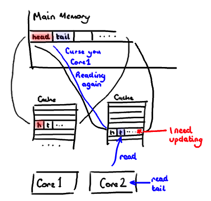
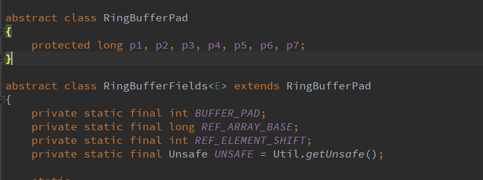
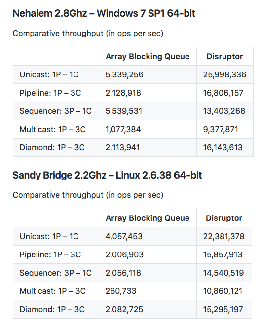

> 好不容易发现了自己的平庸，但却为时已晚，这才是最残忍的事啊。

周末在家闲来无事，翻看技术文章，发现一个叫做`disruptor`的高性能内存队列占据了头版头条，好奇其高性能的秘密，于是对该框架进行了一些简单的研究。disruptor并非新出，而是从2013年到现在经历了3个大版本的迭代。本文有如下几个部分：

1. disruptor如何使用？
2. disruptor高性能的秘密？

## 如何使用

核心概念：

1. EventFactory：用于生成一个事件提供消费者消费
2. EventHandler：消费者处理器
3. 事件和生产者：无内部接口，可以自己封装实体对象和RingBuffer
4. RingBuffer：核心数据结构，可以理解为环形缓冲，disruptor高性能秘密
5. WaitStrategy：消费者阻塞时候的等待策略：`SleepingWaitStrategy`,`BlockingWaitStrategy`,`BusySpinWaitStrategy`,`YieldingWaitStrategy`
6. Disruptor：disruptor框架入口，进行相关配置

事件和工厂

``` java

    public static class LogEvent {
        String content;
        public void setContent(String content) {
            this.content = content;
        }
    }

    public static class LogEventFactory implements EventFactory<LogEvent> {
        @Override
        public LogEvent newInstance() {
            return new LogEvent();
        }
    }
```

消费者

```java
    public static class LogEventHandler implements EventHandler<LogEvent> {

        @Override
        public void onEvent(LogEvent event, long sequence, boolean endOfBatch) throws Exception {
            System.out.println(Thread.currentThread().getName() + ",seq=" + sequence + ",event=" + event.content);
        }
    }

```

生产者

```java
    public static class LogEventProducer {
        private final RingBuffer<LogEvent> ringBuffer;

        public LogEventProducer(RingBuffer<LogEvent> ringBuffer) {
            this.ringBuffer = ringBuffer;
        }

        public void onData(String content) {
            long seq = ringBuffer.next();
            try {
                LogEvent logEvent = ringBuffer.get(seq);
                logEvent.setContent(content);
            } finally {
                ringBuffer.publish(seq);
            }
        }
    }
```


```java
    public static void main(String[] args) {
        LogEventFactory eventFactory = new LogEventFactory();
		
        // 缓冲区大小
        int bufferSize = 16;

        // ProducerType有single和multi之分，分别对应不同的RingBuffer实现，性能不同
        // WaitStrategy对应消费者阻塞时的处理策略
        Disruptor<LogEvent> disruptor = new Disruptor<>(eventFactory, bufferSize,
            (ThreadFactory)Thread::new,
            ProducerType.MULTI,
            new BlockingWaitStrategy());
			
        //挂载消费者，可以有多个消费者，并可以通过Group自由链接组合关系
        disruptor.handleEventsWith(new LogEventHandler());
        disruptor.start();
		
        RingBuffer<LogEvent> ringBuffer = disruptor.getRingBuffer();
        LogEventProducer producer = new LogEventProducer(ringBuffer);

        for (int i = 0; i < 20; i++) {
            producer.onData("this is a log event i=" + i);
        }
    }
	
```

## 高性能的秘密

如下是高性能的秘密，我个人理解和简述：

### lock-free

ArrayBlockingQueue使用lock实现并发控制，无论get或者put，都是将`final ReentrantLock lock;`进行上锁，毋庸置疑当c/p大量并发时会有性能损失。

相比，disruptor通过'分离竞争点'解决大量cp并发问题。即当：

1. 1p-1c：无特殊
2. 1p-多c：每个消费者使用独立的seq，即分离竞争点。disruptor不会清理数据，循环覆盖。
3. 多p-多c：多p之间采用cas操作。内部实现AtomicLong
4. 多p-1c：与3一样

这种分离竞争点技术思想，也用于LongAdder以及ConcurrentHashMap。

### 伪共享和缓存行填充



L1cache是计算机体系结构中重要组成部分，我们都知道L1Cache的作用：缓存memory热点数据，以加快cpu访问。在多核时代，由于不同cpu的缓存中拥有相同内存区域的不同副本，因此，L1Cache之间的同步是有其成本的，这需要使用内存控制器以及MESI协议。缓存以行作为最小加载单元（64byte=8个long)，如上图，当队列首位指针（disruptor使用seq)，被加载到相同的缓存行的时候，c1处理生产，c2处理消费，而首位指针其实是独立的但却进行了共享（伪共享），导致L1Cache的缓存行刷新。

解决办法很明显，h，t分别放到不同的缓存行上。如何放？Padding。因此看源码时有如下代码：



### 性能优越性

给一个官方disruptor与ArrayBlockingQueue的性能测试结果：



## 参考链接

- http://ifeve.com/disruptor/ 
- http://www.cnblogs.com/cyfonly/p/5800758.html
- https://github.com/LMAX-Exchange/disruptor