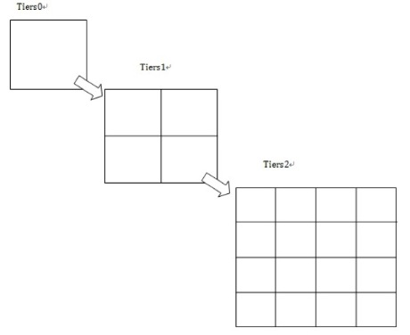
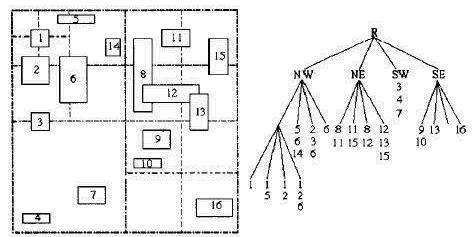
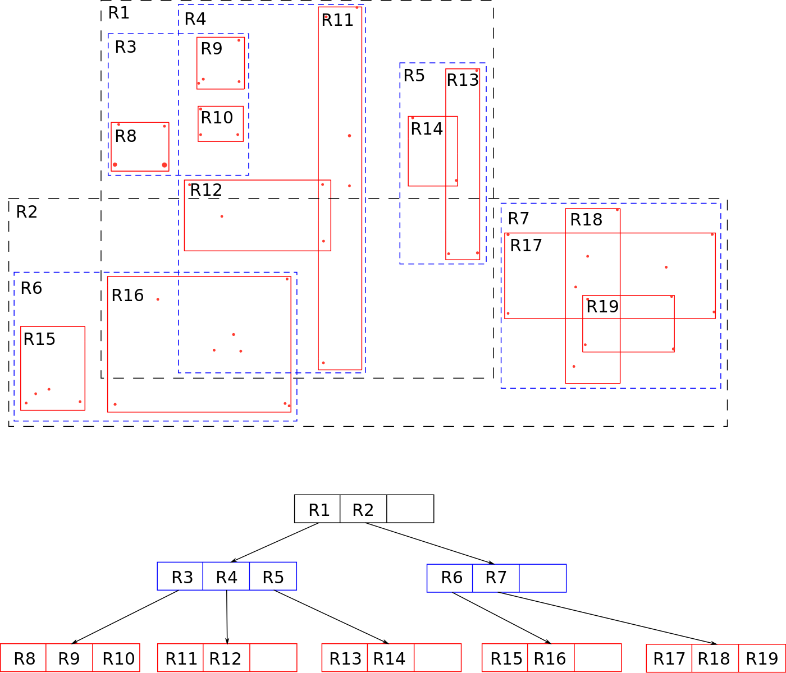

> 搜索周边有哪些店铺，是一个比较常见的场景。本文概要性的总结了一些处理该问题的常用技术方法。


## 问题提出

o2o应用经常会有根据你当前位置，定位附近有哪些店铺的业务场景。都可以抽象成：给定数据集500万个POI点，再给定经纬坐标点（比如116.402831,39.916042），求该点周围1公里有哪些POI存在。

## 解决方案

### 两点距离的计算

从二维平面角度看，两个点之间的距离可以直接通过计算公式求得出来：

> `sqrt((x1-x2)^2 +( y1-y2)^2)`

如果精度要求不高，追求速度，可直接通过上面公式计算。但，地球是圆的，我们需要考虑球面上两点的距离计算，[有很多文章](http://www.cnblogs.com/ycsfwhh/archive/2010/12/20/1911232.html)都在说这个事情，同时地球也只不过是近似正球体，此时精度可以满足一般商用。如若要求更高精度，则需通过椭球体计算公式进行计算。我们一般可直接采用spatial4j类库，该类库采用`Haversine`计算两点距离，美团对其进行了应优化，提升了大约50%的性能：http://tech.meituan.com/lucene-distance.html

### 暴力法

暴力法的思想是穷举出所有目标点与原点之间的距离，然后找到小于1km的点集合：

```python
for point in set:
	distance = distanc(point, source)
	if distance < 1000:
		result.add(point);
return result;
```

很明显这种方法只适用于集合中只有少量poi点的场景。主要作用在于辅助其他算法进行距离筛选。

### 过滤法

我们不需要比较所有的点，只需要给定`外接正方形`(2公里\*2公里)，然后通过经度纬度坐标过滤，将正方形内点过滤出来。

```sql
select id from poi_set where lat between xx and xx and lng between yyy and yyy
```

最后我们将过滤出来的点集上，运行暴力法算法，精确的算出实际的距离。我们发现，这种范围搜索是可以借助`btree索引`以加快范围搜索效率。这已经可以应用到一般的应用当中了，但btree索引有其问题：

- 只能对经度或纬度索引（一维索引），无法索引多维数据，比如三维（x，y，z）
- 当空间数据不是点，而是线、面等，则无法索引

### 空间索引法

空间索引可以分为`基于hash的空间索引方法`，比如`geohash`，`笛卡尔层`，以及`基于树的空间索引方法`，比如`四叉树`，`R树`等。

#### geohash

基于hash的空间索引算法的本质是将n维点映射到一个单维的值。geohash本质即是如此，网上很多文章讲解geohash算法，这里不多做说明，算法无外乎几个步骤：

- 考虑经度区间，[-180,180]，待编码点经度如果在0点右侧则为编码为1，左侧为0
- 若右侧，则考虑区间[0,180]，待编码点经度如果在90点右侧则为编码为1，左侧为0
- 一共迭代执行n次，则有n位二进制编码，设为X（比如1100110）
- 同上文算法，得维度n位二进制编码，设为Y（比如1011110）
- 组合XY，比如1100110 1011110，在执行base32编码

随着迭代次数n的增加，精度越高，n=8精度则为18米。geohash最重要的特性是在相同区域的点的编码是相同的。因此我们可以通过`前缀匹配`进行搜索，但是需要注意的是，为了防止边界点问题，我们需要搜索点周围的8个区域+点本身区域。在搜索的时候，我们通过编码精度定位所有区域以后，即可得到所有POI点，然后在通过暴力法精确召回在圆内的所有POI点。

### 笛卡尔层

笛卡尔层方法也可称为网格法。比如我们将点<x,y>进行编码：



- 在第一个平面中，我们以0点为中心点分为4^1个网格，假设点<x,y>在第2个网格，那么我们记录元组：<x,y,<1,2>>
- 同理，在第二个平面中，我们将平面切分成4^2=16个网格，假设点<x,y>在第10个网格，我们记录元组为：<x,y,<1,2>,<2,10>>
- 递归执行n次，则有元组：<x,y,<1,2>,<2,10>......<n,K>>，一般n=20即可满足一般需要。

有了上述元组，我们即可建立倒排索引（通过平面网格id找到属于该网格的所有poi点）。此时如果要查询点<m,n>周围1公里的所有POI，则可先通过精度（1公里）定位需要扫描的平面，再定位周围8个网格+本身所在网格，将网格中所有poi捞出来以后，然后在通过暴力法精确召回在圆内的所有POI点。网格法的最大弊端在于很多网格可能比较稀疏。

### 四叉树

四叉树索引就是递归地对地理空间进行四分，可用来建多边形索引，此时只需要将`最小外包矩形（MBR-Minimum Bounding Rectangle）`包围住多边形区域。



上图四叉树有存储冗余，我们可以将多个区域在用MBR进行包围减少这种冗余，可以参考如下博客提供的方法：http://blog.csdn.net/zhouxuguang236/article/details/12312099

除此之外四叉树有很多分类，比如点四叉树、PR四叉树、MX四叉树等，可参考这篇文章：http://malagis.com/gis-quad-tree-indexes-classification.html

我们利用点四叉树即可将所有POI点进行索引，如下是我简单实现的一颗点四叉树源码（非平衡）：

```java
public class QuadTree {
    private static final float MAX_L2M = 55000.0f;

    private Node root;

    public static class Node {

        public double x, y;              // x- and y- coordinates
        Node NW, NE, SE, SW;            // four subtrees
        public int id;                // associated data
        public String seq; 

        Node(double x, double y, int id, String seq) {
            this.x = x;
            this.y = y;
            this.id = id;
            this.seq = seq;
        }
    }

    public static class Box {

        double xlow, ylow, xhigh, yhigh;

        public Box(double xlow, double ylow, double xhigh, double yhigh) {
            this.xlow = xlow;
            this.xhigh = xhigh;
            this.ylow = ylow;
            this.yhigh = yhigh;
        }

        public boolean contains(double x, double y) {
            return (x >= xlow && y >= ylow && x <= xhigh && y <= yhigh);
        }

        @Override
        public String toString() {
            return "( " + xlow + ", " + ylow + ", " + xhigh + ", " + yhigh + " )";
        }
    }

    public void insert(double x, double y, int id, String seq) {
        root = insert(root, x, y, id, seq);
    }

    private Node insert(Node h, double x, double y, int id, String seq) {
        if (h == null)
            return new Node(x, y, id, seq);

        else if (x < h.x && y < h.y)
            h.SW = insert(h.SW, x, y, id, seq);
        else if (x < h.x && !(y < h.y))
            h.NW = insert(h.NW, x, y, id, seq);
        else if (!(x < h.x) && y < h.y)
            h.SE = insert(h.SE, x, y, id, seq);
        else if (!(x < h.x) && !(y < h.y))
            h.NE = insert(h.NE, x, y, id, seq);
        return h;
    }

    public List<Node> query(Box box) {
        List<Node> result = new ArrayList<Node>();
        query(root, box, result);
        return result;
    }

    private void query(Node h, Box box, List<Node> result) {
        if (h == null)
            return;

        if (box.contains(h.x, h.y))
            result.add(h);

        if ( (box.xlow < h.x) &&  (box.ylow < h.y))
            query(h.SW, box, result);
        if ( (box.xlow < h.x) && !(box.yhigh < h.y))
            query(h.NW, box, result);
        if (!(box.xhigh < h.x) &&  (box.ylow < h.y))
            query(h.SE, box, result);
        if (!(box.xhigh < h.x) && !(box.yhigh < h.y))
            query(h.NE, box, result);
    }

    public static Box makeBox(double lat, double lng, int distance) {
        double r = distance / MAX_L2M;
        return new Box(lat - r, lng - r, lat + r, lng + r);
    }
}

```

### R树

R树的“R”代表“Rectangle（矩形）”，以下摘自百科的一段话基本可以描述R树的一些基本内容：

> R树是GUTTMAN于1984年提出的最早支持有序扩展的对象存取方法之一，也是目前应用最为广泛的一种空间索引结构。许多商用空间数据库系统，如MapInfo SpatialWaro和Oracle Spatial等均提供对R树的支持，开放源码系统PostgreSQL也实现了R树。近二十多年来，许多学者致力于R树的研究，在R树的基础上衍生出了许多变种。比较典型的有R+树、R*树、压缩R树等。

R树的核心思想是聚合距离相近的POI节点，然后在树结构的上一层将其表示为这些节点的MBR，这个MBR就成为上一层的一个组合节点。因为所有节点都在它们的最小外接矩形中，所以跟某个矩形不相交的查询就一定跟这个矩形中的所有节点都不相交。之后再将MBR在组合成更大的MBR。这样递归的执行，就可以得到一颗R树了。如下图：



搜索的时候，我们也是使用一个外接正方形作为过滤条件，R树的结构能够快速的找到在其内部或与其相交的MBR叶子节点，然后将叶子节点中POI点与中心节点通过暴力法计算，即可召回满足要求的所有POI点。

## 后记

之前在qunar.com做酒店相关的搜索工作，我们关于poi点计算的处理比较简单，就是将所有POI点加载到内存，然后在内存中建立一颗四叉树。通过四叉树索引来进行POI的召回。只所以可以这么做，也是因为我们的POI点规模相对比较小，虽然总量很大，但通过城市维度hash后，每个城市所具有的POI规模就很小了。这也正是因为大部分的o2o应用，用户搜索总是要先定位一个具体的城市。

## 参考资料

- http://tech.meituan.com/lucene-distance.html
- https://www.atatech.org/articles/71502
- http://tech.meituan.com/solr-spatial-search.html
- http://www.cnblogs.com/LBSer/category/575692.html
- http://blog.csdn.net/zhouxuguang236/article/details/7898272
- https://zh.wikipedia.org/wiki/R%E6%A0%91
- http://blog.csdn.net/v_JULY_v/article/details/6530142/