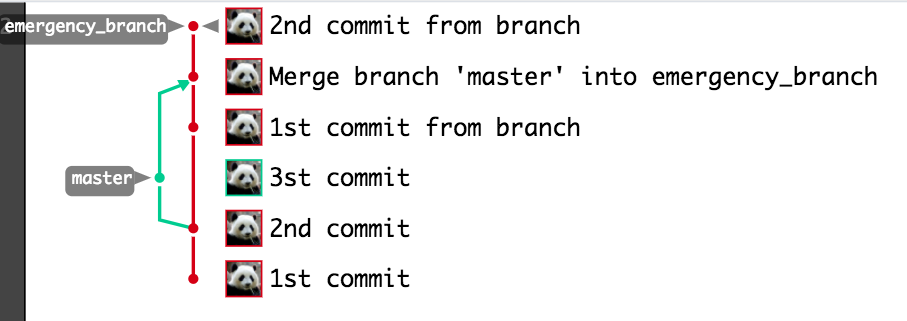
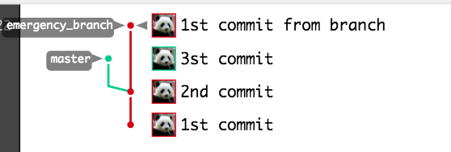
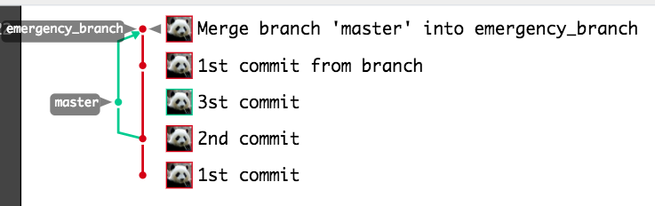

> 慌张源于无知

上周的发布，搞了一个小插曲：不小心把master的代码（暂时不应该被发布的代码），merge到了紧急发布分支（一会就要发布的代码）。这可不妙，需要赶紧将这次merge进行回滚，其实解决办法非常简单，只需要`git revert`就可以了。但是情急之下，却执行了`git reset --hard`，强制回退到merge之前的提交，更悲催的是紧接着又执行了`git push -f`将远程代码库也强制更新了，最后又提交了几个commit。当发现犯了错误时，紧急发布分支已经变得‘混乱不堪了’。

觉得’混乱不堪‘的根本原因，还不是因为自己吃的盐太少了吗？静下心来场景还原一下，就会发现，解决这问题真的很简单。

下面来模拟一下当时的情况：

#### 创建master分支，打一个tag。

```
$ touch a.txt
$ git commit -am '1st commit'

$ touch b.txt
$ git commit -am '2nd commit'

$ git tag -m 'v1.0' v1.0
$ git push
```

#### 创建master不该被提交的代码

```
$ touch c.txt
$ git commit -am '3st commit'
$ git push
```

记住，这个`c.txt`是不应该被出现在紧急发布分支的！！！

#### 基于tag创建新的分支，用于模拟紧急发布

```
$ git checkout -b emergency_branch v1.0
$ touch a_branch.txt
$ git commit -am '1st commit from branch'
$ git push --set-upstream origin emergency_branch

```

#### 此时不小心执行了merge 操作，把master代码merge到了紧急分支

```
$ git merge master
$ touch b_branch.txt
$ git commit -am '2nd commit from branch'
$ git push
```

现在来看一下network图：



上图，绿色的提交`3rd commit`就是被merge进来的提交，绿色线的箭头所指向的那次提交就是导致本次merge的提交。

#### 此时进行错误的回滚操作！！

```
$ git reset --hard 99a0f0708d7c9f41d8d186823230d8672a7fe38d
$ git push -f
```

network图就变成了以下的样子：



看上图，可以发现两个问题。其一，`3st commit`并没有按照预期被reset掉。显然这是错误的回滚merge操作；其二，之前那个绿色的箭头没有了，我们怎么都找不到究竟是通过哪次提交将`3st commit` merge 到 emergency_branch分支中的？正确的回滚merge操作应该是执行revert，而不是reset，当然这是后话。那当前这种窘境我们应该如何面对？当时由于`产品大爷`等着验证，时间紧迫，于是找项目经理重新基于tag拉了一个分支。

其实真不用慌张，git大部分操作均是可回滚，有备份的。慌张是因为无知，知道了reflog之后，变根本用不着慌张了。

#### 解决merge提交丢失问题

首先我们要找到丢失的merge提交：

```
$ git reflog
99a0f07 HEAD@{0}: reset: moving to 99a0f0708d7c9f41d8d186823230d8672a7fe38d
1df64ac HEAD@{1}: commit: 2nd commit from branch
e7baf58 HEAD@{2}: merge master: Merge made by the 'recursive' strategy.
99a0f07 HEAD@{3}: commit: 1st commit from branch
e7355cf HEAD@{4}: checkout: moving from master to emergency_branch
14560d0 HEAD@{5}: commit: 3st commit
e7355cf HEAD@{6}: commit: 2nd commit
c361d63 HEAD@{7}: commit (initial): 1st commit
```

我们看到`git reflog`记录了我们的所有的提交记录，包括之前的merge，找到这个merge提交:`e7baf58`，然后我们将其恢复：

```
$ git reset --hard e7baf58
$ git push
```

这个时候，我们看到network，这个merge提交又回来了！



#### 真正的解决问题

这个提交回来了之后，我们在将其revert：

```
$ git revert e7baf587556be1d97a0bcf8eb1d53fafaff954ac
error: commit e7baf587556be1d97a0bcf8eb1d53fafaff954ac is a merge but no -m option was given.
fatal: revert failed
```

竟然报错，这是什么意思呢？因为一次merge，会产生一个merge提交，而这个merge既会指向被merge分支的HEAD，也会指向merge分支的HEAD，因此会产生一个特别讨厌的分叉（可以使用rebase操作进行基变），此时你想revert这个merge，git就不知道你是想revert哪个方向呢？因此你需要制定一个-m选项，一般1即是被merge分支的方向：


```
$ git revert e7baf587556be1d97a0bcf8eb1d53fafaff954ac -m1
$ git push
```

此时c.txt已经被干掉，问题便真正的解决了。