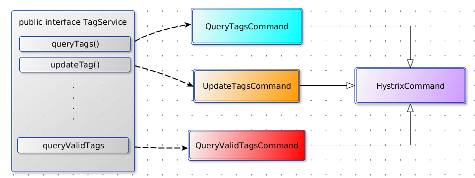

> 凡是可能出错的事必定会出错


hystrix(`[hɪst'rɪks]`)是豪猪的意思。豪猪是一种哺乳动物，全身是刺用以更好的保护自己。netflix使用这畜生来命名这框架实在是非常的贴切，意味着hystrix能够像豪猪的刺一样保护着你的应用。下面是一张豪猪的`高清无码大图`。


本文专门探讨netflix的hystrix框架。首先会说明在一次请求中调用多个远程服务时可能会出现的致命的雪崩问题，然后提出几个解决这些问题的办法，从而引出了`hystrix`框架；之后我们会给出几个例子试图说明hystrix是如何解决上述雪崩问题的，同时还会给出其常用配置的解释和额外的使用示例，从而使得读者能够从一个更加宏观角度去理解hystrix究竟都能做什么；然后我们将会深入框架内部，看一看hystrix的设计思想及其实现原理。最后我们再来看一看如何对你的线程池进行监控、如何进行配置调优等。

<!-- toc -->

 # 从雪崩看应用防护

## 一个现实中常见的场景

我们先来看一个分布式系统中常见的简化的模型。此图来自hystrix的[官方wiki](https://github.com/Netflix/Hystrix/wiki)，因为模型比较简单我这里就在不在重复画图，直接使用现成的图片做补充说明。


App Container可以是我们的应用容器，比如`jetty`，`tomcat`，也可能是一个用来处理外部请求的线程池（比如netty的worker线程池）。一个用户请求有可能依赖其他多个外部服务，比如上图的A,H,I,P，在不可靠的网络环境下，任何的RPC都可能会面临三种情况：成功、失败、超时。如果一次用户请求所依赖外部服务A,H,I,P有任何一个不可用，就有可能导致整个用户请求被阻塞。考虑到应用容器的线程数目基本都是固定的（比如tomcat默认200线程数），当在高并发的情况下，一个外部服务的超时，就有可能使得整个线程池被占满，这是[长请求拥塞反模式](http://tech.meituan.com/performance_tuning_pattern.html)。


更进一步，线程池被占满会导致整个服务不可用，而依赖该服务的其他服务，就又可能会重复产生上述问题。因此整个系统就像雪崩一样逐渐的扩散、坍塌、崩溃了！

## 产生原因

服务提供者不可用，从而导致服务调用者线程资源耗尽是产生雪崩的原因之一。除此之外还有其他因素能够产生雪崩效应：

- 服务调用者自身流量激增，导致系统负载升高。比如异常流量、用户重试、代码逻辑重复
- 缓存到期刷新，使得请求奔向数据库，导致长请求拥塞
- 重试机制，比如我们`rpc`框架`dubbo`的retry次数，每次重试都可能会恶化服务提供者
- 硬件故障，比如机房断电，电缆被挖了....

## 常见的解决方案

针对上述雪崩情景，有很多应对方案，但没有一个万能的模式能够应对所有情况。

1. 针对服务调用者自身流量激增，我们可以采用autoscaling方式进行自动扩容以应对突发流量，或者在负载均衡器上安装限流模块。参考[微博：春节日活跃用户超一亿，探秘如何实现服务器分钟级扩容](https://yq.aliyun.com/articles/18132?spm=5176.blog7548.yqblogcon1.8.sohzos)
2. 针对缓存到期刷新，我们也有很多方案，参考[Cache应用中的服务过载案例研究](http://tech.meituan.com/avalanche-study.html)
3. 针对重试机制，我们可以减少或关闭重试，直接采用`failfast`，或者采用`failsafe`进行优雅降级。
4. 针对硬件故障，我们可以做`多机房容灾`，`异地多活`等。
5. 针对服务提供者不可用，我们可以使用`资源隔离`，`熔断器`机制等。参考Martin Fowler的[熔断器模式](http://martinfowler.com/bliki/CircuitBreaker.html)

hystrix能够解决雪崩问题的主要场景是`远程服务提供者不可用`。他采用了资源隔离模式，通过线程隔离和信号量隔离保护主线程池；使用熔断器模式避免无节操的重试，并提供更加智能化的短路控制。下面我们就来看一看如何使用hystrix。

# 使用hystrix

为了方便编程，hystrix采用`命令模式`，客户端需要继承抽象类HystrixCommand并实现其特定方法。为什么使用命令模式呢？使用过`dubbo`都应该知道一个dubbo接口所定义的方法可能不止一个，为了更加细粒度的保护单个方法调用，命令模式就非常适合这种场景。命令模式的本质就是分离方法调用和方法实现，在这里我们通过将接口方法抽象成`HystricCommand`的子类，从而获得安全防护能力，并使得的控制力度下沉到方法级别。



## 从简单例子入手

先来看一个简单的例子，`TagService`是一个远程调用接口，`queryTags()`是其中一个方法，我们将其封装为一个命令：

```java
 public class TagQueryCommand extends HystrixCommand<List<String>> {

        // queryTags()的入参
        int groupId;

        // dubbo的实现接口
        TagService remoteServiceRef;

        // 构造方法用来进行方法参数传递
        protected TagQueryCommand(int groupId) {
           super(Setter.withGroupKey(HystrixCommandGroupKey.Factory.asKey("TagService"))
                    .andCommandKey(HystrixCommandKey.Factory.asKey("TagQueryCommand"))
                    .andThreadPoolKey(HystrixThreadPoolKey.Factory.asKey("TagServicePool"))
                    .andCommandPropertiesDefaults(HystrixCommandProperties.Setter()
                                    .withExecutionIsolationStrategy(THREAD)
                                    .withCircuitBreakerEnabled(true)
                    ));

            this.groupId = groupId;
            this.remoteServiceRef = ApplicationContextHelper.getBean(TagService.class);
        }

        // 我们调用远程方法定义在这里面
        @Override
        protected List<String> run() throws Exception {
            return remoteServiceRef.queryTags(groupId);
        }

        // 降级方式
        @Override
        protected List<String> getFallback() {
            return Collections.emptyList();
        }
    }
```

在以往的编程实战中，我们大多是直接通过@Resource注入容器中的bean，从而使用该bean单例调用远程方法。但经过命令模式包装之后（使用`HystrixCommand`封装了`TagService.queryTags()`方法），我们每次的调用都需要动态的创建一个命令：`new TagQueryCommand(1).execute()`，这个是同步阻塞调用，他也等同于

```java
Future<List<String>> f = new TagQueryCommand(1).queue().get()
List<String> tags = f.get();
```

对于异步调用方式我们则可以直接使用Future模式接口。在上述调用过程中会调用run()方法，从而执行被我们封装起来的(`remoteServiceRef.queryTags`方法)。后文将会讲解其[实现原理](#hystrix核心实现)。

对于上述简单的实例我们有几个问题需要弄明白：

> 1. 每次new对象开销怎么样？
> 2. 构造方法中的那几个key分别是什么意思？
> 3. 这里的隔离策略配置是什么意思？
> 4. 如何实现的优雅降级？
> 5. 怎么开启和配置熔断器？

这里回答1，2问题，3，4，5后面会分三个小节去讨论。每次new对象确实会有开销。但是如果查看HystrixCommand的源码，你会发现这个类的内部成员变量都是共享对象。由于使用共享对象，每次创建一个新的command对象也就仅仅消耗一些引用空间以及一些非共享的原子状态变量。因此这个类仍然是比较轻量的，我们在继承这个类时，也应该继续保持轻量。由于做了一层封装，对cpu的额外消耗不可避免，但经过netflix的测试发现，带来的额外性能消耗与他能带来的好处相比是可以忽略不计。

接着，我们再来说一下构造方法中key的意义：

1. HystrixCommandKey 他用于唯一区分一个命令对象，并且能够标识熔断器、metric等资源。我们可以为每一个远程方法都建立一个独一无二的key。如果key相同，意味着此时会共用熔断器和metric资源。
2. HystrixCommandGroupKey 将command进行分组，主要用于统计以便于我们进行监控。
3. HystrixThreadPoolKey 用来标示线程池，每一个command可以配备一个线程池（线程隔离模式下）。如果key相同，则会共用一个线程池资源。

## 正确选择隔离模式

hystrix能够保护应用防止雪崩的本质是采用了资源隔离模式。所谓资源隔离，其实非常好理解，就像船舱一样，一个一个舱室是隔离开来的，这样一处出现火灾，其他部分不会受到影响。资源隔离如出一辙，上文我们已经说过，由于服务提供者不可用，会导致服务调用端主线程池被占满，资源耗尽。此时如果采用资源隔离模式将对远程服务的调用隔离到一个单独的线程池后，若服务提供者不可用，那么受到影响的只会是这个独立的线程池。如图：


hystrix的线程池抽象是HystrixThreadPool类，它封装了JDK的ThreadPoolExecutor，然后通过并发策略HystrixConcurrencyStrategy对外提供工厂方法。对该线程池的核心配置如下表：

参数                                            | 解释
--------------------------------------------- | --------------------------
coreSize                                      | 核心线程数，在hystrix中是等于maxSize的
keepAliveTime                                 | 空闲线程保活时间
maxQueueSize                                  | 最大队列大小，如果-1则会使用交换队列
queueSizeRejectionThreashold                  | 当等待队列多大的时候，将会执行决绝策略
executionIsolationThreadTimeoutInMilliseconds | 执行线程的超时时间

这里我们需要注意的是`queueSizeRejectionThreashold`配置，直接用`maxQueueSize`去限制队列大小行不行？行，但是不好，因为maxQueueSize是在初始化BlockingQueue时写死的，灵活性较差，queueSizeRejectionThreashold则能够动态进行配置，灵活性非常好，我们在调节线程池配置的时候也会重点关注这个值，如果设置的过高，则起不到隔离的目的（试想把他和maxQueueSize设置的非常大，则基本不会触发拒绝策略），如果设置过小，就难以应对突发流量，因为你的缓存队列小了，当qps突然上来后很快就会触发拒绝策略。因此需要根据实际的业务情况求得一个最佳值，也可以去做动态感知。

除了线程池隔离，hystrix还提供了信号量隔离机制。所谓信号量隔离，说的比较玄乎，其实很简单，就是采用资源计数法，每一个线程来了就去资源池判断一下是否有可用资源，有可用资源就继续执行，然后资源池信号量自减，使用完再自增回来。通过这种方式能够限制资源的最大并发数，但是他有两个不好的地方，其一是他无法使用异步特性，因为使用信号量，意味着在调用者线程中执行`run()`方法；其二信号量不像线程池自带缓冲队列，无法应对突发情况，当达设定的并发后，就会执行失败。因此信号量更适用于非网络请求的场景中。信号量隔离模式下的最主要配置就是`withExecutionIsolationSemaphoreMaxConcurrentRequests`，用来设定最大并发量。

## 使用优雅降级

有时，当服务提供者不可用，我们并不希望直接抛出异常，或不做任何处理。我们更希望对服务做降级处理。这里举个例子，如果查询标签服务不可用，我们可以返回一组默认的标签，比如我们要查看首页大品类，他包括：家电、图书、音响等等，我们在系统初始化的时候默认装载一批`兜底数据`，当服务不可用，我们降级到这些兜底数据上，虽然数据不完全，但是基本可用。使用hystrix继承机制可以非常方便的添加优雅降级策略。比如上文的

```
// 降级方式
@Override
protected List<String> getFallback() {
    return Collections.emptyList();
}
```

当出现异常，或执行超时，将会调用次方法，进行优雅降级。这里需要注意相关配置

参数                                                  | 解释
--------------------------------------------------- | -------------
withFallbackEnabled                                 | 是否开启优雅降级
withFallbackIsolationSemaphoreMaxConcurrentRequests | 这个控制优雅降级的最大并发

这里主要说一下优雅降级的最大并发数。当降级并发达到这个数的时候，则不会再进行优雅降级，而是抛出REJECTED_SEMAPHORE_FALLBACK异常。这里主要是为了保护降级逻辑，因为降级中也可能会访问远程服务。

wiki文档上说了几种降级模式：

- failfast：表示马上抛出异常，即不会降级
- fail silent：或者叫做failsafe，默默的什么都不做，并发度最大
- failback static：比如返回0，true，false这种
- failback stubbed：返回默认的数据，比如上文的默认标签
- failback cache via network：通过网络访问缓存数据

## 开启circuit-breaker

## 使用request-cache

## 使用collapse

# hystrix核心实现

## 隔离机制实现

## 熔断器实现

## metrics实现

## hystrix扩展

# 监控和调优

## 单机监控和集群监控

## 如何进行参数配置

# 后记

在写这篇文章之前，我犹豫了很久，反复阅读了wiki文档和相关资料，觉得wiki文档已经写的非常全面了，这让我无从下笔：因为你的文章中任何一点都可以在官方wiki上找到影子。所以似乎你写出来的东西是没有太大意义的。但我在谷歌上搜了很多关于hystrix的中文文章，发现大家都是千篇一律的翻译官方文档，有些是半翻译半记录，有些则是文档的纯翻译，因此并没有夹杂着太多自己的思考。因此我决定写一篇集入门、应用、实现原理、监控的

## 参考资料

- [hystrix wiki](https://github.com/Netflix/Hystrix/wiki)
- [防雪崩利器：熔断器 Hystrix 的原理与使用](https://github.com/Netflix/Hystrix/wiki)
- [hystrix文档译文](http://youdang.github.io/categories/%E7%BF%BB%E8%AF%91/)
- [性能优化模式](http://tech.meituan.com/performance_tuning_pattern.html)
- [Cache应用中的服务过载案例研究](http://tech.meituan.com/avalanche-study.html)
- [微博：春节日活跃用户超一亿，探秘如何实现服务器分钟级扩容](https://yq.aliyun.com/articles/18132?spm=5176.blog7548.yqblogcon1.8.sohzos)
- [熔断器模式](http://martinfowler.com/bliki/CircuitBreaker.html)
