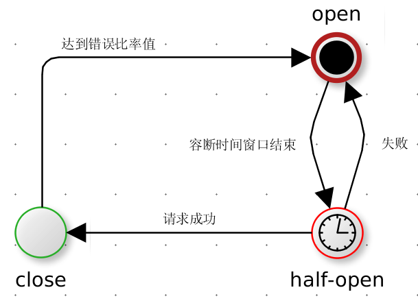

> 凡是可能出错的事必定会出错


hystrix(`[hɪst'rɪks]`)是豪猪的意思。豪猪是一种哺乳动物，全身是刺用以更好的保护自己。netflix使用这畜生来命名这框架实在是非常的贴切，意味着hystrix能够像豪猪的刺一样保护着你的应用。下面是一张豪猪的`高清无码大图`。


本文专门探讨netflix的hystrix框架。首先会说明在一次请求中调用多个远程服务时可能会出现的雪崩问题，然后提出几个解决这些问题的办法，从而引出了`hystrix`框架；之后我们会给出一个简单的例子试图说明hystrix是如何解决上述问题的；文章主要探讨了线程池隔离技术、信号量隔离技术、优雅降级、熔断器机制。

<!-- toc -->

 # 从雪崩看应用防护

## 一个现实中常见的场景

我们先来看一个分布式系统中常见的简化的模型。此图来自hystrix的[官方wiki](https://github.com/Netflix/Hystrix/wiki)，因为模型比较简单我这里就在不在重复画图，直接使用现成的图片做补充说明。


App Container可以是我们的应用容器，比如`jetty`，`tomcat`，也可以是一个用来处理外部请求的线程池（比如netty的worker线程池）。一个用户请求有可能依赖其他多个外部服务，比如上图中的A,H,I,P，在不可靠的网络环境下，任何的RPC都可能会面临三种情况：成功、失败、超时。如果一次用户请求所依赖外部服务(A,H,I,P)有任何一个不可用，就有可能导致整个用户请求被阻塞。考虑到应用容器的线程数目基本都是固定的（比如tomcat的线程池默认200），当在高并发的情况下，某一外部依赖的服务超时阻塞，就有可能使得整个主线程池被占满，这是[长请求拥塞反模式](http://tech.meituan.com/performance_tuning_pattern.html)。


更进一步，线程池被占满就会导致整个服务不可用，而依赖该服务的其他服务，就又可能会重复产生上述问题。因此整个系统就像雪崩一样逐渐的扩散、坍塌、崩溃了！

## 产生原因

服务提供者不可用，从而导致服务调用者线程资源耗尽是产生雪崩的原因之一。除此之外还有其他因素能够产生雪崩效应：

- 服务调用者自身流量激增，导致系统负载升高。比如异常流量、用户重试、代码逻辑重复
- 缓存到期刷新，使得请求都流向数据库
- 重试机制，比如我们rpc框架的retry次数，每次重试都可能会进一步恶化服务提供者
- 硬件故障，比如机房断电，电缆被挖了....

## 常见的解决方案

针对上述雪崩情景，有很多应对方案，但没有一个万能的模式能够应对所有情况。

1. 针对服务调用者自身流量激增，我们可以采用`auto-scaling`方式进行自动扩容以应对突发流量，或在负载均衡器上安装限流模块。参考[微博：春节日活跃用户超一亿，探秘如何实现服务器分钟级扩容](https://yq.aliyun.com/articles/18132?spm=5176.blog7548.yqblogcon1.8.sohzos)
2. 针对缓存到期刷新，我们也有很多方案，参考[Cache应用中的服务过载案例研究](http://tech.meituan.com/avalanche-study.html)
3. 针对重试机制，我们可以减少或关闭重试，直接采用`failfast`，或采用`failsafe`进行优雅降级。
4. 针对硬件故障，我们可以做`多机房容灾`，`异地多活`等。
5. 针对服务提供者不可用，我们可以使用`资源隔离`，`熔断器`机制等。参考Martin Fowler的[熔断器模式](http://martinfowler.com/bliki/CircuitBreaker.html)

hystrix能够解决`服务提供者不可用`的场景。他采用了资源隔离模式，通过线程隔离和信号量隔离保护主线程池；使用熔断器避免无节操的重试，并提供断路自动复位功能。下面我们就来看一看如何使用hystrix。

# 使用hystrix

hystrix采用了`命令模式`，客户端需要继承抽象类`HystrixCommand`并实现其特定方法。为什么使用命令模式呢？使用过`RPC`框架都应该知道一个远程接口所定义的方法可能不止一个，为了更加细粒度的保护单个方法调用，命令模式就非常适合这种场景。命令模式的本质就是分离方法调用和方法实现，在这里我们通过将接口方法抽象成`HystricCommand`的子类，从而获得安全防护能力，并使得的控制力度下沉到方法级别。


## 从简单例子入手

先来看一个简单的例子，`TagService`是一个远程接口，`queryTags()`是其中一个方法，我们将其封装为一个命令：

```java
 public class TagQueryCommand extends HystrixCommand<List<String>> {

        // queryTags()的入参
        int groupId;

        // dubbo的实现接口
        TagService remoteServiceRef;

        // 构造方法用来进行方法参数传递
        protected TagQueryCommand(int groupId) {
           super(Setter.withGroupKey(HystrixCommandGroupKey.Factory.asKey("TagService"))
                    .andCommandKey(HystrixCommandKey.Factory.asKey("TagQueryCommand"))
                    .andThreadPoolKey(HystrixThreadPoolKey.Factory.asKey("TagServicePool"))
                    .andCommandPropertiesDefaults(HystrixCommandProperties.Setter()
                                    .withExecutionIsolationStrategy(THREAD)
                                    .withCircuitBreakerEnabled(true)
                    ));

            this.groupId = groupId;
            this.remoteServiceRef = ApplicationContextHelper.getBean(TagService.class);
        }

        // 我们调用远程方法定义在这里面
        @Override
        protected List<String> run() throws Exception {
            return remoteServiceRef.queryTags(groupId);
        }

        // 降级方式
        @Override
        protected List<String> getFallback() {
            return Collections.emptyList();
        }
    }
```

在以往的编程实战中，我们大多是直接通过依赖注入的方式，注入rpc接口代理。但经过命令模式包装之后（使用`HystrixCommand`封装了`TagService.queryTags()`方法），我们每次的调用都需要动态的创建一个命令：

```java
// 带有隔离机制和熔断器的远程调用
List<String> tags = new TagQueryCommand(1).execute()
```

以上的调用是阻塞的，他也等同于下面的代码：

```java
Future<List<String>> f = new TagQueryCommand(1).queue();
List<String> tags = f.get();
```

我们也可以直接使用Future模式接口执行异步调用：

```java
Future<List<String>> f = new TagQueryCommand(1).queue();

// 做一些额外工作
if(f.isDone()) {
   f.get();
}
```

对于上述实例我们还有以下几个问题需要弄明白：

> 1. 每次new命令对象开销怎么样？
> 2. 构造方法中的那几个key分别是什么意思？
> 3. 这里的隔离策略配置是什么意思？
> 4. 如何去做优雅降级？
> 5. 怎么开启和配置熔断器？

## 创建命令开销

每次new一个命令确实会有开销。但是如果查看HystrixCommand的源码，你会发现这个类的内部成员变量大都是共享对象。由于使用共享对象，每次创建一个新的command对象也就仅仅消耗一些引用空间以及一些非共享的原子状态变量。因此这个类仍然是比较轻量的，我们在继承这个类时，也应该继续保持轻量。由于做了一层封装，对cpu的额外消耗不可避免，但经过netflix的测试发现，带来的额外性能消耗与他能带来的好处相比是可以[忽略不计](https://github.com/Netflix/Hystrix/wiki/FAQ%20:%20General)。

## key的意义

接着，我们再来说一下构造方法中key的意义：

1. `HystrixCommandKey` 他用于唯一区分一个命令对象，并且唯一标识熔断器、metric等资源。我们可以为每一个远程方法都建立一个独一无二的key。如果key相同，意味着此时会共用熔断器和metric资源。
2. `HystrixCommandGroupKey` 将command进行分组，主要用于统计以便于我们进行监控。
3. `HystrixThreadPoolKey` 用来标示线程池，每一个command默认配备一个线程池（线程隔离模式下）。如果key相同，则会共用一个线程池资源。

一般实践中，我们将一个接口中的所有方法都用不同的命令key区分，组key采用类名，线程池则根据需要选择性的采用共享线程池或独立线程池。

## 正确选择隔离模式

hystrix之所以能够防止雪崩的本质原因，是其运用了资源隔离模式。要解释资源隔离的概念，我们可以用船舱做比喻。一艘游轮一般都是一个一个舱室隔离开来的，这样如果某一个舱室出现火灾，就不会波及到其他船舱，从而影响整艘游轮（这个是弹性工程学的一个关键概念：舱壁）。软件资源隔离如出一辙，上文已经说过，由于服务提供者不可用，可能导致服务调用端主线程池被占满。此时如果采用资源隔离模式，将对远程服务的调用隔离到一个单独的线程池后，若服务提供者不可用，那么受到影响的只会是这个独立的线程池。如图：


hystrix的线程池抽象是`HystrixThreadPool`类，它封装了JDK的`ThreadPoolExecutor`，然后通过并发策略`HystrixConcurrencyStrategy`对外提供工厂方法。我们这里只关心该线程池的核心配置，如下表：

参数                           | 解释
---------------------------- | -------------------
coreSize                     | 核心线程数，maxSize也是该值
keepAliveTime                | 空闲线程保活时间
maxQueueSize                 | 最大队列大小，如果-1则会使用交换队列
queueSizeRejectionThreashold | 当等待队列多大的时候，将会执行决绝策略
timeoutInMilliseconds        | 执行线程的超时时间

这里我们需要注意的是`queueSizeRejectionThreashold`配置，直接用`maxQueueSize`去限制队列大小行不行？行，但是不好，因为maxQueueSize是在初始化BlockingQueue时写死的，灵活性较差，queueSizeRejectionThreashold则能够动态进行配置，灵活性好，我们在调节线程池配置的时候也会重点关注这个值，如果设置的过高，则起不到隔离的目的（试想把他和maxQueueSize设置的非常大，则基本不会触发拒绝策略），如果设置过小，就难以应对突发流量，因为你的缓存队列小了，当并发突然上来后很快就会触发拒绝策略。因此需要根据实际的业务情况求得一个最佳值，当然也可以去做弹性感知。

除了线程池隔离，hystrix还提供了信号量隔离机制。所谓信号量隔离(`TryableSemaphore`)，说的比较玄乎，其实很简单，就是采用资源计数法，每一个线程来了就去资源池判断一下是否有可用资源，有就继续执行，然后资源池信号量自减，使用完再自增回来；没有则调用降级策略或抛出异常。通过这种方式能够限制资源的最大并发数，但它有两个不好的地方：其一是他无法使用异步调用，因为使用信号量，意味着在调用者线程中执行`run()`方法；其二信号量不像线程池自带缓冲队列，无法应对突发情况，当达设定的并发后，就会执行失败。因此信号量更适用于非网络请求的场景中。信号量隔离模式下的最主要配置就是`semaphoreMaxConcurrentRequests`，用来设定最大并发量。我们再来看一下信号量的实现类，`TrableSemaphore`：

```java
   private static class TryableSemaphore {

        // 总资源数
        private final HystrixProperty<Integer> numberOfPermits;

        // 当前资源数
        private final AtomicInteger count = new AtomicInteger(0);

        public TryableSemaphore(HystrixProperty<Integer> numberOfPermits) {
            this.numberOfPermits = numberOfPermits;
        }

        public boolean tryAcquire() {
            int currentCount = count.incrementAndGet();
            if (currentCount > numberOfPermits.get()) {
                count.decrementAndGet();
                return false;
            } else {
                return true;
            }
        }

        public void release() {
            count.decrementAndGet();
        }

        public int getNumberOfPermitsUsed() {
            return count.get();
        }
    }
```

## 使用优雅降级

所谓的优雅降级本质上就是指当服务提供者不可用时，我们能够通过某种手段容忍这种不可用，以不影响正常请求。我们这里举个查询标签服务的例子，如果该服务不可用，是可以返回一组默认标签以提供优雅降级。比如，我们要查看大品类，它包括：家电、图书、音响等，这时我们可以在系统初始化中默认装载这一批`兜底数据`，当服务不可用，我们则降级到这些兜底数据上，虽然数据可能不完备，但基本可用。使用hystrix可以非常方便的添加优雅降级策略，只需要Override `getFallback()`方法就可以了。

```java
// 降级方式
@Override
protected List<String> getFallback() {
    // 这里我们可以返回兜底数据
    return Collections.emptyList();
}
```

父类的`getFallback()`是直接抛出异常的，因此要想开启优雅降级，必须重写这个方法，并且需要确保配置`withFallbackEnabled`被开启。有的时候我们可能会在降级代码中访问远程数据（比如访问`redis`），那么当并发量上来之后，也需要保护我们的降级调用，此时可以配置`withFallbackIsolationSemaphoreMaxConcurrentRequests`参数，当调用降级代码的并发数超过阈值时会抛出`REJECTED_SEMAPHORE_FALLBACK`异常

降级有很多种玩法，[官方wiki](https://github.com/Netflix/Hystrix/wiki/How-To-Use#Common-Patterns)也说了几种降级策略，我们可以根据实际情况选择合适的降级策略：

- _failfast_：表示马上抛出异常，即不会降级，比较适用于关键服务。
- _fail silent_：或者叫做failsafe，默默的什么都不做，并发度最大
- _failback static_：比如返回0，true，false等
- _failback stubbed_：返回默认的数据，比如上文的默认标签
- _failback cache via network_：通过网络访问缓存数据

## 使用熔断器

熔断器与家里面的保险丝有些类似，当电流过大，保险丝熔断以保护我们的电器。在没有熔断器机制保护下，我们可能会无节操的重试，这会持续加大服务端压力，造成恶性循环；如果直接关闭重试功能，当服务端又可用的时候，我们又该如何恢复？熔断器正好适合这种场景：当请求失败比率(失败/总数)达到一定阈值后，熔断器开启，并休眠一段时间，这段休眠期过后熔断器将处与半开状态(`half-open`)，在此状态下将试探性的放过一部分流量(hystrix只支持single request)，如果这部分流量调用成功后，再次将熔断器闭合，否则熔断器继续保持开启并进入下一轮休眠周期。



我们知道了熔断器的原理后，再重点看一下hystrix都支持哪些熔断器配置：

参数                        | 解释
------------------------- | ------------------
enabled                   | 熔断器是否开启，默认开启
errorThresholdPercentage  | 熔断器错误比率阈值
forceClosed               | 是否强制闭合
forceOpen                 | 是否强制打开
requestVolumeThreshold    | 表示请求数至少达到多大才进行熔断计算
sleepWindowInMilliseconds | 半开的触发试探休眠时间

`errorThresholdPercentage`用来设定错误比率，默认50%，比如在一段时间内我们有100个调用请求，其中有70个超时了，那么这段时间的错误比率是70%，它大于50%则会触发熔断器熔断。这个值的设定非常重要，他表示我们对错误的容忍程度，值越小我们对错误的容忍程度越小。强制闭合和强制打开是两个运行时调节动态参数，如果强制闭合则忽略统计信息，熔断器马上闭合，相反强制打开则会保证熔断器始终处于open状态。`requestVolumeThreshold`也是一个比较重要的参数，默认是20，表示至少有20个请求才进行熔断错误比率计算。什么意思？比如我有19个请求，但是全部失败了，错误比率100%，但也不会触发熔断，因为我的volume设定的是20。`sleepWindowInMilliseconds`是半开试探休眠时间，默认是5000ms，什么是试探休眠时间？上面我们说到了熔断器自动恢复的原理：_当熔断器开启一段时间之后，再放过一部分流量进行试探_。这一段时间就是试探休眠时间。如果这个值比较大，意味着我们可能需要一段比较长的恢复时间。如果值比较小，则表示我们需要更好地应对网络抖动情况。

hystrix抽象出`HystrixCircuitBreaker`接口用来提供熔断器功能，其在内部维护了`AtomicBoolean circuitOpen`作为熔断器状态开关。下面我们来看一下其实现的核心代码：

```java
        // 相关配置，就是我们上文在构造方法中的命令配置
        private final HystrixCommandProperties properties;

        // 统计信息，按照时间窗口进行统计
        private final HystrixCommandMetrics metrics;

        // 熔断器状态
        private AtomicBoolean circuitOpen = new AtomicBoolean(false);

        // 熔断器打开时间或者上一次半开测试的时间，主要用于从休眠期恢复

        private AtomicLong circuitOpenedOrLastTestedTime = new AtomicLong();

        // 外部调用者主要通过该方法获取熔断器状态
        public boolean isOpen() {
            if (circuitOpen.get()) {
                // 如果熔断器是打开的，则返回true
                return true;
            }

            // metric能够统计服务调用情况
            HealthCounts health = metrics.getHealthCounts();

            // 如果没有达到熔断器设定的volumn值则false，肯定是关闭的
            if (health.getTotalRequests() < properties.circuitBreakerRequestVolumeThreshold().get()) {
                return false;
            }

            // 如果错误比率也没有达到设定值，也会关闭的
            if (health.getErrorPercentage() < properties.circuitBreakerErrorThresholdPercentage().get()) {
                return false;
            } else {
                // 熔断器开启
                if (circuitOpen.compareAndSet(false, true)) {
                    //设定熔断器打开时间，主要为了进行休眠期判断
                    circuitOpenedOrLastTestedTime.set(System.currentTimeMillis());
                    return true;
                } else {
                    return false;
                }
            }
        }

        //做single request测试
        public boolean allowSingleTest() {
            long timeCircuitOpenedOrWasLastTested = circuitOpenedOrLastTestedTime.get();
            // 判断是否已经过了熔断器打开休眠期
            if (circuitOpen.get() && System.currentTimeMillis() > timeCircuitOpenedOrWasLastTested + properties.circuitBreakerSleepWindowInMilliseconds().get()) {
                // 这里将上一次测试时间设置为当前时间，主要为了休眠期判断
                if (circuitOpenedOrLastTestedTime.compareAndSet(timeCircuitOpenedOrWasLastTested, System.currentTimeMillis())) {
                    return true;
                }
            }
            return false;
        }
```

# 后记

第一次听说`熔断器模式`还是在公司的tech邮件讨论组里，同事都在讨论一个故障：由于代码bug，导致请求时间变长，调用方又不断重试，结果使整组服务崩溃。这件事过后没多久，公司的RPC框架中就增加了熔断器机制。最近也在做motan的开源代码，想在其中增加一个熔断器的实现，于是翻了翻hystrix源代码，从中学习到了不少好东西：线程池隔离、信号量隔离、熔断器的实现、RxJava等等。当然hystrix的功能还不仅限于此，由于篇幅原因，还有很多内容并没有涉及到，比如请求缓存与上下文、collapse请求合并、metrics的实现、hystrix扩展钩子。

## 参考资料

- [hystrix wiki](https://github.com/Netflix/Hystrix/wiki)
- [防雪崩利器：熔断器 Hystrix 的原理与使用](https://github.com/Netflix/Hystrix/wiki)
- [hystrix文档译文](http://youdang.github.io/categories/%E7%BF%BB%E8%AF%91/)
- [性能优化模式](http://tech.meituan.com/performance_tuning_pattern.html)
- [Cache应用中的服务过载案例研究](http://tech.meituan.com/avalanche-study.html)
- [微博：春节日活跃用户超一亿，探秘如何实现服务器分钟级扩容](https://yq.aliyun.com/articles/18132?spm=5176.blog7548.yqblogcon1.8.sohzos)
- [熔断器模式](http://martinfowler.com/bliki/CircuitBreaker.html)
