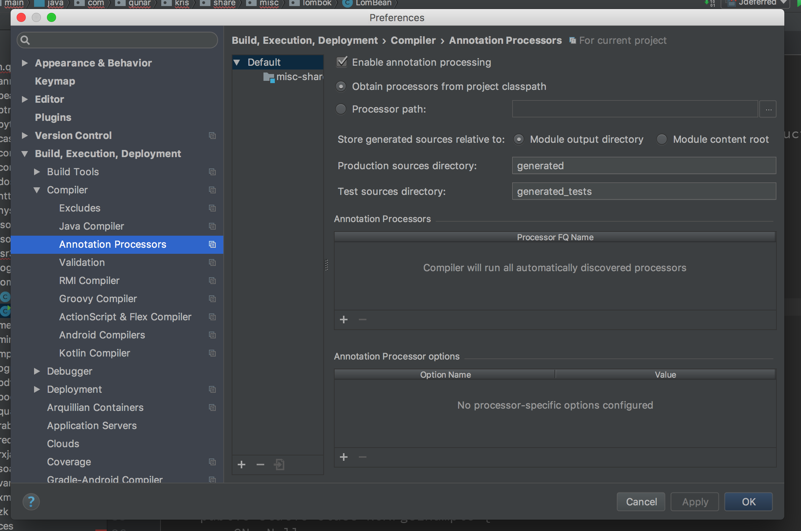

Lombok意味`龙目岛`，上图便是网友拍摄的一张风景图([原文链接](https://homeiswhereyourbagiscom/en/15-things-you-should-see-on-lombok/))。该岛是巴厘岛的一座附属岛屿，虽然风景优美，但并非本文主题。本文要介绍的Lombok一样风景绮丽，它乃是java的一个强大工具，能极大的减少代码量，并使代码更加整洁清晰。

本文分如下几个部分：

0. 使用前的准备
1. 基本用法
2. 实现原理

## 使用前的准备

在享受Lombok所带来的酸爽之前，需要有以下准备：

1. 添加依赖
2. 安装插件
3. 修改idea配置（optional）

### 添加依赖

```xml
<dependency>
    <groupId>org.projectlombok</groupId>
    <artifactId>lombok</artifactId>
    <version>1.14.4</version>
</dependency>
```
### 安装插件


为了视觉效果，安装插件是必须的，否则会有很多'飘红'。插件可直接在idea中进行搜索和安装。

### 修改idea配置

由于lombok基于插入式注解引擎，只在编译器生成代码，因此进行编译的时候，需要idea开启注解引擎支持功能，其功能默认开启，但有时候是关闭状态，需要我们自己手动开启，否则idea会编译报错：



## 基本用法

### 生成Getter/Setter方法

考虑实体对象`Community`，有四个属性，一般情况下我们会使用idea生成工具，生成Getter和Setter方法。如下代码：

```java
public class Community {
    private String communityId;
    private String name;
    private String title;
    private int type;

    /**
     * Getter method for property communityId.
     *
     * @return property value of communityId
     */
    public String getCommunityId() {
        return communityId;
    }

    /**
     * Setter method for property communityId.
     *
     * @param communityId value to be assigned to property communityId
     */
    public void setCommunityId(String communityId) {
        this.communityId = communityId;
    }

    /**
     * Getter method for property name.
     *
     * @return property value of name
     */
    public String getName() {
        return name;
    }

    /**
     * Setter method for property name.
     *
     * @param name value to be assigned to property name
     */
    public void setName(String name) {
        this.name = name;
    }

    /**
     * Getter method for property title.
     *
     * @return property value of title
     */
    public String getTitle() {
        return title;
    }

    /**
     * Setter method for property title.
     *
     * @param title value to be assigned to property title
     */
    public void setTitle(String title) {
        this.title = title;
    }

    /**
     * Getter method for property type.
     *
     * @return property value of type
     */
    public int getType() {
        return type;
    }

    /**
     * Setter method for property type.
     *
     * @param type value to be assigned to property type
     */
    public void setType(int type) {
        this.type = type;
    }
}
```

这代码很长，如果是一个单独的类还好，如果是内部类，那么会使得该类相当难读，使人分不清主次。采用lombok则可以直接：

```java
public class Community {
    @Getter @Setter
    private String communityId;

    @Getter @Setter
    private String name;

    @Getter @Setter
    private String title;

    @Getter @Setter
    private int type;
}
```

`@Getter`和`@Setter`都可以单独定义函数的访问等级：

```java
public class Community {
    @Getter (AccessLevel.PUBLIC)
    @Setter(AccessLevel.PRIVATE)
    private String communityId;

    @Getter(AccessLevel.PUBLIC)
    @Setter(AccessLevel.PUBLIC)
    private String name;

    @Getter(AccessLevel.PUBLIC)
    @Setter(AccessLevel.PUBLIC)
    private String title;

    @Getter(AccessLevel.PUBLIC)
    @Setter(AccessLevel.PUBLIC)
    private int type;
}

```
如果都是`public`，则代码可以更加简洁：

```java
@Getter @Setter
class Community {
    private String communityId;
    private String name;
    private String title;
    private int type;
}
```

### 生成构造方法

如果我们要给Community实体类生成构造方法，那么可以如下代码示例：

```java
public class Community {
    private String communityId;
    private String name;
    private String title;
    private int type;

    public Community(String communityId, String name, String title, int type) {
        this.communityId = communityId;
        this.name = name;
        this.title = title;
        this.type = type;
    }

    public Community() {

    }

    public Community(String communityId, String name) {
        this.communityId = communityId;
        this.name = name;
    }

}
```

可以看到很麻烦，也很混乱，如果使用lombok则变得清晰简洁：

```java
@AllArgsConstructor
@NoArgsConstructor
@RequiredArgsConstructor(staticName="of")
class Community {
    private String communityId;
    @NonNull private String name;
    @NonNull private String title;
    private int type;
}
```

其中`@AllArgsConstructor`用来指定全参数构造器，`@NoArgsConstructor`用来指定无参数构造器，`@RequiredArgsConstructor`用来指定参数（采用静态方法`of`访问）

### 生成equals、hashcode、toString

我们在来看，如果需要生成`equals`、`hashcode`、`toString`呢？按照平常的做法：

```java
public class Community {
    private String communityId;
    private String name;
    private String title;
    private int type;

    @Override
    public boolean equals(Object o) {
        if (this == o) { return true; }
        if (o == null || getClass() != o.getClass()) { return false; }

        Community community = (Community)o;

        if (type != community.type) { return false; }
        if (communityId != null ? !communityId.equals(community.communityId) : community.communityId != null) {
            return false;
        }
        if (name != null ? !name.equals(community.name) : community.name != null) { return false; }
        return title != null ? title.equals(community.title) : community.title == null;
    }

    @Override
    public int hashCode() {
        int result = communityId != null ? communityId.hashCode() : 0;
        result = 31 * result + (name != null ? name.hashCode() : 0);
        result = 31 * result + (title != null ? title.hashCode() : 0);
        result = 31 * result + type;
        return result;
    }

    @Override
    public String toString() {
        return "Community{" +
            "communityId='" + communityId + '\'' +
            ", name='" + name + '\'' +
            ", title='" + title + '\'' +
            ", type=" + type +
            '}';
    }
}
```

可以看到，代码相当的恼人，如果使用lombok：

```java

@ToString
@EqualsAndHashCode
class Community {
    private String communityId;
    private String name;
    private String title;
    private int type;
}
```

如果我们只需要是否name作为`equals`和`hashcode`的运算字段，并且不想将title toString出来：

```java
@ToString(exclude = {"title"})
@EqualsAndHashCode(of = {"name"})
class Community {
    private String communityId;
    private String name;
    private String title;
    private int type;
}
```

结合上面所有的实例，我们可以使用如下代码就能完成平常需要上百行代码才能完成的事情：

```java
@AllArgsConstructor
@NoArgsConstructor
@RequiredArgsConstructor(staticName="of")
@Getter @Setter
@ToString(exclude = {"title"})
@EqualsAndHashCode(of = {"name"})
public class Community {
    private String communityId;
    @NonNull private String name;
    @NonNull private String title;
    private int type;
}
```

### @Data

我们可以看到，上节中类上面打了好多注解，还是显得有些乱，如果我们没有要求那么多定制化需求，则可以直接使用@Data注解，他包含了：@Getter @Setter @ToString @EqualsAndHashCode RequiredArgsConstructor注解，因此可以简化为：

```java
@NoArgsConstructor
@AllArgsConstructor
@Data(staticConstructor="of")
public class Community {
    private String communityId;
    @NonNull private String name;
    @NonNull private String title;
    private int type;
}
```

是不是极其简洁，表达力又极强呢？

### Builder模式

有的时候，我们喜欢采用Builder模式去构造一个对象，比如如下代码：

```java

class Community {
    private String communityId;
    private String name;
    private String title;
    private int type;

    @java.beans.ConstructorProperties({"communityId", "name", "title", "type"})
    Community(String communityId, String name, String title, int type) {
        this.communityId = communityId;
        this.name = name;
        this.title = title;
        this.type = type;
    }

    public static CommunityBuilder builder() {return new CommunityBuilder();}

    public static class CommunityBuilder {
        private String communityId;
        private String name;
        private String title;
        private int type;

        CommunityBuilder() {}

        public Community.CommunityBuilder communityId(String communityId) {
            this.communityId = communityId;
            return this;
        }

        public Community.CommunityBuilder name(String name) {
            this.name = name;
            return this;
        }

        public Community.CommunityBuilder title(String title) {
            this.title = title;
            return this;
        }

        public Community.CommunityBuilder type(int type) {
            this.type = type;
            return this;
        }

        public Community build() {
            return new Community(communityId, name, title, type);
        }

        public String toString() {
            return "com.qunar.kris.share.misc.lombok.Community.CommunityBuilder(communityId=" + this.communityId
                + ", name="
                + this.name + ", title=" + this.title + ", type=" + this.type + ")";
        }
    }
    
}
```

然后我们可以这么使用：

```java
 public static void main(String[] args) {
        Community community = Community.builder()
            .communityId("zzz")
            .name("xxx")
            .title("yyy")
            .type(1).build();
    }
```

上述创建builder的方式是在是太麻烦了，这只是4个参数，如果更多的参数，可想而知代码量啊！使用Lombok则很简单：

```java

@Builder
class Community {
    private String communityId;
    private String name;
    private String title;
    private int type;
}
```

以上均是在日常项目中非常常用的特性，我们再来看一些使用频率较低的特写，可作为读者的参考。

### 其他特性

#### 异常处理

捕获全局异常，我们经常使用如下代码：

```java
    public void doMethod() {
        try {
            invokeMethodMayThrowExeption();
        } catch(Exception e) {
            if (e instanceof MyException) {
                throw e;
            } else {
                //swallow it
            }
        }
    }

```

使用lombok可以简化为：

```java
    @SneakyThrows(MyException.class)
    public void doMethod() {
        invokeMethodMayThrowExeption();
    }
```

#### logger

如果我们要打日志，经常创建如下日志静态对象：

```java
    public class Community {
        private static final Logger logger = LoggerFactory.getLogger("MY-LOGGER");
    }
```

我们采用lombok简化一下：

```java
    @Slf4j(topic = "MY-LOGGER")
    public class Community {
    }
```

没有用slf4j?没有关系，除了slf4j还支持如下Logger:

- @XSlf4j
- @Log4j
- @Log4j2
- @Log
- @CommonsLog

#### 空指针异常的快速失败

```java
public void doMethod(@NonNull String name, @NonNull String title) {

}
```

以上代码，当name或者title为空的时候，则会直接抛出NPE，快速失败。

#### 简化烦人的类型

有的时候，我们可能会有非常长的泛型，很恼人：

```java
 Map<String, Map<String, List<Community>>> map = new HashMap<String, Map<String, List<Community>>();
        for (Entry<String, Map<String, List<Community>>> entry : map.entrySet()) {
            //.....
        }
```

采用lombok可以简化为：

```java
        val map = Maps.<String, Map<String, List<Community>>>newHashMap();
        for (val entry : map.entrySet()) {
            //.....
        }
```

当然，在jdk8下，一般使用foreach进行遍历。

## 基本实现原理

lombok魔法并不神秘，他采用[JSR269](https://www.jcp.org/en/jsr/detail?id=269)所提出的`插入式注解处理`(Pluggable Annotation Processing)，并结合动态代码生成技术所开发的。如下图所示：


上图展示了一个一般javac的编译过程，java文件首先通过进行解析构建出一个`AST`，然后执行注解处理，最后经过分析优化生成二进制的`.class`文件。我们能做到的是，在注解处理阶段进行一些相应处理。首先我们在META-INF.services下创建如下文件：


文件中指定我们的注解处理器：`com.alipay.kris.other.lombok.MyAnnotaionProcessor`

然后我们接可以编写自己的注解处理器，一个简单的实例代码如下：

```java
@SupportedSourceVersion(SourceVersion.RELEASE_8)
@SupportedAnnotationTypes("com.alipay.kris.other.lombok.*")
public class MyAnnotaionProcessor extends AbstractProcessor {

    public MyAnnotaionProcessor() {
        super();
    }

    @Override
    public boolean process(Set<? extends TypeElement> annotations,RoundEnvironment roundEnv) {
        for (Element elem : roundEnv.getElementsAnnotatedWith(MyAnnotation.class)) {
            MyAnnotation annotation = elem.getAnnotation(MyAnnotation.class);
            String message = "annotation found in " + elem.getSimpleName()
                + " with  " + annotation.value();
            addToString(elem);
            processingEnv.getMessager().printMessage(Diagnostic.Kind.NOTE, message);
        }
        return true; // no further processing of this annotation type
    }
}
```

我们能做到的也就是这么多，但lombok在此基础之上，对AST进行修改，将Setter/Getter等上文提到过的方法'挂载'到AST中。更多的请点击下文的参考资料（blogspot需要翻墙）。

## 后记

Lombok项目已经有很多年了，网上也有超级多的文章在说这个工具。我在原公司也普遍使用lombok，后面来到支付宝发现大家都很少有使用这套工具，因此本文主要为没有使用过Lombok的同事做一些相关介绍，旨在起到抛砖引玉的作用，其中插入式注解引擎还能做很多特别有意思的事情（比如代码生成），这便有待大家慢慢探索。

## 参考资料

- [代码生成1](https://deors.wordpress.com/2011/09/26/annotation-types/)
- [代码生成2](https://deors.wordpress.com/2011/10/08/annotation-processors/)
- [代码生成3](https://deors.wordpress.com/2011/10/31/annotation-generators/)
- [jsr注解引擎](https://www.jcp.org/en/jsr/detail?id=269)
- [stack overflow中关于lombok的疑](http://stackoverflow.com/questions/6107197/how-does-lombok-work
https://projectlombok.org/)
- [安全吗](http://stackoverflow.com/questions/3852091/is-it-safe-to-use-project-lombok)
- [使用lombok方便的生成自定义代码](http://notatube.blogspot.com/2010/12/project-lombok-creating-custom.html)
- [如何替换](http://stackoverflow.com/questions/13690272/code-replacement-with-an-annotation-processor)
- [lombok利用了其注解引擎的bug](http://notatube.blogspot.com/2010/11/project-lombok-trick-explained.html)
- [Project Lombok](https://projectlombok.org/)