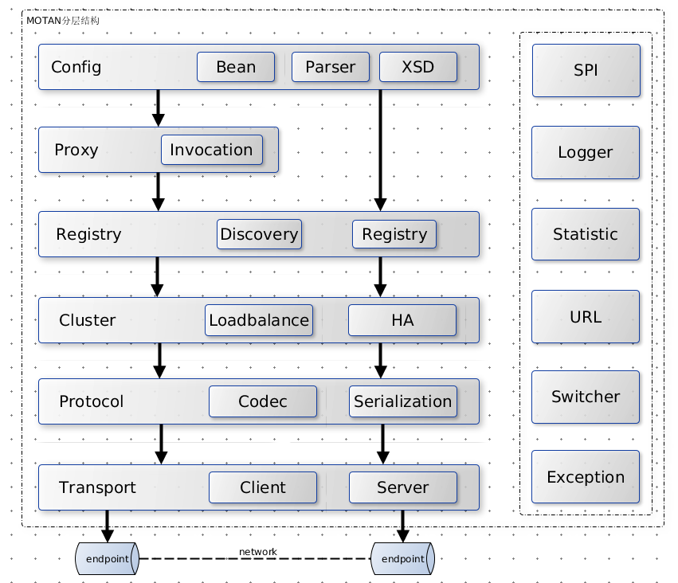

> 计算机科学领域的任何问题都可以通过增加一个间接的中间层来解决

从零开发一款RPC框架，说难也难说简单也简单。难的是你的设计将如何面对实际中的复杂应用场景；简单的是其思想可以仅仅浓缩成一行方法调用。`motan`是今年(2016年)新浪微博开源的一款RPC框架，据说在新浪微博正支撑着千亿次调用。对于她的详细介绍和赞誉是新闻稿和README的责任，本文则会从RPC的基本原理入手，分析和讲解motan的各层的实现思想。

为了避免落入俗套，本文将尽力避免对各种概念的解释（这是wiki的责任），并默认读者已经有了相关RPC框架的使用经验（比如`dubbo`）。为了使得文章充满'干货'，本文重点讲解的是`motan`的实现原理，并配有一定量的代码予以解释。这会使读者不但知晓RPC框架的设计思路，也能知道相关生产代码究竟是如何编写的（在这个浮躁的年代，只有算法和代码是最干的货）。

本文先简单解释一下RPC的本质，然后直接给出`motan`的整体架构，并解释每层的具体含义。然后我们将从一段XML的配置入手，详细讲解provider与consumer的初始化流程以及调用和服务流程。最后挑选几个比较重要的机制进行讲解。

在开始之前，让我们思考以下几个问题：

- 如何与Spring做集成？
- SPI机制的实现原理是什么？为什么要用这个？
- 这么多的配置，究竟是如何在类间传递和保存的？
- 服务降级是如何做的？
- motan协议究竟是什么样子的？
- 服务发现和注册究竟是怎么做的？或者说客户端是如何找到服务端的？
- 为什么要用动态代理，到底proxy了什么？
- cluster的负载均衡和ha究竟是如何实现的？
- transport层是怎么进行抽象的？
- client对server的心跳检测是怎么实现的呢？
- client端的连接池是如何管理的？
- server端的连接是如何共享的？

# 概述

## 对RPC本质的理解

对于软件工程师来讲，形如`object.method()`的方法调用实在是太过熟悉，当我们在同一个JVM进程内执行方法调用的时候，一切都显得顺其自然。然而如果我们将上述的调用过程拆分成两个部分----方法的`调用端`和方法的`实现端`，然后将他们分别放置到不同的进程中，使得调用端和实现端能够做到跨操作系统，跨网络。这便是RPC的本质。

从功能角度来讲，RPC框架可以分为`服务治理型`和`多语言型`。motan显然属于前者，因此对motan框架可以简单的理解为：_分离方法的调用和实现，并具双端服务治理功能_。

## motan的整体架构

分层是软件设计的基础工具，几乎所有软件都有分层的影子，motan也不例外，见下图：



从上图可以看到，motan的架构层次非常清晰（有点类似dubbo，关于区别请参考[后记](#后记)），从上到下分为6层，其中右侧部分为通用组件服务。跟其他所有RPC一样，motan框架也有两个核心脉络，其一是`客户端`（对应图左侧垂直箭头），和`服务端`（对应于右侧箭头），服务端不需要进行动态代理，理由很简单，因为服务端已经有了实现，不需要在进行代理。最下面的endpoint(client)到endpoint(server)就是TCP全双工链接。

先来说公共组件部分：

- SPI：Service Provider Interface，主要通过ExtensionLoader提供扩展点功能，用来动态装载接口具体实现，以提供客户端扩展能力。
- Logger：使用slf4j，提供整个框架统一的日志记录工具。
- Statistic：使用定时回调方式，收集和记录框架监控信息。
- URL：非Jdk里的URL。他对协议，路径，参数的统一抽象，系统也是使用URL来保存和读取配置信息的。
- Switcher：提供开关控制服务，能够控制框架关键路径的升级和降级。
- Exception：统一异常处理，分为业务异常，框架异常，服务异常等。

再来说每一个层的作用：

- Config层：主要提供了配置读取，解析，实体生成。同时他也是整个框架的入口，
- Proxy层：服务端无proxy，客户端具有代理功能，他通过InvocationHandler来拦截方法调用。目前只使用了jdk原生动态代理工具。
- Registry层：用来进行服务发现和注册，server端进行服务的注册，client进行服务发现。目前有zk,consul的实现，还有对directUrl（就是p2p，不借助中心）的特殊处理。
- Cluster层：集群功能，他提供了集群的服务暴露、服务引用、负载均衡，HA等。
- Protocol层：协议层，目前只支持injvm和motan协议，主要就是提供给下层协议编码和解析，并且使用filter/pipe模式进行访问日志，最大并发量控制等功能。
- Transport层：主要处理网络连接，他主要抽象了Client和Server接口。使用netty框架。

# 从两端看核心调用链

## privder端

### 初始化过程

请看下面配置

```xml
    <bean id="motanDemoServiceImpl" class="com.weibo.motan.demo.server.MotanDemoServiceImpl"/>

    <motan:registry regProtocol="zookeeper"
                    name="registry"
                    address="127.0.0.1:2181"/>

    <motan:protocol id="demoMotan" default="true" name="motan"/>

    <motan:basicService export="demoMotan:8002"
                        group="motan-demo-rpc"
                        registry="registry"/>

    <motan:service interface="com.weibo.motan.demo.service.MotanDemoService"
                   ref="motanDemoServiceImpl" basicService="serviceBasicConfig">
    </motan:service>
```

如果有dubbo的使用经验，上述配置非常容易看懂。简单的说，上述代码使用motan协议，在8002端口上暴露了`motanDemoServiceImpl`服务。任何client都可以连接到8002端口，并使用motan协议调用这个服务。这个服务提供的功能也很简单：

```java
public class MotanDemoServiceImpl implements MotanDemoService {
    public String hello(String name) {
        System.out.println(name);
        return "Hello " + name + "!";
    }
}
```

这，看似简单，但，究竟都发生了什么？

#### 配置解析

所谓配置解析实际上就是完成一种映射功能，即xml->java的过程。那么做到xml到对象的映射呢？如果是普通的xml文件，我们完全可以使用JAXB；如果是spring，它提供了自定义解析机制，这里可以参考相关[Spring文档](http://docs.spring.io/spring/docs/current/spring-framework-reference/html/xml-custom.html#extensible-xml-using)，大概分为三步：

1. 定义自己的xsd文件。
2. 在META-INF中分别方式spring.handlers文件和spring.schemas文件，一个是具体的解析器的配置，一个是motan.xsd的具体路径。
3. 继承NamespaceHandlerSupport抽象类或实现NamespaceHandler接口完成具体解析工作。

我们这里不需要关心解析过程，因为他实在乏陈。只需要知道这些配置将会映射成ServiceConfig对象(对应`<motan:service>`标签)。需要注意的是，每个不同的service标签都会生成不同的`ServiceConfig`对象，即所谓的prototype模式，相反，有些配置使用的是单例，比如ProcotolConfig。

#### 服务export过程

放在Spring容器中的bean一定会经过一个初始化过程，ServiceConfig对象也不例外，他会监听应用上下文事件，并当整个容器初始化完毕后，调用`export()`方法进行服务暴露。export则主要做了一下两件事：

1. 将我们第一步解析生成的配置实体类转换成URL类（通过uri形式来表示配置）
2. 代理给`ConfigHandler`，并生成Exporter对象

URL对象是整个框架的核心对象，他保存了一系列配置，分为注册URL和服务URL，注册URL是指到Registry服务的地址，服务URL则是具体使用的服务串。

比如在这里生成的url对象是注册URL：

> zookeeper://127.0.0.1:2181/com.weibo.api.motan.registry.RegistryService?group=default_rpc

他表示了注册中心的地址，path则是与zookeeper的树形结构相对应。URL中还包含一个parameters的HashMap，他保存了`<registry>`的配置，以及一个叫做embed的属性，embed则是保存了服务URL（注意与注册URL区别）

> embed=motan://192.168.122.1:8001/com.weibo.motan.demo.service.MotanDemoService?maxContentLength=1048576&module=motan-demo-rpc&export=demoMotan:8001&maxServerConnection=80000&group=motan-demo-rpc .....

有了URL配置后，我们将暴露过程代理给`ConfigHandler`类。这个类是一个辅助类，我们也可以成它为胶水代码，连接了配置层和协议层。

```java
 public <T> Exporter<T> export(Class<T> interfaceClass, T ref, List<URL> registryUrls) {

        .....

        // 查找协议
        Protocol protocol = new ProtocolFilterDecorator(ExtensionLoader.getExtensionLoader(Protocol.class).getExtension(protocolName));

        //创建provider ref是具体实现类，serviceUrl就是上文的服务url，interfaceClass就是服务接口
        Provider<T> provider = new DefaultProvider<T>(ref, serviceUrl, interfaceClass);

        //暴露过程代理给具体协议，Exporter是一次暴露的核心接口
        Exporter<T> exporter = protocol.export(provider, serviceUrl);

        //注册服务，暴露之后在注册到zk上
        register(registryUrls, serviceUrl);

        return exporter;
    }
```

可以看到上述过程是先进行服务暴露，然后再注册到中心，通知refer端。原因很明显，如果先通知上线，这个时候服务并没有暴露完毕，refer端实际上是无法调用的。另外，暴露过程又代理给具体的协议实现，这里使用motan协议，即`DefaultRpcProtocol`对象（个人觉得应该叫做MotanProtocol），他实际上又代理给了内部类`DefaultRpcExporter`。在`DefaultRpcExporter`的类初始化中，根据当前系统的SPI配置，找到`EndpointFactory`的实现类，并创建一个Server对象，由Server对象的`server.open()`最终完成transport的网络层暴露。

#### transport层服务暴露

motan只实现了基于netty的transport层（可以理解，大部分场景netty都可以解决），在`server.open()`方法中，只是仅仅根据上下文传递过来的参数对bootstrap进行配置，然后bind端口，完成对指定端口的监听。在对bootstrap初始化的时候有两点可能值得注意。一是我们需要知道他都注入了哪些pipeline

```java
                pipeline.addLast("channel_manage", channelManage);
                pipeline.addLast("decoder", new NettyDecoder(codec, NettyServer.this, maxContentLength));
                pipeline.addLast("encoder", new NettyEncoder(codec, NettyServer.this));
                pipeline.addLast("handler", handler);
```

可以看到，`decoder/encoder`用来解码，编码具体协议；`chanelMessage`是用来进行channel并发连接数限制；`handler`则是具体的channel处理器，用于处理心跳包，客户端业务请求和消息路由。

二是在实际开发中，经常是多个provider暴露在相同的端口号下，那么当一个`request`来的时候，具体会路由到哪一个provider类呢？这个路由机制是由`ProviderMessageRouter`实现的，它的实现思路也比较简单：在其内部维护一个`Map<String, Provider>`，并通过group/interface/version进行key生成，从而对provider进行定位。因此我们虽然一个provider的实现类是一样的，但是不同的组或相同组不同版本之间也是可以一起暴露服务的。

至此，我们的`com.weibo.motan.demo.service.MotanDemoService`服务已在8002端口暴露，关于服务的registry注册实现机制请参考后文，[registry机制](#registry机制)。

### 服务调用过程

当一个`Request`到达服务端后，是如何被调用执行的呢？我们知道ProviderMessageRouter可以对`Request`进行路由，当netty的channel收到这个实现`Request`之后，将会定位到具体`Provider`shi，然后调用`provider.call()`执行服务。

```java
        try {
            //直接调用call方法
            return provider.call(request);
        } catch (Exception e) {
            //产生异常，将会封装到Response中
            Response response = new DefaultResponse();
            response.setException(new MotanBizException("provider call process error", e));
            return response;
        }
```

DefaultProvider是Provider的默认实现，其中的`defaultProvider.invoke()`执行真正的调用：

```java
public Response invoke(Request request) {
        DefaultResponse response = new DefaultResponse();
        Method method = lookup(request);

        ....

        try {
            //反射调用，proxyImpl就是spring上下文中具体实现的Service
            Object value = method.invoke(proxyImpl, request.getArguments());
            //设置返回值
            response.setValue(value);
        } catch (Exception e) {
            ...
        } catch (Throwable t) {
            ...
        }
        // 传递rpc版本和attachment信息方便不同rpc版本的codec使用。
        response.setRpcProtocolVersion(request.getRpcProtocolVersion());
        response.setAttachments(request.getAttachments());
        return response;
    }
```

以上代码的执行实际上是在bootstrap初始化的工作线程池中执行的，该线程池并没有采用JCU中的线程池，而是使用了`StandardThreadExecutor`，这个线程池是tomcat所使用的线程池。jCU中的线程池当线程数超过core的时候会放到队列，队列满了之后，在继续提高到max，然后在执行reject策略，这个比较适合于CPU密集型任务。`StandardThreadExecutor`则当到达max的时候再放入队列，队列满了之后再执行reject策略，这比较适合处理网络请求。

到此，我们知道服务端的具体调用也仅仅是`Method.invode()`而已，并没有什么太大的秘密。 到目前为止我们已经追踪了服务端的两个重要过程：`服务暴露`和`服务调用`。如果不配合相关源码的阅读，可能会觉得有些枯燥，在这配一张说明图片。


## refer端

### 初始化过程

还是请先看下面的xml配置

```xml
    <motan:registry regProtocol="zookeeper" name="registry" address="127.0.0.1:2181"/>

    <motan:protocol default="true" name="motan"
                    haStrategy="failover"
                    loadbalance="roundrobin"/>

    <motan:basicReferer group="motan-demo-rpc"
                        protocol="motan"
                        registry="registry"/>

    <motan:referer id="motanDemoReferer"
                   interface="com.weibo.motan.demo.service.MotanDemoService"
                   basicReferer="motantestClientBasicConfig"/>
```

客户端调用

```java
        MotanDemoService service = (MotanDemoService) ctx.getBean("motanDemoReferer");
        System.out.println(service.hello("motan"));
```

很简单，就是要调用远端的MotanDemoService服务的hello方法。那么具体实现过程是怎么样的呢？

首先与provider端一样，配置解析也需要借助spring框架，但稍有不同，refer端的配置是映射到RefererConfigBean中，他是一个`FactoryBean`，这意味着需要调用`getObject()`获得真正的对象。为什么要使用FactoryBean而不是像provider端那样直接生成对象呢？这是因为我们refer端只能调用接口（没有实现），接口是无法直接使用的，它需要被动态代理进行封装，产生代理对象，再把代理对象放入spring容器。因此使用FactoryBean实际上是为了方便创建代理对象。

在`getObject()`中，RefererConfigBean会调用子类RefererConfig的`initRef()`方法，从而开启了客户端初始化过程。

#### cluster初始化

上文的`initRef()`中最重要的当属Cluster的初始化。什么是`Cluster`?他其实代表provider服务集群，每一个具体的provider服务都被抽象成一个Referer接口，这个接口与客户端的Exporter相对应。因此，Cluster的本质是`Referer`的容器，并且提供了负载均衡和HA服务（参考下文[cluster集群管理](#cluster集群管理)）。每一个Cluster都被ClusterSupport封装起来，以提供对Cluster的刷新机制和生命周期管理。一个RefererConfig只会对应一个Cluster和一个ClusterSupport。

#### 服务发现与刷新

当Cluster初始化完毕后，将会调用`registry.subscribe(subUrl, this);`完成服务订阅。所谓的'订阅'，不过是一个逻辑操作，主要是将客户端节点写到zk的/motan/group/xxxx.xxxx/client/ip/节点下。实际上的订阅其实是通过watch机制实现的（详见后文[registry机制](#registry机制)），当发生服务变更，将会通知客户端刷新集群。那么当客户端第一次启动的时候，他是如何感知到服务端呢？在客户端第一次执行`subscribe`的时候，将会调用`discover()`，然后调用`NotifyListener`（这里使用的是监听器模式），ClusterSupport实现了该接口，并通过registry回调notify()，从而能够感知到zk中有哪些已经注册的服务以及他们的真实地址。具体的通知过程如下代码：

```java
    @Override
    public synchronized void notify(URL registryUrl, List<URL> urls) {
        ....

        // 通知都是全量通知，在设入新的referer后，cluster内部需要把不再使用的referer进行回收，避免资源泄漏

        // 判断urls中是否包含权重信息，并通知loadbalance。
        processWeights(urls);

        List<Referer<T>> newReferers = new ArrayList<Referer<T>>();
        for (URL u : urls) {
            if (!u.canServe(url)) {
                continue;
            }
            Referer<T> referer = getExistingReferer(u, registryReferers.get(registryUrl));
            if (referer == null) {
                // careful u: serverURL, refererURL的配置会被serverURL的配置覆盖
                URL refererURL = u.createCopy();
                mergeClientConfigs(refererURL);
                referer = protocol.refer(interfaceClass, refererURL, u);
            }
            if (referer != null) {
                newReferers.add(referer);
            }
        }

        if (CollectionUtil.isEmpty(newReferers)) {
            onRegistryEmpty(registryUrl);
            return;
        }

        // 此处不销毁referers，由cluster进行销毁
        registryReferers.put(registryUrl, newReferers);
        refreshCluster();
    }
```

通过上述代码，我们能够看到客户端是如何处理zk通知的，它主要就是根据新的URL（从zk端获得）创建Referer对象，并且刷新整个集群。刷新操作主要将新的Referer加入集群，并将旧的Referer对象释放掉。需要注意，这里并没有直接释放Referer资源，而是采用了延迟机制，主要考虑到Referer可能正在执行中，马上销毁会影响正常请求。默认延迟时间是1s，主要考虑1s中对业务执行来说时间已经够长了。

#### 动态代理

当Cluster准备完毕，zk中也订阅了相关服务之后，剩下的工作就只需要对接口进行动态代理。motan中只提供了jdk原生的动态代理实现：

```java
    @SuppressWarnings("unchecked")
    public <T> T getProxy(Class<T> clz, InvocationHandler invocationHandler) {
        return (T) Proxy.newProxyInstance(this.getClass().getClassLoader(), new Class[] {clz}, invocationHandler);
    }
```

不过我们能够通过SPI机制提供自己的实现。我个人认为搞那么多不同的代理实现方案并没有太大意义，实际工作中基本也只是使用一种而已。

### 调用过程

当客户端初始化完毕之后，我们就能正常使用motan进行方法调用了。从上文我们知道，对接口的调用，实际上是被动态代理了，那么动态代理的执行入口是哪里呢？`RefererInvocationHandler`提供了这个入口。主要实现如下：

```java
        public Object invoke(Object proxy, Method method, Object[] args) throws Throwable {

        //创建一个request，这个request中的参数将会被序列化
        DefaultRequest request = new DefaultRequest();

        //设置request参数
        request.setRequestId(RequestIdGenerator.getRequestId());
        request.setArguments(args);
        request.setMethodName(method.getName());
        request.setParamtersDesc(ReflectUtil.getMethodParamDesc(method));
        request.setInterfaceName(clz.getName());
        request.setAttachment(URLParamType.requestIdFromClient.getName(), String.valueOf(RequestIdGenerator.getRequestIdFromClient()));

        // 当 referer配置多个protocol的时候，比如A,B,C，
        // 那么正常情况下只会使用A，如果A被开关降级，那么就会使用B，B也被降级，那么会使用C
        for (Cluster<T> cluster : clusters) {
            String protocolSwitcher = MotanConstants.PROTOCOL_SWITCHER_PREFIX + cluster.getUrl().getProtocol();

            Switcher switcher = switcherService.getSwitcher(protocolSwitcher);

            //降级开关
            if (switcher != null && !switcher.isOn()) {
                continue;
            }

            .....

            try {
                //真正的执行入口
                response = cluster.call(request);
                return response.getValue();
            } catch (RuntimeException e) {
                //异常处理
                .....
            }
        }

        .....
      }
```

可以看到整个代理过程实际上是执行了以下几个步骤：

1. 创建和设置Request对象
2. 代理给Cluster
3. 处理异常

创建request对象没有什么好说的。`Cluster.call()`实际上是重头戏，他在方法执行内部代理给了`haStrategy.call()`，然后ha策略使用`LoadBalance`选择一个或一批Referer对象，并根据具体策略调用这个Referer的`call()`方法。Referer接口在motan协议的默认实现是DefaultRpcReferer，他在初始化的时候通过EndpointFactory创建了一个`Client`对象，他其实就是`NettyClient`，然后调用`client.request()`，从而使rpc请求顺利进入了transport层。

在transport层，NettyClient通过使用commons-pool维护了一个长连接缓存，每次调用都通过连接池获得Channel对象。调用之后，再放回缓存池。

```java
        Channel channel = null;

        Response response = null;

        try {
            // 拿一个连接
            channel = borrowObject();

        ....

            // 执行异步调用
            response = channel.request(request);
            // 返回连接
            returnObject(channel);
        } catch (Exception e) {
            .....
        }

        // 如果是异步调用直接返回response，如果不是就包装到DefaultResponse，在
        // getValue()的时候会进行阻塞
        response = asyncResponse(response, async);

        return response;
```

在`channel.request(request)` 中，会将Request写入到netty的channel中，`ChannelFuture writeFuture = this.channel.write(request);`，之后进行序列化，然后真正的执行socket write送到内核协议栈，长途漫漫后，到达服务端。

以上就是客户端的初始化过程以及方法调用过程，为了便于理解，可以参考下图：


# 核心机制的实现

## cluster集群管理

我们上文说过，在客户端方法调用链中，`Cluster.call()`用于保证高可用，并能够进行软负载均衡。上文说过，Cluster的本质是Referer对象的容器。见下图：


HaStrategy策略接口调用负载均衡器，负载均衡器从众多Referer中选择一个或若干Referer，将他们交给HaStrategy，然后HaStrategy根据特定的策略进行Referer的调用。

motan支持的HaStrategy只有两种：FailfastHatrategy和FailoverStrategy（dubbo有很多种实现比如failsafe，failback等），failfast很容易理解，如果出错马上抛出异常，快速失败，实现代码也很简单：

```java
@Override
public Response call(Request request, LoadBalance<T> loadBalance) {
    Referer<T> refer = loadBalance.select(request);
    return refer.call(request);
}
```

failover策略是目前最常用的，其实现思路其实也不难。我们通过负载均衡器选择一组Referer（选择算法根据不同LB有不同实现），然后只调用第一个，当出现错误的时候（非业务异常），我们尝试调用n次（可配置），如果n次都失败了，那么我们就调用下一个Referer，如果这组Referer都调用失败，则抛出异常。

关于loadbalance算法，motan支持以下几种：

- ActivieWegithLoadBalance：最少并发优先，怎么计算并发量？很简单，通过原子计数器即可。
- ConfigurableWeightLoadBalance：可配权重，无多讲，类似ng。
- ConsistentHashLoadBanlance：一致性hash，网上很多现成的实现，可以使用md5配合TreeMap实现。这里使用了request.arguments作为hash入参。
- LocalFirstLoadBalacne：本地服务优先。
- RandomLoadBalance：使用math.random()实现。
- RoundRoubinLoadBalance：使用原子计数器，进行id分配，在配合取模操作即可。注意避免负数，可以做0x7fffffff的mask。

## 协议编码

一般RPC框架的协议编码分为两个部分，其一是对`协议体`的序列化，其二是对`协议头`的编码格式。采用固定协议头的好处是容易处理tcp的粘包和半包。motan的协议体默认使用的序列化协议是hession或json，同样我们可以通过SPI进行扩展。那么都有哪些会被序列化成协议体呢？为了能够在服务端路由到具体实现类，接口名+方法名+方法参数+方法参数描述以及附加信息（比如接口版本等）会被序列化到协议体当中。

针对协议头，motan的实现也非常简单。头部一共16个字节：

协议位        | 意义
---------- | ----------------------------
0-15 bit   | magic
16-23 bit  | version
24-28 bit  | extend flag
29-30 bit  | event 比如normal, exception等
31 bit     | 0 is request , 1 is response
32-95 bit  | request id
96-127 bit | body content length

## switcher机制

Switcher就是开关机制，他提供了一种降级控制能力。具体的实现主要有一下几个类：

1. Switcher，开关实体类，维护了开关状态
2. SwitcherService，Switcher的容器，提供注册等管理服务
3. SwitcherListener，针对Switcher的监听器，用于监听开关变化
4. LocalSwitcherService，SwitcherService接口的具体实现
5. MotanSwitcherUtil，提供给整个框架静态方法，也是开关服务的入口

使用的时候，我们通过`MotanSwitcherUtil`注册开关和监听器，然后调用`SwitcherService.setValue()`设置开关状态或者得到`SwitcherService.getSwitcher()`得到开关状态。然后就可以在需要使用的地方，加上判断即可。

## SPI机制

类似dubbo，motan也使用了扩展点机制（SPI），以提供客户端动态扩展能力。使用比较方便，只需要在/META-INF/下放置一个文本文件，文件名就是接口名比如（com.weibo.api.motan.transport.EndpointFactory），文件内容就是接口实现类全路径比如：com.weibo.api.motan.transport.netty.NettyEndpointFactory。因此框架在需要打桩的地方调用

```java
endpointFactory =
        ExtensionLoader
        .getExtensionLoader(EndpointFactory.class)
        .getExtension(
                url.getParameter(URLParamType.endpointFactory.getName(), URLParamType.endpointFactory.getValue())
        );
```

即可得到被注入的实现类。真是怎么实现的呢？其主要思路就是通过io操作读取classpath下的相应文件(/META-INF/xxxx)，并进行解析，反射得到接口的实现类，并调用newInstance()创建实例。如果他是单例，就将其缓存，如果不是单例则无需缓存直接返回。@SpiMeta打在接口上，用来标识其生命周期。@Spi打在实现类上，通过name属性作为唯一引用标识，即可打通xml的配置和具体的实现。

## 客户端心跳检测

客户端心跳检测就是定时检测服务端是否可用。为什么要有客户端心跳检测？很明显，对于客户端来讲，服务端是永远不可控的，当出现某个服务端故障，客户端无法调用的时候，除了将该Referer从负载均衡器中拿掉外，还要定时（500ms）发送心跳检测包，以检测服务端是否可用。当服务又变得可用的时候，我们再将其上线。如下代码：

```java
executorService.scheduleWithFixedDelay(new Runnable() {
    @Override
    public void run() {

        for (Map.Entry<Client, HeartbeatFactory> entry : endpoints.entrySet()) {
            Client endpoint = entry.getKey();

            try {
                // 如果节点是存活状态，那么没必要走心跳
                if (endpoint.isAvailable()) {
                    continue;
                }

                HeartbeatFactory factory = entry.getValue();
                endpoint.heartbeat(factory.createRequest());
            } catch (Exception e) {
                LoggerUtil.error("HeartbeatEndpointManager send heartbeat Error: url=" + endpoint.getUrl().getUri(), e);
            }
        }

    }
}, MotanConstants.HEARTBEAT_PERIOD, MotanConstants.HEARTBEAT_PERIOD, TimeUnit.MILLISECONDS);
```

## Registry机制

Registry是Broker模式中最重要的角色之一，在RPC框架中他主要提供以下功能：

- 服务发现，对应接口DiscoveryService，提供给客户端，以查询服务端真实地址。
- 服务注册，对应接口RegistryService，提供给服务端，以注册真实地址。
- 变更通知，对应接口NotifyListener，对上层进行变更通知，以刷新集群。

motan中，Registry接口继承了DiscoveryService和RegistryService，主要有以下实现类：

- DirectRegistry：实际上就是client直接连接到server上，不走配置中心。
- LocalRegistry：将服务注册发现都保存在本地。
- AbstractRegistry：提供模板方法，帮助子类解决日志记录，URL处理等。
- FailbackRegistry：提供处理无法连接到中心的失败重试功能。
- CommandFailbackRegistry：提供命令功能，用于通过管理界面进行服务治理。
- ZookeeperRegistry和ConsulRegistry，提供zk和consul的相应实现。

以zk为例，当服务com.weibo.motan.demo.service.MotanDemoService被注册的时候，将会在zk上生成如下树形结构：

/motan/group/com.weibo.motan.demo.service.MotanDemoService/server/ip/

当客户端发生订阅的时候的树形结构：

/motan/group/com.weibo.motan.demo.service.MotanDemoService/server/ip/

以上都是ZNODE的临时节点，并且将配置信息存在ip节点中。当客户端或服务端的session退出后，节点将会自动销毁。对于客户端还需要watch server目录下的所有child ZNODE，当发生变更（比如下线、配置变更），则会调用NotifyListener进行集群的刷新操作。

# 后记

至此我们就基本讲完了motan的核心实现，实际上还有一些内容并没有讲解到。比如，motan是如何记录访问日志的(filter)？统计信息是如何处理的(callback)？服务治理平台都有哪些功能，是如何实现的(command)等等。这些功能相对比较容易，由于篇幅限制，就需要读者自己阅读相关源码了。

很多人都会问，`motan`与其他RPC框架的区别是什么？这里的区别主要是指与`dubbo`的区别。我从头到尾review了一遍motan的代码，发现与dubbo最大的区别就是：motan的设计更加精简，配置更加简单。他几乎就是一个剪裁版的dubbo，砍掉了大部分不常用的配置和特性，而简单则意味着对二次开发更加友好。motan同时提供了一套简单的服务治理平台（虽然功能还很不完善），几乎就是开箱即用。对于性能，我没有亲自跑过基准测试，所以这里不敢做太多的评价。因此dubbo是大而全，motan是小而精。

关于SPI机制，个人认为设计的并不是很优美，充满着代码的坏味道，现在大多数的开源项目都在使用[guice](https://github.com/google/guice)(比如ES)，或者阿里的[cooma](https://github.com/alibaba/cooma)。因此这种SPI的设计方式并不是很赞同，不过对于不希望依赖其他三方框架的系统来说（比如JDK），倒也还成。
