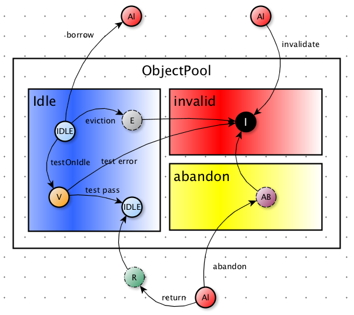
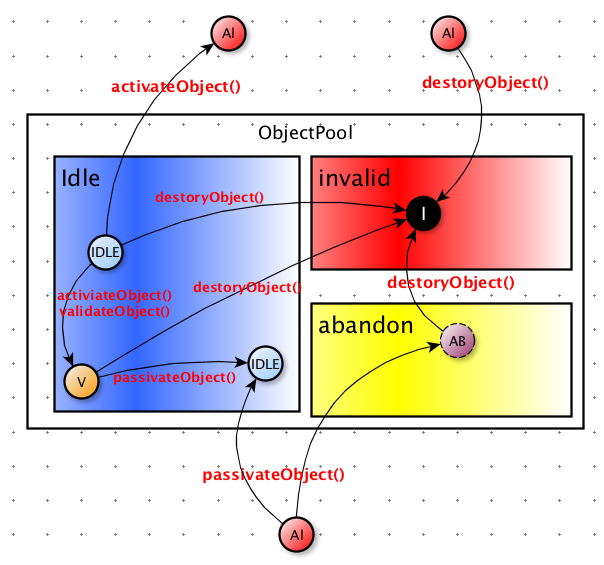
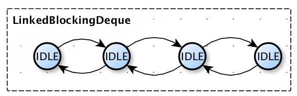
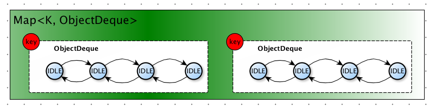

对象池技术是一种常见的对象缓存手段。'对象'意味着池中的内容是一种结构化实体，这也就是一般意义上`面向对象`中的对象模型；'池'(或动词`池化`)意味着将有生命周期的对象缓存到'池子'中进行管理，即用即取。缓存的目的大多是为了美化性能指标，对象池技术的目的也即如此。因此，对象池技术的本质简单来说就是：_将具有生命周期的结构化对象缓存到带有一定管理功能的容器中，以提高对象的访问性能。_

对象池使用最多的场景还是在处理网络连接方面。比如一些RPC框架的`NettyChannel`缓存(比如`motan`)，以及数据库连接池的`Connection`缓存（比如`DBCP`）等。除此之外，我们还可以利用对象池管理一些大对象，这些对象有着相对复杂的构造过程。那么对象池技术与普通的本地缓存（比如guava cache）有什么区别呢？其一，本地cache可能会有一些失效策略，比如按照时间、访问次数等，而对象池是可以没有这些特性的。其二，也是最重要的一点，缓存中的对象没有生命周期的概念，我们不需要管理他们的生命周期，相反对象池中的对象是具有生命周期的，我们可以按需对对象的生命周期加以控制。

本篇文章结合了[Apache Commons Pool](https://commons.apache.org/proper/commons-pool/)的[源代码](https://github.com/apache/commons-pool)，讲解了实现一个通用对象池可能需要考虑的方方面面。文章着重回答了如下几个问题：

1. 进入池子的对象是什么？需要包装一下吗？
2. 池子中的对象可能有一些什么状态和属性呢？
3. 池子中的对象可能有哪些组织形式（数据结构）？
4. 池子中的对象是怎么创建出来的？我们如何控制池子中的对象（生命周期）？
5. 什么时候我们需要校验一个池对象的有效性？
6. 什么是eviction？什么是abandon？，区别是什么？
7. 有哪些对象池接口方法可以提供给用户使用呢？
8. 对象被借到的顺序是怎么样的？fair or lifo？
9. 池子中需要定时任务么？定时任务能够做什么？

# 一个入门的例子

先来看官方文档的一个简单例子，通过这个入门例子让我们对`Apache Commons Pool`有一个感性的认识，至少我们要知道如何使用这个对象池框架。

## 不使用对象池

```java
    public class ReaderUtil {
        public String readToString(Reader in) throws IOException {
            // 这里我们构建一个StringBuilder，我们假如他是个大对象，是需要很长时间的创建
            StringBuilder buf = new StringBuilder();
            Closer closer = Closer.create();
            closer.register(in);

            try {
                for(int c = in.read(); c != -1; c = in.read()) {
                    buf.append((char)c);
                }
                return buf.toString();
            } finally {
                closer.close();
            }
        }
    }
```

上述代码其实就是：Reader到String的一个种映射。这个官方例子举的不是很好，因为StringBuilder并没有那么需要放到对象池中去管理。但是为了说明问题，我们可以假想他是一个很大的对象，需要花费很长时间进行创建。因此上述代码的问题在于，每次使用这个工具的`readToString()`方法都会产生比较大的`对象创建开销`，这有可能会影响`ygc`。

## 使用对象池

如果此时使用对象池技术，我们就可以预置部分对象，每次使用的时候就直接从池子中取，避免对象的重复创建消耗。如下述代码：

```java
public class ReaderUtil {

       private ObjectPool<StringBuilder> pool;

       ReaderUtil(ObjectPool<StringBuilder> pool) {
           this.pool = pool;
       }

       public String readToString(Reader in)
               throws IOException {
           StringBuilder buf = null;
           Closer closer = Closer.create();
           closer.register(in);

           try {
               // ① 从对象池中拿出来
               buf = pool.borrowObject();
               for (int c = in.read(); c != -1; c = in.read()) {
                   buf.append((char) c);
               }
               return buf.toString();
           } catch (IOException e) {
               throw e;
           } catch (Exception e) {
               throw new RuntimeException("Unable to borrow buffer from pool" + e.toString());
           } finally {
               closer.close();
               try {
                   if (buf != null) {
                       //② 用完要还回来
                       pool.returnObject(buf);
                   }
               } catch (Exception e) {}
           }
       }

       // 针对池对象的生命周期管理
      private static class StringBuilderFactory extends BasePooledObjectFactory<StringBuilder> {

              @Override
              public StringBuilder create() throws Exception {
                  // 创建新对象
                  return new StringBuilder();
              }

              @Override
              public PooledObject<StringBuilder> wrap(StringBuilder obj) {
                  // 将对象包装成池对象
                  return new DefaultPooledObject<>(obj);
              }

              // ③ 反初始化每次回收的时候都会执行这个方法
              @Override
              public void passivateObject(PooledObject<StringBuilder> pooledObject) {
                  pooledObject.getObject().setLength(0);
              }

          }

       // 使用这个工具
       public static void main(String[] args) {
               // ④ GenericObjectPool这个是一个通用的范型对象池
               ReaderUtil readerUtil = new ReaderUtil(new GenericObjectPool<>(new StringBuilderFactory()));
      }
   }
```

从上述代码可以看到，使用对象池的主要方法`pool.borrowObject()`和`pool.returnObject(buf)`进行对象的申请和释放。这两个方法也是对象池的最核心的方法。`BasePooledObjectFactory`是池对象工厂，用于管理池对象的生命周期，我们只需要继承他，并覆写父类的生命周期管理方法即可控制池对象的生成、初始化、反初始化、校验等。这些内容后文会有详细站看。`GenericObjectPool`是Apache Commons Pool实现的一个通用泛型对象池，是一个对象池的完整实现，我们直接构建并使用即可。

我们在使用对象池的时候，一般是需要基于`BasePooledObjectFactory`创建我们自己的对象工厂，并初始化一个对象池，将该工厂与对象池绑定（见上述代码④），然后就可以使用这个对象池了。比如DBCP的`PoolableConnectionFactory<PoolableConnection>`就是DBCP为了管理JDBC连接所实现的池对象工厂。

# 对象池实现原理

通过上面的例子，我们已经初步了解到了对象池的基本操作步骤，下面我们就将深入对象池内部，具体看看一个对象池是如何设计的。我们这里不会大量讲解代码实现细节，取而代之的是其实现思想和原理，这样当阅读Apache Commons Pool源代码的时候，不会觉得困惑。

## 对象池的基础接口

想一想，如果让我们去设计一个`ObjectPool`接口，我们会给用户提供哪些核心的方法呢？`borrowObject()`，`returnObject()`是上文已经说过的两个核心方法，一个是'借'，一个是'还'。那么我们有可能需要对一个已经借到的对象置为失效（比如当我们的远程连接关闭或产生异常，这个连接不可用需要失效掉），`invalidateObject()`也是必不可少的。对象池刚刚创建的时候，我们可能需要预热一部分对象，而不是采用懒加载模式以避免系统启动时候的抖动，因此`addObject()`提供给用户，以进行对象池的预热。有创建就有销毁，`clear()`和`close()`就是用来清空对象池（觉得叫purge()可能更好一点)。除此之外，我们可能还需要一些简单的统计，比如`getNumIdle()`获得空闲对象个数和`getNumActive()`获得活动对象（被借出对象）的个数。如下表：

方法名                | 作用
------------------ | ---------
borrowObject()     | 从池中借对象
returnObject()     | 还回池中
invalidateObject() | 失效一个对象
addObject()        | 池中增加一个对象
clear()            | 清空对象池
close()            | 关闭对象池
getNumIdle()       | 获得空闲对象数量
getNumActive()     | 获得被借出对象数量

除了`ObjectPool`接口，我们还应该抽象出池对象接口`PooledObject`以包装外部对象，以及池对象工厂`PooledObjectFactory`以提供池对象生命周期管理，后文有述。

### 基础接口的实现类

Commons Pool不但针对ObjectPool提供了相应的对象池实现，还实现了一套`KeyedObjectPool`接口，他能够将对象更细粒度的划分，[详见后文](#池对象组织结构与borrow公平性)。我们来看下ObjectPool和KeyedObjectPool的类图：


我们比较关注的是GenericObjectPool和GenericKeyedObjectPool，他们是整个Apache Commons Pool的核心实现。除此之外，他还为我们实现了软引用对象池`SoftReferenceObjectPool`，他的池对象又被封装了一层。剩下类图上的所有实现类都是包装器，Commons Pool采用了装饰者模式，提供对象池额外的扩展功能，比如ProxiedObjectPool，提供了池对象代理功能，防止客户端将池对象还回后还能继续使用。

## 对象池的空间划分

一个对象存储到对象池中，其位置不是一成不变的。对于空间的划分可以分为两种，一种是`物理空间划分`，一种是`逻辑空间划分`。不同的实现可能采用不同的技术手段，Commons Pool实际上采用了逻辑划分。如下图所示：


从整体上来讲，可以将空间分为`池外空间`和`池内空间`，池外空间是指被'出借'的对象所在的空间（逻辑空间）。池内空间进一步可以划分为`idle空间`，`abandon空间`和`invalid空间`。idle空间就是空闲对象所在的空间，空闲对象之间是有一定的组织结构的（[详见后文](#池对象的容器组织形式)）。abandon空间又被称作放逐空间，用于放逐被出借的对象。invalid空间其实就是对象的垃圾场，这些对象将不会在被使用，而是等待被gc处理掉。

## 池对象

池对象就是对象池中所管理的基本单元。我们可以思考一下，如果直接将我们的原始对象放到对象池中是否可以？答案当然是可以，但是不好，因为如果那样做，我们的对象池就退化成了容器`Collection`了，之所以需要将原始对象wrapper成池对象，是因为我们需要提供额外的管理功能，比如生命周期管理。commons pool采用了`PooledObject<T>`接口用于表达池对象，它主要抽象了池对象的状态管理和一些诸如状态变迁时所产生的统计指标，这些指标可以配合对象池做更精准的管理操作。

### 池对象的状态

说到对池对象的管理，最重要的当属对状态的管理。对于状态管理，我们熟知的模型就是状态机模型了。池对象当然也有一套自己的状态机，我们先来看看commons pool所定义的池对象都有哪些状态：

状态                        | 解释
------------------------- | -------------
IDLE                      | 空闲状态
ALLOCATED                 | 已出借状态
EVICTION                  | 正在进行驱逐测试
EVICTION_RETURN_TO_HEAD   | 驱逐测试通过对象放回到头部
VALIDATION                | 空闲校验中
VALIDATION_PREALLOCATED   | 出借前校验中
VALIDATION_RETURN_TO_HEAD | 校验通过后放回头部
INVALID                   | 无效对象
ABANDONED                 | 放逐中
RETURNING                 | 换回对象池中

上述状态我们可能对`EVICTION`和`ABANDONED`不是特别熟悉，[后文会讲到](#对象池的放逐与驱逐)，这里只需知道：_放逐指的是不在对象池中的对象超时流放，驱逐指的是空闲对象超时销毁。_`VALIDATION`是有效性校验，主要校验空闲对象的有效性。注意与驱逐和放逐之间的区别。我们通过一张图来看看状态之间的变迁。



我们看到上图的'圆圈'表示的就是池对象，其中中间的英文首字母是其对应的状态。虚线外框则表示瞬时状态。比如`RETURNING`和`ABANDONED`。这里我们省略了`VALIDATION_RETURN_TO_HEAD`，`VALIDATION_PREALLOCATED`，`EVICTION_RETURN_TO_HEAD`，因为他们对于我们理解池对象状态的变迁没有太多帮助。针对上图，我们重点关注四个方面：

1. `IDLE->ALLOCATED` 即上图的borrow操作，除了需要将状态置为已分配，我们还需要考虑如果对象池耗尽了怎么？是继续阻塞还是直接异常退出？如果阻塞是阻塞多久？
2. `ALLOCATED->IDLE` 即上图的return操作，我们需要考虑的是，如果池对象还回到对象池，此时对象池空闲数已经达到上界或该对象已经无效，我们就需要进行特殊处理。
3. `IDLE->EVICTION` 与 `ALLOCATED->ABANDONED` [请参考后文](#对象池的放逐与驱逐)
4. `IDLE->VALIDATION` 是testOnIdle的有效性测试所需要经历的状态变迁，他是指每隔一段时间对对象池中所有的idle对象进行有效性检查，以排除那些已经失效的对象。失效的对象将会弃置到invalid空间。

### 池对象的生命周期控制

只搞清楚了池对象的状态和状态转移是不够的，我们还应该能够控制对象状态转移的行为，即对池对象生命周期施加影响。commons pool通过`PooledObjectFactory<T>`接口对对象生命周期进行控制。该接口有如下方法：

方法              | 解释
--------------- | --------------------
makeObject      | 创建对象
destroyObject   | 销毁对象
validateObject  | 校验对象
activateObject  | 重新初始化对象，也可以叫reinit()
passivateObject | 反初始化对象，也可以叫uninit()

我们需要注意，池对象需要经过创建过程（`makeObject()`）和初始化过程（`activateObject()`）才能被我们使用。结合状态变迁，我们看一看这些方法能够影响哪些状态。



### 池对象组织结构与borrow公平性

对象池中的对象，并不是杂乱无章的，他们得有一定的组织结构。不同的组织结构可能会从整体影响对象池的使用。apache commons提供了两种组织结构，其一是有界阻塞双端队列(`LinkedBlockingDeque`)，其二是key桶。



有界阻塞队列能够提供阻塞特性，当池中对象`exhausted`后，新申请对象的线程将会阻塞，这是典型的生产者消费者模型，通过这种双端的阻塞队列，我们能够实现`lifo`和`fifo`。如下代码：

```java
            if (getLifo()) {
                idleObjects.addFirst(p);
            } else {
                idleObjects.addLast(p);
            }
```

因为是带有阻塞性质的队列，我们能够通过`fairness`参数控制线程获得锁的公平性，这里我们可以参考`AQS`实现，不说了。我们再来看一看key桶的结构：



从上图我们可以看到，每一个key对应一个的双端阻塞队列`ObjectDeque`，ObjectDeque实际上就是包装了LinkedBlockingDeque，采用这种结构我们能够对池对象进行一定的划分，从而更加灵活的使用对象池。commons pool采用了`KeyedObjectPool<K,V>`用以表示采用这种数据结构的对象池。当我们borrow和return的时候，都需要指定对应的key空间。

## 对象池的放逐与驱逐

上文我们多次提到了`驱逐(eviction)`和`放逐(abandon)`，这两个概念是对象池设计的核心。先来看驱逐，我们知道对象池的一个重要的特性就是伸缩性，所谓伸缩性是指对象池能够根据当前池中空闲对象的数量（maxIdle和minIdle配置）自动进行调整，进而避免内存的浪费。自动伸缩，这是驱逐所需要达到的目标，这是如何实现的呢？实际上在对象池内部，我们可以维护一个驱逐定时器(`EvictionTimer`)，由`timeBetweenEvictionRunsMillis`参数对定时器的定时间隔做控制，每次达到驱逐时间后，我们就选定一批对象（由`numTestsPerEvictionRun`参数进行控制）进行驱逐测试，这个测试可以采用策略模式，比如commons pool的`DefaultEvictionPolicy`，代码如下：

```java
   @Override
   public boolean evict(EvictionConfig config, PooledObject<T> underTest,
           int idleCount) {

       if ((config.getIdleSoftEvictTime() < underTest.getIdleTimeMillis() &&
               config.getMinIdle() < idleCount) ||
               config.getIdleEvictTime() < underTest.getIdleTimeMillis()) {
           return true;
       }
       return false;
   }
```

对于符合驱逐条件的对象，将会被对象池无情的驱逐出空闲空间，并丢弃到invalid空间。之后对象池再保证内部空闲对象能够至少达到minIdle的要求。我们在看来放逐，对象出借时间太长（由`removeAbandonedTimeout`控制），我们就把他们称作`流浪对象`，这些对象很有可能是那些用完不还的坏蛋们的杰作，也有可能是对象使用者发生了什么问题，比如网络连接超时时间设置长于放逐时间。总之，被放逐的对象是不允许再回归到对象池中的，他们会被搁置到abandon空间，进而进入invalid空间再被gc掉以完成他们的使命。放逐由`removeAbandoned()`方法实现，分为`标记过程`和`放逐过程`，代码实现并不难，有兴趣的可以直接翻翻源代码。

驱逐是由内而外将对象驱逐出境，放逐则是由外而内，将对象流放。他们一内一外，正是整个对象池形成闭环的核心要素。

## 对象池的有效性探测

用过数据库连接池的同学可能对类似`testOnBorrow`的配置比较熟悉。除了testOnBorrow，对象池还提供了`testOnCreate`, `testOnReturn`, `testWhileIdle`，其中testWhileIdle上文已经做了足够的说明。我们这里着重看一下其他三个配置的测试行为。

所谓testOnBorrow其实就是当对象出借前进行测试，测试什么？当然是有效性测试，在测试之前我们需要调用`factory.activateObject()`以激活对象，在调用`factory.validateObject(p)`对准备出借的对象做有有效性检查，如果这个对象无效则可能有抛出异常的行为，或者返回空对象，这全看具体实现了。testOnCreate则表示当对象创建之后，再进行有效性测试，这并不适用于频繁创建和销毁对象的对象池，他与testOnBorrow的行为类似。testOnReturn是在对象还回到对象池之前进行测试，与出借的测试不同，无论是测试成功还是失败，我们都需要保证池子中的对象符合配置要求，`ensureIdle()`方法就是做这个事情的，并且return的测试失败了，我们可以直接swallow这个异常，因为用户根本不需要关心它。

## 对象池的常见配置一览

当我们了解到了对象池的基本实现原理之后，我们再从配置的角度预览一下对象池可能提供的所有功能配置。这里我们直接参考了Apache Commons Pool。

配置参数                          | 意义              | 默认值
----------------------------- | --------------- | -----
maxTotal                      | 对象总数            | 8
maxIdle                       | 最大空闲对象数         | 8
minIdle                       | 最小空闲对象书         | 0
lifo                          | 对象池借还是否采用lifo   | true
fairness                      | 对于借对象的线程阻塞恢复公平性 | false
maxWaitMillis                 | 借对象阻塞最大等待时间     | -1
minEvictableIdleTimeMillis    | 最小驱逐空闲时间        | 30分钟
numTestsPerEvictionRun        | 每次驱逐数量          | 3
testOnCreate                  | 创建后有效性测试        | false
testOnBorrow                  | 出借前有效性测试        | false
testOnReturn                  | 还回前有效性测试        | false
testWhileIdle                 | 空闲有效性测试         | false
timeBetweenEvictionRunsMillis | 驱逐定时器周期         | false
blockWhenExhausted            | 对象池耗尽是否block    | true

# 参考资料

- [Apache Commons Pool 源代码](https://github.com/apache/commons-pool)
- [对象池的wiki](https://commons.apache.org/proper/commons-pool/)
