> 定时扫表是一个很常见的场景，有些时候我们能通过延迟队列中间件解决，有些时候这种扫描又是无法避免的，比如做分布式事务补偿或分布式定时系统等。本篇文章是对扫表方案的一个总结性思考，欢迎大家指导并提出其他方案。

## 场景

先来看一个抽象场景：

> 有一张表bill(id,status,x,y,z)，我们要每N分钟扫描一次，将`status=1`的所有列捞出来，并且做一些处理后，`set status=2`；

这场景贯穿了整篇文章，然后我们通过对他进行否定、肯定、再否定，就可以不断的进行架构升级迭代了。

## 单表扫描

### 方案1-最简方法

一种最简单的方式：

```java
select id,status,x,y,z from bill where status = 1
doSomething();
update bill set status = 2 where id = xx
```

定时方案我们可选用单机下`quartz`做定时框架；也可以用采用`crontab`定时掉接口。

以上场景在功能上能够满足需求。但有几个问题：

1. 每次扫描数量不可控，如果行较多，则会产生慢查询
2. 无索引，随着表的增加，扫描耗时亦会增加

### 方案2-方案1+扫描控制

针对方案1的问题，我们可以先创建status索引，然后通过增加可控因子`limit`和`maxSize`进行迭代扫描：

```sql
select id,status,x,y,z
from bill
where status =1 and id > #lastId#
order by id
limit #limit#
```

扫描的时候可以采用如下算法：

```java
limit = 200;//动态可控
totalRows = min(select count(1) from bill where status = 1, maxSize=1000);
scanTimes = totalRows / limit;
lastId = 0;

for (i = 0; i < scanTimes + 1; i++) {
    result.addAll(select(lastId, limit));
    lastId = result.last();
}
```

方案2是一套比较完整可用的方案。在一些可用性和数据规模要求均不高的小型系统中，方案2是可以直接拿来就用。但如果我们要求可用性，那就不得不做架构上的升级。

### 方案3-可用性考量

考虑quartz定时和扫表处理均在同一台服务器上，首先想到的是将定时机制单独拆出来做成一个通用的定时集群：

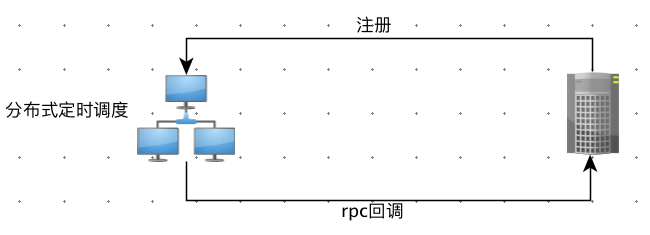

其中分布式定时调度系统是高可用的，网上有各种文章和开源项目都在做定时调度系统（各互联网公司也基本都有自己的定时调度中心），读者可按照自己实际业务做选型，亦可开发自己的一套定时任务中心。其实现方式无外乎：主从模式（keepalive）、选主+分片定时。

虽然提高了定时器的可用性，但扫表处理任务依然是单点，因此需要做集群：

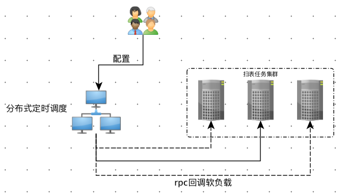

此时就需要分布式定时调度系统能够支持软负载，负载策略可以是`RR`，`sticky+failover`，`random`等。调度系统可以提供`Web Console`做任务配置，亦可提供编程api满足动态创建定时器的场景。

上述方案，还有一个问题，就是定时机制和其任务执行'绑死了'（RPC调用）：不但定时调度系统需要提供负载机制，也要处理失败重试的情况，这使得架构不那么灵活。此时我们可以通过消息队列将其进行解耦：

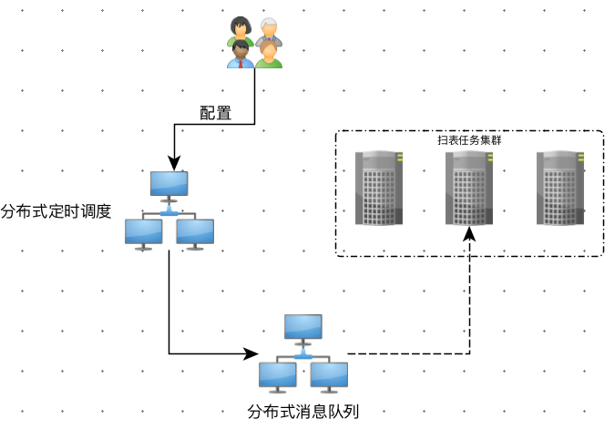

我们发现，为了实现一个定时扫表功能，竟然最后需要动用这么多中间件，这作为创业小公司来说，实在是太重了，有没有一些简单的实现方案呢？

### 方案4-兼具可用性的简单架构

如果我们没有那么多条件，只有n台线上机器，则可以直接通过一致性算法来进行选主，比如使用raft（可以参考我的文章：[分布式强一致性框架Atomix学习](http://kriszhang.com/atomix/)

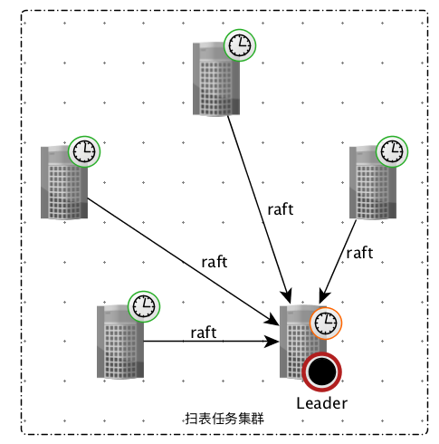

上图选主成功后，则主进行定时并扫表。从节点只进行定时，不做实际任务处理。当主节点挂掉，再通过raft选主。这种方案需要机器数为`2n+1`，其中n为容忍的宕机数。

如果我集群机器总数<=3，那怎么办？此时如果你有zookeeper或其他分布式协调系统，亦可：

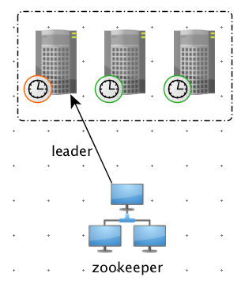

通过zookeeper选出leader以后，在leader上执行定时处理。

如果我没有zk，只有redis可以用呢？那也成：

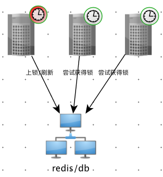

这种方案实现起来就稍微麻烦一些：

1. 初始化，所有节点抢占锁lock，超时时间为：定时周期+抖动值，
2. 如果A节点抢到锁，则进行定时处理，定时到后先判断自己是否还占有锁，如果占有则，设定lock的expire时间：任务执行最长时间，然后执行扫描任务，执行结束后释放锁，进入1阶段；如果自己没有锁了，则直接放弃执行，进入3。
3. 其他节点没有抢到锁则进行高频1s扫描锁是否释放，如果释放，则去抢占该锁。成功进入2，失败进入3。
4. 可以看到主节点在任何情况下出现问题宕机，均可由从节点处理。

如果没有redis，只有db，则也可以按照上述方案实现，因为db也可以进行分布式锁分配，唯一区别在于redis提供expire机制，db的话就只能自行通过时间窗口判断是否失效。

如果我只有两台机器，又没有额外的中间件帮助，怎么实现呢？通过standby方式，亦可做到，只不过需要服务自己提供健康检查，以及恢复机制：

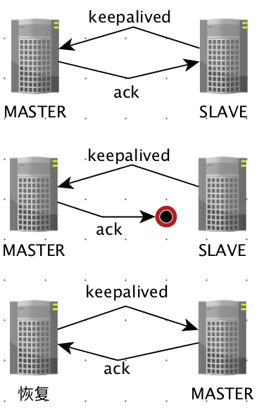

### 方案5-更高容灾级别

上述考虑的容灾级别是`单机容灾`，如果当我们所要求的容灾级别更高，比如机房容灾、甚至异地容灾。那么就不得不考虑做多机房部署甚至异地部署。这就变得更加复杂了。

## 分片扫描

方案1到方案5均是在单库单表场景下，只考虑到了可用性，但没有考虑数据规模以及处理性能。设想一下，如果我们的表中有很多数据，并且每次处理都要花上较长时间（比如1s），显然这种串行扫表，串行执行的效率是低下的。除此之外，mysql单库单表存储容量也是有一定限制的（一般最多几千万），因此实际业务中都是采用分库分表设计，比如我们这里采用百库千表，那么我们又如何去扫描这1000张表呢？

单表的分片和分表的分片本质上是相同的，都可以抽象成如下问题：将[1,n=1000]平均（或其他策略）分配给m台机器。每台机器分到数字[x,y]即是一个分片。在这种场景下，架构重点则是`水平扩展`。

### 方案6-单机多线程

这种方案是单机多线程进行分片处理，比如我们要用`4个线程`去处理`1000个数据集`，每个`分片为250`，也即每个线程处理250个数据。一般选用线程数是可以计算出来：

> 阻塞率=io-wait时间/（io-wait时间+oncpu耗时）
> 线程数=cpu核数/(1-阻塞率)

这种设计可以直接使用`线程池`，实现起来也非常简单，但其不具有水平扩展性，只适用于分片数较少的场景，并在一定程度上提升扫描性能。

### 方案7-中心化调度

如果想要支持水平扩展，就一定不能在单机上处理所有分片扫描。那让整个集群去协同处理分片便会遇到`分片感知`问题——每台机器如何去感知到自己应该处理哪些分片呢？，很显然的一种解决方案是：

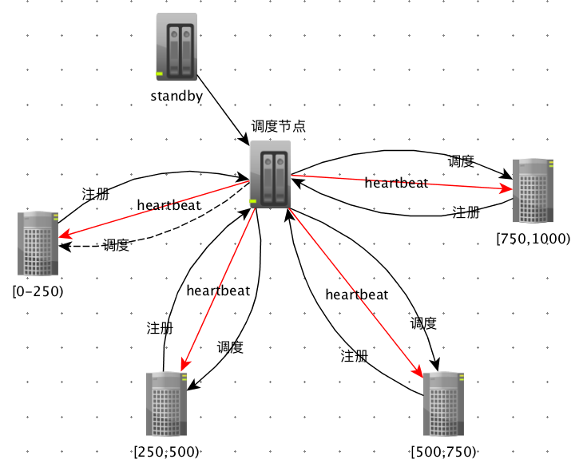

如上图所示，每个节点初始化的时候需要向中心调度节点注册。定时由中心节点完成，当定时器超时，中心节点则计算分片，再分配给这些节点。当有新节点加入或节点挂掉，则重新计算分片。这种方案扩展性比较好，但需要提供一个中心节点进行调度分配、心跳检测、注册等功能，并应保证中心调度节点的高可靠性。在一般分布式系统设计中，类似这种中心化调度节点应尽量保持轻量，如果过重，将会影响整个系统的稳定性，成为系统瓶颈。因此我们一般要尽量采用去中心化设计。

### 方案8-去中心化调度

我们可以使用zookeeper来避免中心化设计。如下图所示：

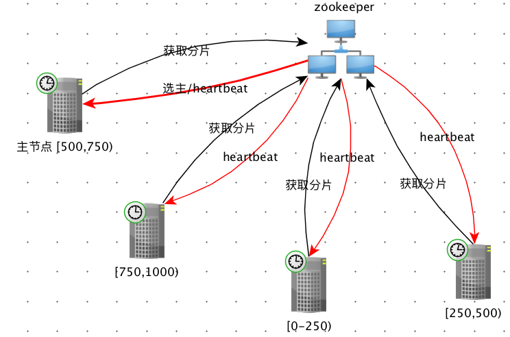

1. 初始化的时候，我们通过zk的选主，选出一个节点作为主节点，并利用zk的heartbeat做从节点探活
2. 主节点初始化后设为待分片，之后注册到zk上，本地定时启动等待调度。
3. 从节点直接注册到zk上，本地定时启动等待调度。
4. 当其中一个节点超时需要调度，则检测zk中是否带分片，如果带分片则交给主节点去做阻塞分片，之后置为已分片，获得该节点分片进行处理。
5. 当其中一台机器挂了主节点能够感知（watch机制），之后再进行重新阻塞分片
6. 同5，当有新机器加入，主节点能够感知（watch机制），之后再进行重新阻塞分片

以上方式能够很好的支持分片的水平扩展。但这里有一点需要注意，由于定时功能交由每台服务器自行处理，因此无统一时钟，所以每个任务可能并不是在一个时间点上同时执行，但这对分片场景来说无关紧要。

以上的架构模型，基本上能够用于生产环境了，不过，如果让我们从头开发这样的一套分片调度系统，有点重复造轮子的感觉。我们可以直接使用开源项目，比如[elastic-job-lite](https://github.com/dangdangdotcom/elastic-job)，来满足我们的需求。

但是，如果条件不允许我们使用zookeeper怎么办？

### 方案9-三层分发模型

我们可以采用三层分发技术去做分片，这种方法网络开销稍大（走RPC长连接），但其模型清晰、架构简单、可操作性强、扩展性好，不失为一种优雅的模型：

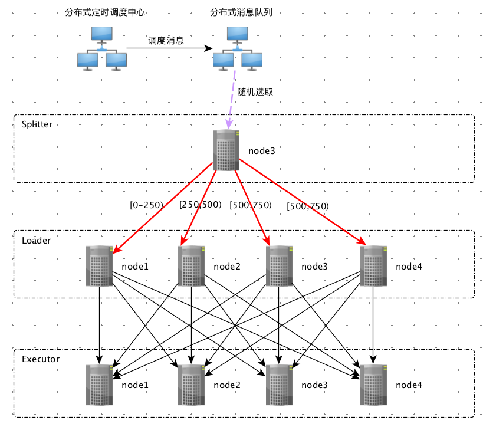

三层分发分为如下三层：

1. Splitter，用来进行整体划分，比如我们有1000张表：[0,1000)，如果集群有n台机器，那么很自然的每台机器所需要处理`1000/n`张表。
2. Loader，接受到Splitter所分配的表，比如接到了第998张表(bill\_998)，那么loader则需要处理该表中的数据比如:`select id from bill_998 where status = 1 limit 200`。加载到所需要处理的全部id之后，下发给executor层。
3. Executor层，接受Loader发过来的id，进行业务处理（就是上文说的doSomething()）

其中每层之间的调用可以直接采用RPC，Executor的处理亦可放入用户工作线程池，以避免占用RPC核心处理线程。同时，为减少请求数量，Loader层下发到Executor层的数据可以做合并处理。

以上三层分发模型，暂时没有找到开源支持。

### 方案10-利用消息队列

参考方案7，我们并不需要将这个中心节点做的那么重，利用消息队列：

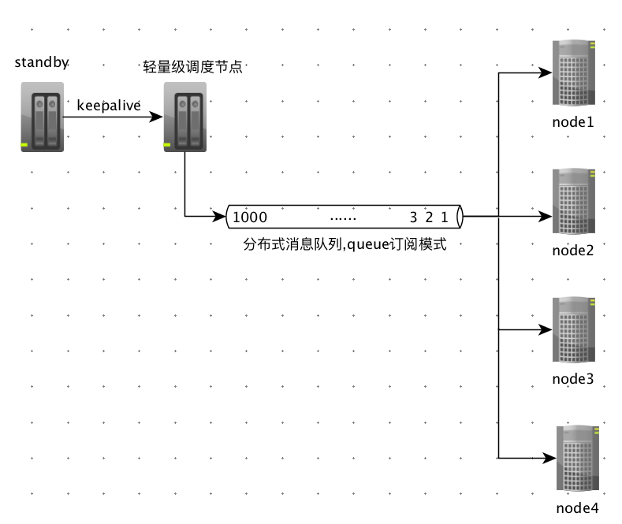

如上图，中心节点只需做定时处理，然后发送消息给消息队列（对消费者集群完全无感知）。消费者集群则采用queue订阅模式，将[0,1000)这1000负载到整个集群中。从上述架构中我们可以延伸以下几点：

1. 中心节点可以通过选举产生（ZK或使用一致性算法框架），亦可部署一个standby模式的集群。
2. 如果将这个MQ换成RPC调用，整个架构模型就演变成三层分发模型的第一层分发了。
3. 上图的这个分布式消息队列，我们亦可换成点对点的内存队列（比如ZeroMQ）。

## 总结

到这里我们就讲完了关于表扫描的所有方案，可以看到这种扫描的本质实际上就是一种分片调度。下面我们来总结一下：

扫描方案 | 数据量 | 可用性 | 扩展性 | 实现难度
--- | --- | --- | --- | ---
方案1-最简方法 | 极小 | 差 | 差 | 极简单
方案1+扫描控制 | 稍大 | 差 | 差| 极简单
方案2+可用性考量 | 稍大 | 较好 | 较高 | 较复杂（需要公司级别组件支持）
方案4-兼可用性简单架构 | 稍大 | 较好 | 一般| 较容易
方案5-更高容灾级别 | 稍大 | 极好 | 极好 | 极复杂（需要公司级别支持）
方案6-单机多线程 | 稍大 | 不高 | 扩展性差 | 极简单
方案7-中心化调度 | 极大| 一般 | 扩展性极好 | 较复杂
方案8-去中心化调度 | 极大| 较高 |扩展性极好 | 较简单（有开源支持）
方案9-三层分发模型 | 极大 |较高 |扩展性极好 | 较复杂
方案10-利用消息队列 | 极大|较高 |扩展性极好 | 较简单


