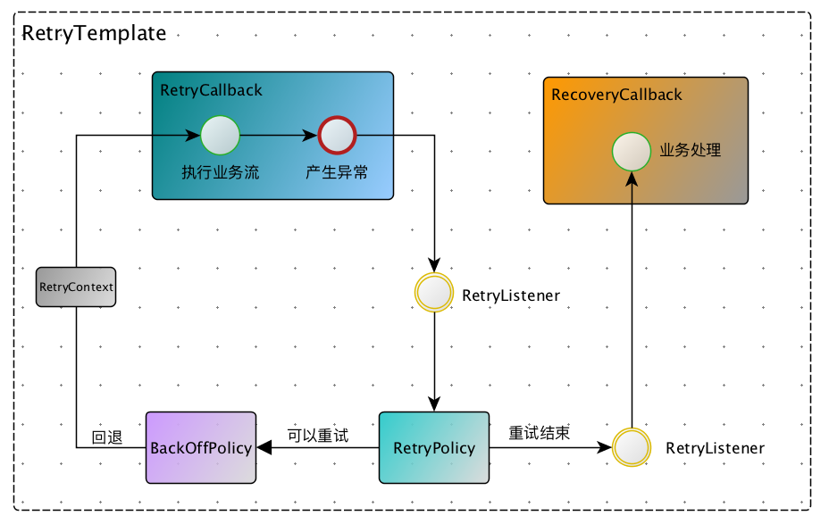

假设A,B两个系统，当`A->B`的调用失败时，我们可以采取何种策略？以下是常见的策略：

1. `failfast`，即快速失败像上层抛出`远程调用异常`
2. `failover`，即A->B失败，选择集群其他机器A->Bn(1...N)
3. `failsafe`，失败吞异常
4. `failback`, 过一会再重试，比如网络抖动，等一小会在重试。

其中failback则是本文所要讨论的核心内容。有些rpc框架提供failback策略，比如dubbo，但dubbo的failback仅仅只是设置重试次数，功能单一。更多的RPC框架则懒得管这事儿，他们将failback策略实现交给用户自己去做，你爱怎么做就怎么做。

那么思考一下，如果我们要自己做failback，比如如下场景：XXXFacade调用失败后，我们等20毫秒在重试，一共重试5次，如果依旧失败则打一条日志出来。一般人的实现，会做一个`for`循环，然后在使用一个`int n`作为计数，并且`catch`住XXXFacade异常后，`sleep`5s，最后判断n的次数。这个办法确实能实现该功能，但是重复早轮子，并且功能扩展性也不高。本文教大家使用spring-retry框架实现可定制化的调用重试策略。文章主要包含以下几个方面：

- 整体概览
- retry策略
- backoff策略
- 其他方面
- 实现文章开头的例子

## 框架概览
 
*Spring Retry* 框架广泛使用于`Spring Batch`,`Spring Integration`,` Spring for Apache Hadoop`等spring项目，由于spring-try源代码简单明确，本文不会讲其实现，只讲解其大体执行流和相应的框架抽象。其整体思路大致如下图所示：



1. `RetryTemplate`，重试模板，是进入spring-retry框架的整体流程入口
2. `RetryCallback`，重试回调，用户包装业务流，第一次执行和产生重试执行都会调用这个callback代码
3. `RetryPolicy`，重试策略，不同策略有不同的重试方式
4. `BackOffPolicy`，两次重试之间的回避策略，一般采用超时时间机制
5. `RecoveryCallback`，当所有重试都失败后，回调该接口，提供给业务重试回复机制
6. `RetryContext`，每次重试都会将其作为参数传入RetryCallback中使用
7. `RetryListener`，监听重试行为，主要用于监控。

当RetryCallback的调用产生异常的时候，框架首先会通过我们设置的RetryPolicy判断本次异常是否需要重试，如果需要重试，则调用BackOffPolicy，回退一定时间后，在重新调用RetryCallback。如果所有重试都失败了，则退出重试，调用RecoveryCallback退出框架。

使用示例如下：

```java
 public static void main(String[] args) throws Throwable {

        // 新建一个模板，可用作为我一个spring bean注入进来
        RetryTemplate template = new RetryTemplate();

        RetryCallback<String, Throwable> retryCallback = context -> remoteInvoke();
        RecoveryCallback<String> recoveryCallback = context -> {System.out.println("recovery"); return "recovery";};

        // 设置回避策略
        template.setBackOffPolicy(new FixedBackOffPolicy());

        // 设置策略
        template.setRetryPolicy(new SimpleRetryPolicy(5));

        // 设置listener
        template.setListeners(new RetryListener[]{new StatisticsListener(new DefaultStatisticsRepository())});

        // 执行模板
        template.execute(retryCallback, recoveryCallback);
    }
```

## 重试策略

支持的重试策略如下：

1. `NeverRetryPolicy`：只调用RetryCallback一次，不重试；
2. `AlwaysRetryPolicy`：无限重试，最好不要用
3. `SimpleRetryPolicy`：重试n次，默认3，也是模板默认的策略。很常用
4. `TimeoutRetryPolicy`：在n毫秒内不断进行重试，超过这个时间后停止重试
5. `CircuitBreakerRetryPolicy`：熔断功能的重试，关于熔断，请参考：[使用hystrix保护你的应用](http://kriszhang.com/hystrix_defend_your_webapp/)
6. `ExceptionClassifierRetryPolicy`: 可以根据不同的异常，执行不同的重试策略，很常用
7. `CompositeRetryPolicy`：将不同的策略组合起来，有悲观组合和乐观组合。悲观默认重试，有不重试的策略则不重试。乐观默认不重试，有需要重试的策略则重试。

下面简单思考一下以上策略的实现方式。

1. `NeverRetryPolicy`：判断是否重试的时候，直接返回false
2. `AlwaysRetryPolicy`：判断是否重试的时候，直接返回true
3. `SimpleRetryPolicy`：通过一个计数n，每次重试自增
4. `TimeoutRetryPolicy`：保存第一次重试时间，每次进行重试判断 `当前毫秒时间-第一次重试时间 > 设置的时间间隔`
5. `CircuitBreakerRetryPolicy`：与4类似
6. `ExceptionClassifierRetryPolicy`：采用一个Map实现，每次异常的时候，拿到对应重试策略，在重试即可
7. `CompositeRetryPolicy`：使用数据依次保存策略，执行的时候，顺序执行即可

## 回避策略

支持的回避策略如下：

1. `NoBackOffPolicy`：不回避
2. `FixedBackOffPolicy`：n毫秒退避后再进行重试
3. `UniformRandomBackOffPolicy`：随机选择一个[n,m]（如20ms，40ms)回避时间回避后，然后在重试
4. `ExponentialBackOffPolicy`：指数退避策略，休眠时间指数递增
5. `ExponentialRandomBackOffPolicy`：随机指数退避，指数中乘积会混入随机值

以上有两点需要注意：

1. 如何执行回避?一般使用`ThreadWaitSleeper`，即当前线程直接sleep一段时间。
2. 凡是带有随机性的策略，大多都是为了避免`惊群效应`，防止相同时间执行大量操作。

下面思考一下以上策略的实现方式：

1. `NoBackOffPolicy`：直接返回即可
2. `FixedBackOffPolicy`: 直接通过Sleeper设置n秒即可
3. `UniformRandomBackOffPolicy`:  FixedBackOffPolicy + Random()
4. `ExponentialBackOffPolicy`：T = initial; T = T + T * multiplier
5. `ExponentialRandomBackOffPolicy`：T = initial; T = (T + T * multiplier) * (1 + randomFloat() * (multiplier - 1))

## 其他主题

### 监听器和监控

```java
 RetryListener listener = new RetryListener( ){
            @Override
            public <T, E extends Throwable> boolean open(RetryContext context, RetryCallback<T, E> callback) {
                // 第一次重试的时候会执行该方法
                return true;
            }

            @Override
            public <T, E extends Throwable> void close(RetryContext context, RetryCallback<T, E> callback,
                                                       Throwable throwable) {
                // 重试结束后会调用改方法
            }

            @Override
            public <T, E extends Throwable> void onError(RetryContext context, RetryCallback<T, E> callback,
                                                         Throwable throwable) {
                // 每次重试产生异常时会调用改方法
            }
        };
```

我理解的监听器是一个很鸡肋的功能，主要用于进行模板执行情况的监控：`new StatisticsListener(new DefaultStatisticsRepository())`

### 有状态和无状态重试

上文讨论的都是无状态重试，这意味着产生异常，并不会将其抛出去，对于事务性调用，这是不可容忍的，因为上层框架需要获得异常进行事务的回滚操作。此时应当使用有状态重试。如下代码示例：

```java
        BinaryExceptionClassifier classifier = new BinaryExceptionClassifier(
            Collections.singleton(Throwable.class)
        );

        RetryState state = new DefaultRetryState("mykey", false, classifier);

        // 有状态
        String result = template.execute((RetryCallback<String, Throwable>)context -> {
            remoteInvoke();
            return "ret";
        }, context -> {
            return "recovery";
        }, state);
```

事务的开销一般较大，这里虽然能够有状态重试进行事务的回滚，但并不建议去进行事务的重试，而应当使用failfast机制，可能更加合理一些。

## 实现文章开头的例子

行文至此，基本上讲完了spring-retry框架应该讲的东西了，下面我们来回答一下文章开头的d问题：如何实现XXXFacade调用失败后，等20毫秒在重试，一共重试5次，如果依旧失败则打一条日志出来。通过本文的讲解，我想你应该能够轻松并且优雅的实现：

```java
    public static void main(String[] args) throws Throwable {
        FixedBackOffPolicy backOffPolicy = new FixedBackOffPolicy();
        backOffPolicy.setBackOffPeriod(20);
        template.setBackOffPolicy(backOffPolicy);
        template.setRetryPolicy(new SimpleRetryPolicy(5));

        new RetryTemplate().execute(context -> remoteInvoke(), context -> {System.out.println("log here"); return "recovery";});
    }
```

**注：如果这个例子采用spring xml配置方式将会更加简洁，策略的创建你都省了**

## 参考资料 

- [srping-try github](https://github.com/spring-projects/spring-retry)