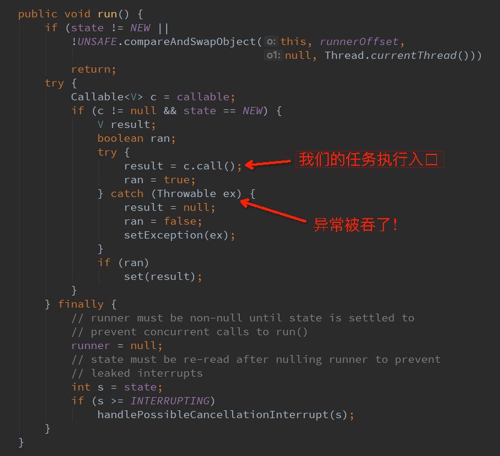
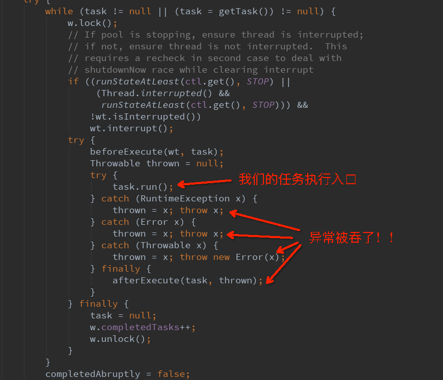

> 工程师不怕出错，就怕不知道哪里出错。

最近在做一个项目，测试环境下都好好的，但在预发环境下，**理所当然**应该输出的日志并没有输出。更重要的是，竟然连特么任何错误异常都没有发现！！本篇文章带您看一看这个关于线程异常捕获的坑。

## 坑爹的代码

```java

/** 对线程抛出的异常统一处理 这里只记一个错误日志 */
UncaughtExceptionHandler UEH = (t, e) -> log.error(e);

/** 创建一个线程池 */
ThreadPoolExecutor pool =
    new ThreadPoolExecutor(10,80,30, MINUTES,
        new LinkedBlockingQueue<>(5000),
        new ThreadFactoryBuilder()
            .setNameFormat("...")
            .setDaemon(false)
            .setUncaughtExceptionHandler(UEH)
            .build(),
        new CallerRunsPolicy());
        
/** 入口函数 */
void method() {
        pool.submit((Callable<Void>) () -> {
        log.info(...);//①
        if (check()) {
            log.info(...);//②
            fun1();
        } else {
            log.info(...);//③
            fun2();
        }
        return null;
    });
}
```

以上是`本坑`的简化代码，很简单：先创建一个线程池`pool`，然后用它执行一个任务，此任务逻辑是`check()`一下，通过则调用`fun1()`，不通过则调用`fun2()`。

在测试环境下，①和②或③的日志均有输出，一切正常符合预期；但上了预发之后我们发现，①日志有输出，②和③均没有输出。同时，所有日志里均无任何异常记录！这就懵逼了，如果**出现异常**，我的`UncaughtExceptionHandler`会打印错误日志啊？如果**没有异常**，为什么②和③均无日志输出？这怎么看都很诡异。

Wait a minute，不知道UncaughtExceptionHandler是什么？我们先花1分钟看一下。

## UncaughtExceptionHandler

线程有很多常用的设置选项，比如：线程名字，线程优先级，是否是守护线程(daemon)，以及`UncaughtExceptionHandler`。他的作用在于捕获线程中没有捕获的异常，比如代码：

```java
public static void main(String[] args) {
    Thread t = new Thread(() -> {
        throw new RuntimeException();
    });
    t.setUncaughtExceptionHandler((t, e) -> e.printStackTrace());
    t.start();
}
```

上述代码在线程中抛出了一个运行时异常，之后，由我们设置的UncaughtExceptionHandler对象进行异常的处理，这里打印一下异常堆栈。UncaughtExceptionHandler存在的意义在于：

- 做异常兜底
- 统一线程的异常处理

## 答案揭晓

理解了UncaughtExceptionHandler之后，再来看上面那个有坑的代码就会越看越诡异，一切似乎都理所当然！如果有异常，那我应该输出异常日志，如果没有异常那也应该输出日志！！可什么都没有发生！难道是`UncaughtExceptionHandler`这货并没有按照预期捕捉到异常，从而导致异常被吞了？于是我在整个`Callable`对象执行的外围套了一层`try-catch`：

```java
pool.submit((Callable<Void>) () -> {
    try {
        log.info(...);//①
        if (check()) {
            log.info(...);//②
            fun1();
        } else {
            log.info(...);//③
            fun2();
        }
    } catch(Exception ex) {
        log.error(ex); //④
    }
    return null;
});
```

重新预发测试，其结果果然是④输出了异常堆栈！通过分析堆栈我发现，`check()`方法是罪魁祸首，而这一切的根本原因在于一个DDL变更并没有在预发执行，从而导致`check()`方法所依赖的sql找不到表字段，报了DB层异常。但究竟为何`UncaughtExceptionHandler`并没有按照预期捕获到该异常呢？

## 原理解析

这就要从线程池的行为说起。对于ThreadPoolExecutor，我们都知道他有两种执行模式，

- Future<> f = t.submit(new Callable<>)；
- t.execute(new Runnable())。

这两种模式对于异常的处理均是不同的。先来说`submit()`，线程池会将我们提交的任务封装成`FutureTask`，而我们的任务执行入口就在FutureTask的`run()`方法中：



上面源代码中我们发现异常被吞没了，setException中实际上将这个异常赋值给`overcome`变量，以提供给FutureTask做后续处理。当我们`future.get()`的时候，这个异常将会作为`ExecutionException`的子异常被我们感知到。

对于`execute()`，线程池将我们提交的任务封装成了`Worker`（ThreadPoolExecutor的内部类），而我们的任务执行入口也被封装在了Worker对象里：



上述代码位于ThreadPoolExecutor的`runWorker()`方法中，可以看到，异常依然被吞了。

**因此，总的来说，UncaughtExceptionHandler不生效的根本原因在于：线程池想当然的捕获了我们的异常，并替我们做了处理！！**

## 解决办法

最简单的解决办法当然就是我们自己try-catch整个方法体。但如果我们非要做异常的统一处理，那么亦可以采用下面两种方式：

其一，采用线程池钩子afterExecute：

``` java
class MyThreadExecutor extends ThreadPoolExecutor {
    @Override
    protected void afterExecute(Runnable r, Throwable t) {
        // 处理异常
    }
}
```

这种方式，要求我们扩展jdk线程池。注意：他只能在`execute`模式下生效，对于`submit`方法调用产生的异常，afterExecute的Throwable入参是null。

其二，采用CompleteableFuture。

```java
CompletableFuture
    .runAsync(()->{throw new RuntimeException();}, threadPool)
    .exceptionally(e-> {
        // 统一异常处理
        e.printStackTrace();
        return null;
});
```

更多关于CompletableFuture，请参考我的文章：[理解CompletableFuture](http://kriszhang.com/CompletableFuture/)

## 后记

这个问题还好发现的比较及时，想想如果当时的DDL执行了，那么便不会出现这个’诡异‘的现象，也就很有可能带着这个bug上线。当真的线上出现问题的时候，也便无法做出任何的排查，因为你的异常被线程池吞了。所以作为一条经验，自定义线程池所执行的任何任务，我们都应该手动捕获异常并处理，以防止异常吞没。

## 修正

这里做一个修正：execute执行的情况下，会先执行afterExecute，然后重新抛出异常。而不是被吞掉。只有submit才会吞异常。 感谢同事指出这个问题。
 